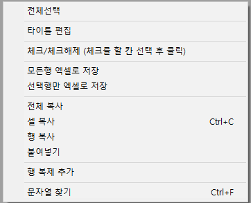

# 공통기능

아이랩내에서 모든화면에서 공통으로 사용할 수 있는 기능들의 매뉴얼입니다.  
해당 매뉴얼을 숙달후에 사용하시면 좀 더 빠르고 정확하게 아이랩을 사용하실 수 있습니다.

## 접수건 아이콘

각 아이콘 마다 접수건의 현재 상태와 적합, 부적합 판정을 나타냅니다.

| 상태 아이콘 | 상태명 |
| :---: | :---: |
|  | 접수  |
|  | 검사중 |
|  | 검사완료 |
|  | 결재완료 |
|  | 발행완료 |
|  | 발송완료 |

해당 아이콘은 접수목록 등에서 아래와 같이 표기 됩니다. 

## 필수입력

각 입력칸 우측 상단에 삼각형 표시가 있다면, 필수 입력칸이니 빈칸이 되지 않도록 값을 입력하시기 바랍니다.

## 날짜컴포넌트

### 날짜 선택

아래와 같이 달력모양을 선택하면 현재 표시되있는 월과 함께 달력이 표시되며, 원하는 날짜를 선택하면 자동으로 선택한 날짜가 입력 되어집니다.

### 날짜 키보드 입력

날짜를 키보드로 입력하고 싶다면 **년도 & 월 & 일** 입력 후 아래 3가지중 하나의 구분값을 입력하시기 바랍니다.  
① ' **,** '  
② ' **.** '  
③ ' **/** '  
해당 구분값을 입력하실 경우 다음 입력칸으로 넘어가게 되어집니다.  
또한 **+** 또는 **-** 키를 입력하시면 선택되있는 년도, 월, 일에 대한 값이 증가, 감소 합니다.  
※ 엔터키의 경우 다른 입력칸들의 기능이 있기 때문에 날짜 컴포넌트에서는 지원이 되지 않습니다.

### 날짜 지우기

입력 되어 있는 날짜를 지우고 싶을 때 날짜 선택 후 키보드의 Delete키를 눌러 지울 수 있습니다.

빠른달력 → 

각 화면 조회 조건 중 날짜의 범위를 빠르게 선택할 때 사용합니다.

해당 모양의 아이콘을 선택하면 아래와 같이 해당 영역에 날짜 범위를 선택 할 수 있는 달력이 표기되고, 그곳에서 원하는 버튼을 클릭하고, 선택 버튼을 누르면 해당 날짜들이 날짜 범위에 입력 되어 집니다.

## 콤보박스

아이랩 상단 메뉴 중 공통/코드관리 → 공통코드관리 화면에서 각 구분값에 따른 값들을 미리 등록해두고, 한번에 한개씩 선택하여 사용할 수 있습니다.

구분값이 추가, 수정 되었다면 정보 갱신을 위해서 해당 정보를 사용 하고 있는 화면을 닫고, 새로 열어서 사용해야 합니다.

[공통코드관리 매뉴얼 링크](https://help.ilabs.co.kr/002공통코드관리/공통코드관리.html)

## 해당 화면 닫기

아이랩 상단 메뉴 바로 아래쪽에 현재 사용중인 화면들이 가로로 나열되고, 각 화면명 오른쪽에 검은색X 표시를 누르면해당 화면이 닫히게 됩니다.

**돋보기**

각 정보에 맞게 아이랩에 저장되어있는 정보를 검색할 때 사용합니다.

접수화면에서 거래처 조회, 주소 검색 등에 사용됩니다.

## 입력초기화

입력칸의 값들만 빈칸으로 만들어 주는 역할이기 때문에 실제 데이터를 저장하는 것은 아닙니다.

입력초기화된 내용을 되돌리는 기능은 없습니다.

↓

**주소가져오기**

주소 입력시 다른 주소지에 입력되어있는 정보를 불러와 입력하는 기능입니다.

## 양식 선택 버튼

지정된 양식이 아닌 원하는 양식으로 선택하여 출력할 때 사용할 수 있습니다.

▼ \( 아래화살표 \)

 버튼 클릭 시 공통/코드관리 -&gt; 리포트관리2.0 화면에 등록해둔 양식들이 팝업되어 표시되고, 그중 원하는 양식을 선택하여 출력 할 수 있습니다.

예1

\)

 공통/코드관리 -&gt; 리포트관리2.0 화면 -&gt; 성적서 탭에 있는 양식들이 성저서 버튼 오른쪽에 ▼ 버튼 클릭시 팝업됩니다.

 -&gt; 

## 그리드정렬

각 화면에 있는 그리드중에서 한 그리드에 한 컬럼에 대해서만 조회된 내용을 정렬할 수 있습니다.

아래와 같이 컬럼에 타이틀 부분을 선택하여 정렬할 수 있습니다.

화면 특성상 적용이 어렵거나 다른 이유에서 적용이 안된 화면이 있을 수 있습니다.

그리드 정렬이 안되는 화면이 있다면 서비스요청으로 요청 보내주시면 확인하여 답변 드리겠습니다.

▲ : 오름차순

▼ : 내림차순

## 그리드에서 마우스 우측버튼 클릭

그리드의 내용을 조작할 수 있는 팝업 메뉴 띄우기

* 전체선택 : 조회된 모든 영역을 선택  
* 타이틀 편집 : 그리드의 칸을 보이기/숨기기  
* 체크/체크해제 : 그리드 목록에서 체크 해야 하는 정보가 있는 경우 일괄 체크 및 체크해제  

  다중 선택 -&gt; 체크 및 체크해제 \(통합접수목록, 성적서관리 -&gt; 화면하단 -&gt; 항목 출력 여부 부분\)  

* 모든행 엑셀로 저장 / 선택행만 엑셀로 저장 : 조회 영역을 엑셀로 변환  
* 전체 복사 / 셀 복사 / 행 복사 : 클립보드에 그리드 내용을 복사  
* 행 복제 추가 : 선택한 행의 내용을 복제 하여 아래쪽에 추가  
* 문자열 찾기 : 선택한 컬럼에서 사용자가 입력한 값을 검색  

  &lt;체크/체크해제 동영상&gt;  

  

  **화면 목록 위치 변경\(그리드 정렬\)**  

  아이랩에서 사용하는 모든 화면에 적용되어있지 않으며,  

  변경이 되지 않는 화면은 해당 기능이 없는것으로 판단해 주시기 바랍니다.  

  측정/분석관리 -&gt; 검사결과등록3.0\(=시험결과입력3.0\), 4.0 화면의 결과입력 탭\(화면 하단부\)에 나오는 변수 목록은  

  각 항목, 시험법 별로 다른 변수들을 불어와야 하는 부분이기 때문에, 컬럼 위치를 변경할 수 없는 부분이니 양해부탁드립니다.  

  **※ 변경된 내용은 개인의 PC에만 적용되며 다른 사람에게 영향을 주지 않습니다.**  

  **※ 같은 화면을 여러개 띄워둘 경우, 가장 마지막에 닫히는 화면의 정보가 저장됩니다.**  

  **예1\) Ctrl + 마우스 왼쪽키\(단일 컬럼 이동\)**  

* 각 화면별로 Ctrl 키를 누른 상태에서 컬럼의 제목부분을 마우스 왼쪽 클릭을 하신 뒤  

  원하시는 방향으로 드래그 하시면 목록 위치를 옮기실 수 있습니다.  

  \(아래처럼 검은 줄이 생기는것이 정상입니다.\)  

  

* 목록 위치를 옮기신 뒤 해당 화면을 한번 닫았다가 다시 여셔서 변경이 잘 되었는지 확인 해보시기 바랍니다.  

  

  ※ 만약 성적서관리 화면처럼 이동 하려는 컬럼이, 접수번호 컬럼 왼쪽으로 가지 않는다면, 해당 화면에서  

  접수번호 컬럼은 그 위치에 고정이 되어 있기 때문에 위치 변경이 불가능하고, 다른 컬럼이 접수번호 컬럼 왼쪽으로도 위치 이동이 불가능한 것이니 당황하지 마시고, 고정된 컬럼의 위치는 놔두고 다른 위치로 변경 해주세요.  

  한번 해 보시고 잘 안되시면 위치를 수정중인 화면과 함께 서비스요청을 보내 주시면 확인해 보고 답변 드리겠습니다.  

  **예2\) 그리드 타이틀을 통한 위치 변경 방법\(다중 컬럼 이동\)**  

  성적서 관리 화면에서 진행하였고,  

  의뢰업체 옆에 의뢰인명, 의뢰업체명으로 놓고 싶은 경우를 예를 들어 동영상으로 첨부합니다.  

  다중 선택은 그리드 타이틀에 나오는 컬럼 목록에서 Ctrl + 마우스 왼쪽 버튼 또는 Shift + 마우스 왼쪽 버튼으로 진행해주세요.  

  \(이부분이 잘 안되시면, 바로 아래쪽에 "  **그리드 다중 선택**  " 부분 참고하신 뒤 다시 진행해보세요.\)  

  ※ 변경 후에는 반드시 화면을 닫았다가 다시 열어서 변경된 것을 확인해주세요.  

  한번 해보시고 잘 안되시면 서비스 요청으로 요청보내주세요.  

  

## 그리드 다중 선택

## 키보드 좌측 하단 Ctrl + 마우스 왼쪽 버튼

그리드 목록에서 선택할 행을 한개씩 선택 할 수 있습니다.

1. 최초 행을 하나 선택.

1. 키보드 좌측 하단에 있는 Ctrl

\(

Control

\)

 키를 누른 상태 유지.

1. 마우스 왼쪽 버튼으로 다른 행을 선택.

아래 동영상을 참고하세요.

## 키보드 좌측 하단 Shift + 마우스 왼쪽 버튼

그리드 목록에서 선택할 행을 범위 지정하여 선택 할 수 있습니다.

1. 범위의 시작이 될 행을 하나 선택.

1. 키보드 좌측 하단에 있는 Shift 키를 누른 상태로 유지.

1. 범위의 마지막으로 선택 될 행을마우스 왼쪽버튼으로 선택.

아래 동영상을 참고하세요.

## 아이랩 하단 정보

## 왼쪽부터 안내합니다.

사용자이름  
사용자가 속한 부서  
사용자의 현재 권한  
사용자의 기관명  
기관에서 사용중인 첨부파일 사용량\( 사용량 / 사용가능량 \)  
바로빌 충전내용  
우리테크 Fax번호  
아이랩 문의 Email -&gt; Email보다 서비스요청으로 보내주셔야 처리가 더 빠릅니다.

