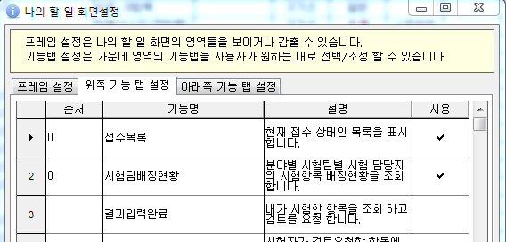
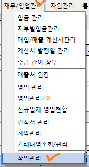

# 나의 할 일


나의 할일 메뉴는 아이랩 로그인 시, 첫번째로 보게 되는 메인 화면이며 이곳에서 사용자가 담당하거나 진행해야하는 업무를 확인하실 수 있습니다.   
또, 구성요소 또한 사용자의 환경에 맞추어 설정이 가능합니다.


## 화면구성

나의 할 일은 왼쪽, 오른쪽, 위쪽, 아래쪽 프레임 영역으로 나뉩니다.

| 프레임 | 설명 |
| :--- | :--- |
| 왼쪽 | 즐겨찾기, 공지사항, 각종 알림, 업데이트 공지 |
| 오른쪽 | 아이랩을 통해 전달된 업무, 작업, 통화 기록 |
| 위쪽, 아래쪽 | 사용자가 직접 설정한 화면이 나타남 |

각 영역은 “화면 구성” 버튼을 통해 감추거나 보이게 설정할 수 있습니다.

화면이 작은 노트북 등에서는 불필요한 프레임을 감추어 화면을 넓게 쓸 수 있습니다.

## 프레임설명

### 왼쪽 프레임

이 영역은 공지사항 및 업계소식, 시스템공지사항이 표기되는 영역입니다.

**·즐겨 찾기**

아이랩 사용 시 부여 받은 사용분야 및 아이랩에서 사용 할 수 있는 각 화면들을 즐겨찾기 해두고, 상단 메뉴를 통해 찾아가지 않고 등록되어있는 화면을 원클릭으로 빠르게 이동 할 수 있는 기능입니다.

즐겨찾기영역 우측에+버튼을 클릭하여 즐겨찾기를 등록 할 수 있습니다.

왼쪽에 있는 목록에서 즐겨찾기를 하고 싶은 화면을 더블클릭 또는 선택 후 &gt; 버튼을 클릭하면 우측 목록으로 이동합니다. 즐겨찾기를 해제하고 싶다면 오른쪽 목록에서 즐겨찾기를 해제 하고 싶은 화면을 더블클릭 또는 &lt; 버튼을 클릭하여 왼쪽목록으로 이동 시킨 후 설정이 끝나면 확인 버튼을 눌러주세요. 즐겨찾기에 등록된 화면을 선택하면 즉시 해당 화면이 열리게 되어집니다.

**·알림**

우리테크에서 작성한 공지사항 및 사내 공지사항이 있는 경우 이 영역에 표기되어지고, 자세한 내용을 확인 할 때는 각 공지사항을 더블 클릭하여 확인 할 수 있습니다.

### 위, 아래쪽 프레임

위쪽과 아래쪽 프레임은 영역만 나누어질 뿐 동작은 똑같기 때문에 함께 설명하도록 하겠습니다.

위, 아래쪽 프레임에는 각 권한이 지정되어있어야만 사용 할 수 있고, 권한이 없는 부분은 회색으로 표기됩니다.

\(권한설정은 메뉴권한관리 -&gt; 나의 할일 권한 매뉴얼을 참고해주세요.\)

선택한 탭들의 표기 순서는 왼쪽부터 표기되며 순서 컬럼에 지정한 순서대로 정렬 할 수 있습니다.

\(왼쪽부터 낮은 숫자 -&gt; 높은숫자 순\)

해당 영역들에 자신이 사용할 적절한 내용들을 위쪽과 아래쪽으로 나누어서 적절하게 사용하실 수 있습니다.

아무것도 필요하지 않다면 아무것도 체크하지 않으시면 됩니다.

| 명칭 | 설    명 |
| :--- | :--- |
| 접수목록 | 현재 접수 상태인 목록을 표시합니다. |
| 시험팀배정현황 | 분야별 시험팀별 시험 담당자의 시험항목 배정현황을 조회 합니다. |
| 결과입력완료 | 내가 시험한 항목을 조회 하고 검토를 요청 합니다. |
| 검토중 | 시험자가 검토요청한 항목에 대해 검토 또는 반려를 진행 합니다. |
| 승인중 | 검토자가 검토를 마친 항목에 대해 최종 승인 또는 반려 합니다. |
| 승인완료 | 최종 승인완료된 접수건을 조회 하고 성적서를 발행 합니다. |
| 웹브라우저 | URL등록\(현재 사용하지 않는 기능입니다.\) |
| 문자발송관리 | 문자 메시지를 발송하거나 발송상태를 조회 할 수 있습니다. |
| 내 결재함 | 내가 상신한 결재, 내가 해야할 결재를 관리합니다. |
| 금월 입금내역 | 이번달 내 접수 업체의 입금내역을 확인합니다. |
| 긴급접수목록 | 긴급 접수 목록을 조회 합니다. |
| 시험분야별 마감건수 조회 | 시험분야별로 주간, 월간, 년간 마감 접수건수를 조회 합니다. |

### 오른쪽 프레임

통화기록, 기관내 업무내용을 저장, 전달 및 확인 할 수 있는 기능이 있는 영역입니다.

**·통화기록**

중요한 통화내용 또는 간단하게 통화내용을 아이랩 내에 기록해두고 싶을 때 사용할 수 있는 화면입니다.

나의 할 일 화면에서는 완료되지 않은건만 표기됩니다.

저장된 통화기록은 상단 메뉴중 공통/코드관리 -&gt; 통화기록 관리 화면에서 확인 할 수 있습니다.

기록삭제는 이력이 남지 않으니 삭제시 신중하게 결정 후 삭제하셔야합니다.

**·작업관리**

기관 내 다른 선생님들과 업무내용을 아이랩을 통해 공유 또는 지시해야 할 경우가 있을 때 사용할 수 있습니다.

간단한 메모를 주고 받는 용도로도 사용가능합니다.

자동알림기능은 없고, 나의할일 오른쪽 프레임이나 작업관리 화면에서 수동으로 확인해주셔야 합니다.

저장된 내용은 상단 메뉴중 재무/영업관리 -&gt; 작업관리 화면에서 확인 가능합니다.

