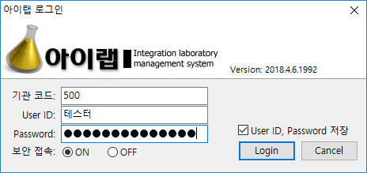

# 로그인

아이랩은 사용자별 아이디를 발급하고 로그인 후 사용 할 수 있는 프로그램 입니다.

### 1. **기관코드**

기관코드는 각 검사기관별 부여된 코드입니다. 로그인 하기 위해서는 본인이 소속된 검사기관의 기관 코드를 알고 있어야 합니다. 기관코드를 잊어버린 경우 각 기관의 관리자에게 문의하시기 바랍니다.

### 2. **User ID**

아이랩 프로그램에 로그인하기 위한 사용자아이디 입니다. 발급 받은 아이디를 입력 합니다.

### 3. **Password**

사용자 아이디에 대한 암호를 입력 합니다.

### 4. 보안 접속

🔘**ON **활성화시 HTTPS 방식으로 아이랩에 로그인 합니다.

🔘**OFF** 활성화시 HTTP 방식으로 아이랩에 로그인 합니다.


만약 아이랩 로그인시 문제가 발생한다면 🔘OFF 활성화 후 로그인을 진행합니다.


