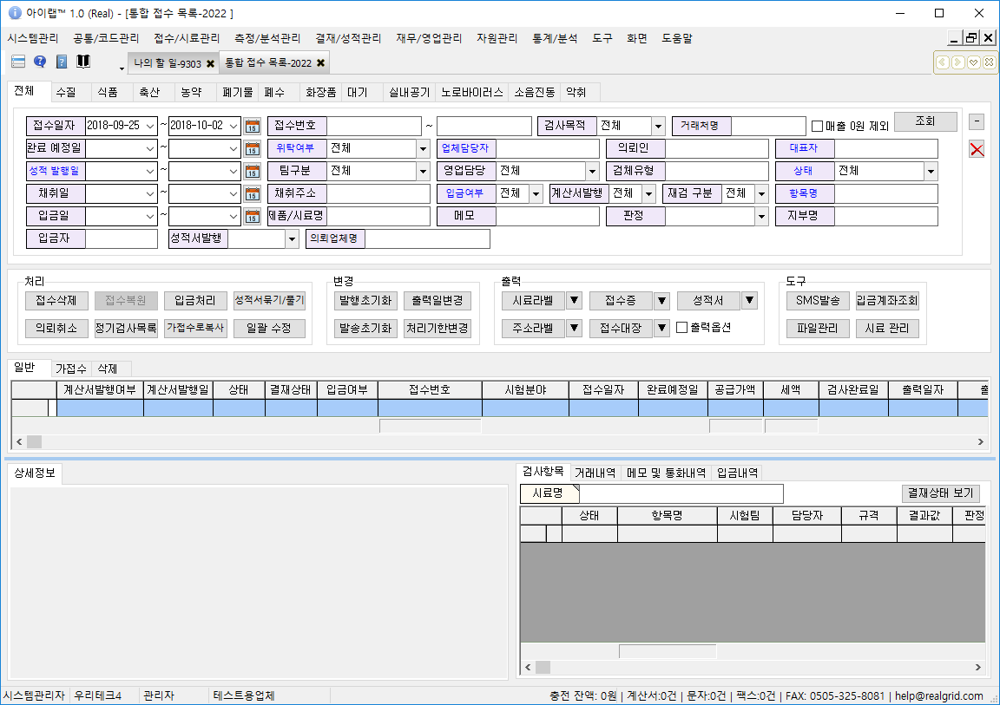

# 공통코드관리


시스템을 사용하기 위한 기본적인 기초 데이터를 입력하고 관리하는 메뉴 입니다. 시스템을 사용할 사용자 정보, 각 업무 화면에서사용하는 공통코드 정보, 매출처 정보 등이 있어야 접수, 결과 입력, 성적서 발행 등의 업무를 할 수 있습니다.


※ 시스템을 처음구축하여 사용하시는 당사 직원의 도움을 받아 기초 코드를 입력하시고, 이후에 법령과     같이 변경된 사항이 있을 때 해당 메뉴를 통해 직접 관리하시면 됩니다.

아이랩에서 제공되는 화면중 대부분의 ComboBox 부분에 들어가는 값들을 지정하는 화면입니다.

\(검사목적, 관리계좌, 문자상용구, 시약구분 등\)

각 분야별로 중복되는 이름이 있는 경우 해당 화면 표기 중 검사목적, 관련법령

\(수질분야\)

를 제외한 다른 분야에 대한 정보들은 각 분야 이름을 앞에 붙여서 사용 하시면 됩니다.

예\)

| 공통코드 | 비고 |
| :--- | :--- |
| 검사목적 | 수질분야 검사목적 |
| 식품검사목적 | 식품분야 검사목적 |
| 대기검사목적 | 대기분야 검사목적 |
| 관련법령 | 수질분야 관련법령 |
| 식품관련법령 | 식품분야 관련법령 |
| 대기관련법령 | 대기분야 관련법령 |
| … |  |

해당 공통코드의 정보가 추가, 변경, 삭제 되었다면 해당 정보가 사용되는 화면이 새로 열릴 때 적용됩니다.

\(적용되어야 할 화면이 이미 열려 있었다면, 해당 화면을 한번 닫았다가 다시 열어서 사용 할 때부터 적용됩니다.\)

## 버튼설명

**Excel**

화면에서 조회된 공통코드 목록을 보이는 그대로 엑셀로 변환합니다. 분류 목록은 변환되지 않고 공통코드 목록만 변환됩니다. 모든 공통코드 목록을 엑셀로 변환하시려면

분류 목록에서 전체를 선택하신 뒤 Excel 버튼을 클릭해 주세요.

**추가**

새로운 공통코드를 생성합니다.

선택한 분류안으로 공통코드를 생성하고 싶을 때는 값유지를 체크하신 뒤 추가버튼을 이용해주세요.

추가 버튼 클릭 후 분류 목록에 있는 공통코드로 사용해야 한다면 분류 목록에 보이는 분류를 입력하시고

새로운 분류 목록을 만드시려면 원하시는 이름을 입력해주세요.

각 입력칸 우측 상단에 삼각형 표시가 있다면 필수 입력칸이니 빈칸이 되지 않도록 값을 입력해주세요.

정렬순서는 해당 공통코드를 사용하는 화면에서 보여지는 순서입니다.

자동증가시 가장 마지막 순서 + 1로 저장되며, 순서를 변경하고 싶을때는 해당 부분을 체크 해지 후

원하시는 순서로 저장해보세요

**분류**

공통으로 사용되는 코드의 분류명을 입력 합니다.

**코드**  
분류항목에 의해 분류되는 공통 코드의 명칭을 코드로 구분하기 위한 항목으로 숫자 값이나 영문자 값으로 입력합니다. 코드 값은 분류에서 유일한 값으로 지정해야 합니다.

**상위코드**  
분류항목에 의한 분류 이외에 코드들을 묶음 형태로 관리할 필요가 있을 때 묶을 상위 공통 코드의 코드 값을 상위 코드 항목으로 지정합니다.

**정렬순서**  
보여지는 순서를 지정하여 자주 사용하는 목록 값은 정렬 순서를 앞으로 놓거나 할 때 사용합니다.

**명칭**  
코드의 명칭을 입력합니다.

**약어**  
명칭으로 표기 하지 않고 약어로 표기할 수 있도록 값을 입력합니다.

**사용여부**  
공통코드로 관리는 하지만 업무에서 사용을 하지 않는 코드의 경우 “미사용”으로 지정하면 제외하여 Combo의 목록을 만듭니다.

**비고**  
코드에 대한 설명을 입력합니다. \(각 관련법령의 세부사항이 필요할 경우 이곳에 입력하여 사용하기도 합니다.\)

**수정**  
선택된 공통코드의 정보를 수정합니다.

**저장**  
추가 또는 수정버튼으로 입력된 공통코드의 정보를 저장합니다.

**삭제** 선택된 공통코드를 삭제합니다.  
분류를 삭제하기 위해서는 선택된 분류 안에 있는 모든 공통코드 목록을 모두 삭제해야 합니다.

**취소**  
입력된 내용들을 저장하지 않고 취소합니다.

## 공통코드관리 활용 예시


공통코드를 추가하고 활용하는 방법에 대한 예시입니다. 

기관과 사용자의 환경에 따라 다소 상이하거나 차이가 있을 수 있습니다. 

오류나 궁금한 점 발생시 아이랩 서비스요청 기능을 이용해주시기 바랍니다.


**공통코드를 추가하여 접수를 진행한뒤, 성적서에 출력되게 만드는 방법을 진행하겠습니다.**

**먼저, 공통코드에 접수화면에 출력되는 "시험구분" 에 코드를 추가합니다.**

**신검과 재검을 구분하는 코드를 추가 하셨다면 접수화면에서 정상적으로 출력이 되는지 확인합니다.**

**그 뒤, 접수를 진행하신다음 성적서에 표시하고 싶은 부분에 시험구분의 데이터를 연동시키는 변수를 기입합니다. \[AgainTypeName\]**
 

마지막으로  접수건과 같이 시험구분이 출력되는지 확인합니다.


공통코드는 재실행시에 적용됩니다. 만약 추가를 진행하셨는데 보이지 않는다면 재실행하셔서 진행해보시기 바랍니다.


