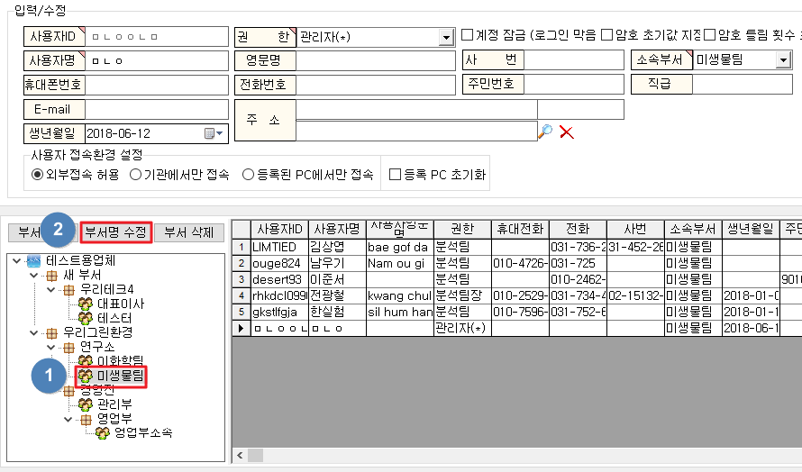

# 사용자관리

1. 아이랩을 사용하는 사용자를 등록하는 화면입니다.
2. 한번 지정된 사용자 ID는 변경 할 수 없습니다.
3. 부서를 생성하여 사용자들을 부서별로 등록, 관리 할 수 있습니다.
4. 사원증 양식이 등록 되어 있다면 사원증을 출력할 수 있습니다.

※ 항목 기준 변경은 권한이 있어야만 동작 할 수 있는 기능 입니다.  
\( 권한에 대한 자세한 사항은 [메뉴권한관리 매뉴얼](../10/0201.md)을 참고합니다. \)


추가된 사용자에게는 최초 로그인 이후 아이랩 상단 메뉴중 도구 -&gt; 비밀번호 변경 메뉴를 이용하여, 자신만이 알 수 있는 비밀번호로 변경하시길 권장해주세요.  
해당 화면은 말그대로 아이랩에 사용자를 등록하는 것이고, 추가한 사용자에게 항목을 배정하시려면 측정/분석관리 -&gt; 시험팀 관리 화면에서 사용자를 추가로 등록해주셔야 합니다.


## 부서관리

부서의 가장 위쪽에는 각 기관의 기관명이 표기됩니다.

그 아래쪽으로 원하시는 부서를 생성하고 관리할 수 있습니다.

부서관리는 트리구조로 되어있기 때문에 여러 그룹들을 묶어서 관리 할 수 있고, 마우스를 이용하여

드래그 & 드롭하여 이동하실 수 있습니다.

예\)

**부서추가**  
부서추가 버튼을 누름과 동시에 “새 부서”라는 부서가 트리 가장아래에 생성되며, 생성된 “새 부서”를 

선택 후 부서명 수정 버튼을 클릭하여 원하는 부서명으로 변경합니다.

**부서수정**

부서명을 수정합니다.

**부서삭제**  
선택한 부서를 삭제합니다.  
해당 부서에 포함되어있는 사용자가 있다면 부서는 삭제되지 않습니다.

## 조회

아무것도 입력하지 않고 조회하시면 기관 내의 모든 사용자가 조회 됩니다.  
사용자명, 또는 사용자ID를 입력하여 조회합니다.  
특정 부서를 조회하고 싶다면 부서명에만 부서명을 입력 후 조회합니다.

## 버튼설명

아이랩 사용자를 관리할 수 있는 버튼들 입니다.

**사원증 출력**  
아이랩에 등록되어있는 사원증 양식이 있다면  
선택한 사원의 사원증을 출력합니다.  
현재는 한번에 한명씩 출력 해야 합니다.

**추가**

새로운 사용자를 추가 합니다.

값유지 체크 후 추가하시면 선택한 사용자 정보가 그대로 복사되고, ID만 변경하여 저장하실 수 있습니다.

입력칸 우측상단에 있는 화살표 모양은 필수 입력칸을 의미 합니다.

권한 부분은 각 기관별로 지정한 권한을 의미 합니다. 또한 해당 권한에 따라 아이랩 내에서의 기능 차이가 있을 수 있습니다.

도구 -&gt; 메뉴권한관리 -&gt; 사용자별 권한 그룹탭에 있는 권한들이 보여집니다.

아무것도 보이지 않는다면 메뉴권한관리 매뉴얼을 참고하셔서 권한을 등록하신 뒤 진행해주세요.

\(메뉴권한관리 매뉴얼 : [https://help.ilabs.co.kr/009도구/메뉴권한관리.html](https://help.ilabs.co.kr/009도구/메뉴권한관리.html)\)

권한이 등록되어있는 경우라면 메뉴권한관리 화면을 볼 수 없더라도, 사용자를 추가할 수 있습니다.

 

**사용자 접속환경 설정**  
각 사용자별 아이랩 접속 환경을 설정합니다.  
※설정이 끝난후에는 반드시 아이랩 로그아웃 -&gt; 로그인을 진행하셔야 적용됩니다.  
\(해당 사용자에게 안내해주세요.\)

| 옵션 | 설명 |
| :--- | :--- |
| 외부접속허용 | 해당 사용자는 인터넷이 되는 환경이라면 어느 곳에서나 접속 할 수 있습니다. |
| 기관에서만 접속 | 해당 사용자는 기관내부에서 사용하는 네트워크에서만 접속 할 수 있습니다. |
| 등록된 PC에서만 접속 | 해당 사용자는 기관내부, 특정 PC에서만 접속할 수 있습니다. |
| 등록 PC 초기화 | 새로운PC에서 접속할 수 있도록 등록된 PC를 초기화합니다. |

**수정**

선택한 권한, 휴대폰번호, 직급 등 사용자의 정보를 변경합니다.

권한은 도구 -&gt; 메뉴권한관리 -&gt; 사용자별 권한 그룹 탭에서 쉽게 변경도 가능하십니다.

### 사용자 비밀번호 초기화


※ 아이랩 비밀번호는 암호화 되어 저장되기 때문에 저희쪽에서도 확인해 드릴 수가 없습니다.

※ 패스워드 초기값지정 체크는 수정버튼 클릭시에만 표기됩니다.


사용자가 비밀번호를 잃어 버린 경우 해당 화면에서 패스워드 초기화 지정에 체크 후 저장해주시면

0000으로 초기화되며, 그 이후에 다시 로그인하여 비밀번호를 변경 하시면 되겠습니다.

**저장**  
입력된 사용자의 정보를 저장합니다.

**삭제**

사용자는 삭제 할 수 없습니다.

해당 사용자가 관여하는 과거 접수건들이나 데이터들이 있을 수 있기 때문입니다.

퇴사한 직원 또는 일부 사용자를 아이랩에 접속하지 못하게 하시려면

해당 사용자 선택 -&gt; 수정 -&gt; 계정잠금체크 -&gt; 저장으로 순으로 처리해주세요.

**취소**  
입력 또는 수정 중인 내용을 취소하고 원래대로 돌아갑니다.

