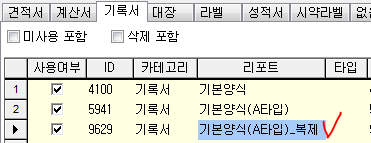

# 휴일관리


휴일관리에서는 각 기관들의 접수건들에 대한 검사시작부터 완료까지의 날짜에 휴일을 설정하여 검사기간을 늘릴 수 있습니다.



년도 추가시 해당 년도에 지정되는 국가 공휴일은 자동으로 반영되지만 임시공휴일이나   
각 기관의 휴일 등은 우리테크에서 알 수가 없기 때문에 직접 등록하여 각 접수건의 처리기한이   
조정되도록 설정해주셔야 합니다.


휴일 관리에 등록되어있는 날짜들은 검체유형의 처리기한 날짜를 계산할 때 제외되어 계산됩니다.  
\(오늘부터 1일로 계산되어집니다.\)  
예\) 접수일자 = 2016.06.10, 검체유형의 처리기한 = 업무일만 계산하되, 접수일자로부터 7일후 라면  
실제 처리기한은 2016.06.20 일 입니다.  
그런데, 이 날짜들 사이에 6월 14일이 휴일관리에 등록되어있다면, 처리기한은 휴일이 하루 더 있기 때문에  
2016.06.21 일로 자동 계산 되어질 것입니다.

## 버튼설명

년도 추가시 해당 년도에 지정되는 국가 공휴일은 자동으로 반영되지만 임시휴일, 각 기관의 휴일 등은  
우리테크에서 알 수 가 없기 때문에 직접 등록하여 각 접수건의 처리기한이 조정되도록 설정해주셔야         합니다.

**조회**

아무것도 입력하지 않고 조회하시면 왼쪽 목록에 보이는 모든 년도에 대한 휴일이 조회 되어집니다.

년도, 휴일명, 월 또는 일자를 입력하여 조회 할 수 있습니다.

년도 및 특정 날짜를 추가하고 관리 하는 버튼들 입니다.

**년도 추가**

1년치 휴일을 일괄로 생성할 때 사용 합니다.

조회된 휴일중 특정일자를 추가하지 않길 원한다면 체크를 해제하신 후 실행 하시면 됩니다.

**Excel**  
화면에 조회된 목록 중 우측에 있는 목록을 엑셀로 변환합니다.

**추가**

특정일자가 휴일로 지정 될 수 있도록 휴일을 추가 합니다.

비슷한 내용의 휴일을 등록하고 싶은경우 값유치 체크 후 추가 버튼을 이용해주세요.

날짜를 입력하고, 음력일 입력칸으로 마우스커서를 옮기게 되면 음력은 자동으로 계산되어 표기됩니다.

**수정**  
선택한 휴일에 대한 정보를 수정합니다.

**저장**  
입력된 휴일 정보를 저장합니다.

**삭제**  
선택한 휴일을 삭제 합니다.  
별도로 이력을 남기지 않기 때문에 실수로 삭제하셨다면 동일한 날짜로 휴일을 등록해주세요.

**취소**  
입력 또는 수정 중인 내용을 취소하고 원래대로 돌아갑니다.

