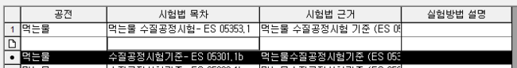

# 공전관리

아이랩에서 사용하는 항목의 시험법이 있는 경우, 이곳에서 등록된 공전을 시험법에 연결하여, 기록서, 성적서 등에서  
시험법 근거를 표기 할 수 있습니다.  
최초 화면이 열린 이후에 조회를 한번 해주셔야합니다.  
이곳에 저장된 시험법 목차, 시험법 근거는 시험법관리 화면에서 연동하여 기록서, 성적서 등에 표기할 수 있습니다.

**버튼 설명**

**·값유지**  
선택한 공전을 그대로 복사하여 목록의 가장 아래에 추가합니다.

**·추가**

버튼 클릭시 목록 가장 아래쪽에 한 행이 생성되며 각 열별로 직접 입력하여 공전을 등록합니다.

Insert 를 눌러 목록 중간 또는 새로운 행을 추가 할 수 있습니다.

각 컬럼에 맞게 값을 입력 한 뒤 엔터 또는 화살표키

\(

→,←,↑,↓

\)

로 커서를 이동하시면 자동으로 저장되어집니다.

기존 공전의 수정도 마찬가지로 진행하시면 됩니다.

처음에도 설명했지만 시험법과 연결하여 사용하는 경우, 시험법 근거에 입력한 부분이 측정/분석관리 메뉴에 있는

시험법 관리 화면에서 선택 할 수 있도록 표기되어 집니다.

시험법 관리 화면을 열어둔 상태로 공전이 추가되었거나 수정되었다면 정보 갱신을 위해서 시험법 관리 화면을 한번 닫았다가다시 열어서 사용해주세요.

\(

기록서, 성적서 등에는 데이터로 불러오는 형태로 지원되기 때문에 바로 적용되어집니다.

\)

**·삭제**  
선택된 공전을 삭제합니다.  
삭제 확인 메시지 이후에 선택된 공전이 삭제됩니다.  
선택된 공전이 사용되고 있는 시험법이 있는지 없는지 판단하지 않고, 삭제되니 참고해주세요.

