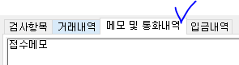
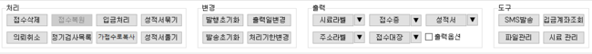
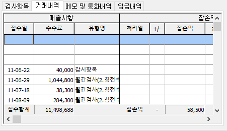

# 통합접수목록


※ 통합접수목록화면과 버튼은 권한이 있어야만 동작 할 수 있는 기능 입니다.   
권한에 대한 자세한 사항은 [메뉴권한관리 매뉴얼](https://help.ilabs.co.kr/~/edit/drafts/-LNNDXJkDUszNphZUsx3/10/0201)을 참고하시기 바랍니다. 


## 화면구성

통합 접수목록 화면은 아래와 같이 화면구성을 하고있습니다.

가장 위쪽에는 각 기관에서 사용중인 분야별로 탭을 나누어 표기하고있고,   
  
각 분야탭으로 이동하면 각 분야에 맞는 추가 조회 조건들을 이용할 수 있습니다. 

각 탭으로 분야가 보여지는 순서는 서비스요청으로 보내주십시오.

이 외에 자세한 내용은 각 영역별 매뉴얼을 참고바랍니다.

## 조회

해상도에 따라 조회 목록이 잘 보이지 않는다면 조회 버튼 우측에 “-” 버튼을 이용하여 조회 조건을 가리고 조회 목록부분을 조금 더 크게 볼 수 있습니다.

전체 탭에서는 아이랩에서 사용중인 전체 분야에 동일 조회조건을 적용하기 때문에 속도가 느려질 수 

있습니다. 화면 상단 -&gt; 전체 탭이 아닌 각 분야 탭을 선택한 경우 해당 분야에 대한 접수건만 

조회되어집니다.

화면 상단 -&gt; 각 분야 탭을 선택 할 경우 전체 탭에 없는 조회 조건을 이용할 수 있습니다.

예1\)

 화면 상단 -&gt; 수질 탭선택 -&gt; 전체 탭에는 없는 이중시료, 관정주소, 채수자 조회조건이 추가됩니다.

예2\)

 화면 상단 -&gt; 대기 탭선택 -&gt; 전체 탭에는 없는 시설번호, 배출시설, 방지시설 조회조건이 추가됩니다.

조회 조건 중에서 폰트 색이 다른 조회 조건들은 각 조회조건을 선택하여 다른 조회조건으로 사용할 수 있습니다.

**해당 조회조건 클릭시 \(ex 성적발행일\)** 한번에 한 조건씩 번갈아가면서 사용할 수 있습니다.

조회 목록은 화면 중간에 일반, 가접수, 삭제 탭으로 나뉘어집니다.

일반:가접수, 삭제, 의뢰취소 상태의 접수건을제외한모든 접수건조회

가접수 : 가접수 상태인 접수건만 조회

삭제 : 접수건의 상태가 삭제인 접수건만 조회

화면 하단부에는 조회목록에서 선택 한 접수건의 상세정보가 표기되어지고, 좌측하단, 우측하단 영역에 부여되어있는 기능들을 진행 할 수 있습니다.

조회목록에 메모아이콘이 있다면 해당 접수건에 참고사항이 적혀있다는 의미입니다.

우측 하단 -&gt; 메모 및 통화내역 에서 왼쪽 부분에 있는 접수 메모입니다

 -&gt; 

## 버튼설명

화면 중간에 있는 각 기능 버튼들에 대한 매뉴얼 입니다.

해당 부분에 버튼이 보이지 않는다면 권한이 없는 것이니, 필요하다면 관리자분께 요청하셔서 권한을 부여 받은 뒤 화면을 다시 열어서 사용해주세요.

**접수삭제**

선택한 접수건을 1차로 삭제합니다.

접수화면에서 접수건을 삭제 하는것과 동일하게 진행되며,

데이터의 물리적 삭제가 아니기 때문에, 삭제 탭으로 이동하셔 접수건을 복원 할 수 있습니다.

삭제 탭에서 영구삭제를 진행 하신 경우, 데이터를 물리적으로 삭제한 것이기 때문에 저희쪽에서도 복구해드릴 수 없습니다.

**의뢰취소**  
선택한 접수건에 대하여 접수번호를 유지한체 삭제가 아닌 의뢰취소 상태로 변경합니다.  
접수삭제는 접수번호를 유지하지 않기 때문에 추후에 삭제한 접수번호로 다시 접수할 수 있지만  
의뢰취소를 한경우라면 접수번호가 빠진것이 아니기 때문에 추후에 해당 접수번호로 접수한다면 동일 접수번호가 있기 때문에 접수할 수 없습니다.

**접수복원**

접수삭제 버튼으로 삭제된 접수건을 복원하는 기능입니다.

삭제 탭에서 영구삭제를 진행 하신 경우, 데이터를 물리적으로 삭제한 것이기 때문에 저희쪽에서도 복구해드릴 수 없습니다.

해당 접수건의 복원 접수번호는 새 접수번호 입력란에 입력된 접수번호로 복원됩니다.

1. 이미 동일한 접수번호가 있는 경우 새 접수번호를 자동생성하여 조회합니다.

1. 모든 접수건이 녹색이어야 복원 가능합니다.

1. 이미 존재하는 접수번호라면 “마지막 접수번호”를 참조하여 새 번호를 지정해주세요.

**정기검사목록**

현재 선택된 접수건들의 정보를 복사하여 선택한 만큼의 접수건을 정기검사목록에 미리 저장해두고,

추후 정기적으로 검사가 들어 왔을 때 기본 정보만 변경하여 다수의 신규 접수건을 생성 할 수 있도록 준비하는 기능입니다.

정기검사목록으로 만드는 접수건들은 실제 접수건들과 연결되지 않습니다.

해당 기능은 정기검사목록을 만들수만 있으며, 기본정보변경은 접수/시료관리 -&gt; 일괄 접수관리 화면에서 진행해주세요.

지역명, 각 접수건의 시설명칭은 필수 입력값 입니다.

**입금처리**

**아이랩을 통해 입금 정보를 관리하는 경우에만 사용해 주시면 됩니다.**

아이랩에서는 접수건에 저장된 확정수수료가 해당 접수건의 업체에 대하여 매출이 발생한 것으로 진행됩니다.

그렇기 때문에 해당 업체, 해당 접수건으로 입금처리를 하지 않는다면 추후 해당 업체에 대한 미수금, 입금액 등 회계 부분에 대하여 금액이 맞지 않을 수 있습니다.

선택한 접수건으로 저장된 거래처로 발생한 매출

\(확정수수료\)

에 대하여, 입금처리를 진행하는 기능입니다.

재무/영업관리 -&gt; 입금관리 화면에서도 입금처리가 가능합니다.

선택한 거래처에 대하여 접수된 접수건이 많을 수 있기 때문에, 입금금액에 대하여 정확히 어떤 접수건에 대한 입금인지 체크를 해주셔야 합니다.

예\)

1. 기본 정보를 입력하고, 입금된 금액을 먼저 입력합니다.

1. 조회된 목록에서 입금된 금액에 대한 접수건을 선택합니다.

1. 확인버튼을 클릭합니다.

**가접수로복사**  
선택한 접수건의 정보를 복사하여 가접수건\(가짜 접수건\)을 생성합니다.  
실제 접수건에는 영향을 미치지 않으며, 선택한 접수건과 비슷한 내용으로 접수해야 할 접수건이 많은 경우  
일부 정보만 변경 한 뒤 일괄로 실제 접수건으로 변경처리 할 수 있도록 준비하는 기능입니다.  
가접수로 생성된 접수건은 접수/시료관리 -&gt; 가접수자료관리 화면에서 조회하여 확인 할 수 있습니다.

**성적서묶기**

**성적서풀기**

**변경**

**발행초기화**  
선택 한 접수건의 상태가 성적서 발행이 끝난 “발” 인 경우 해당 기능을 이용하여 발행을 초기화 하여  
“승” 상태로 변경해 주는 기능입니다.  
상태가 변경되더라도, 출력이력이 남아있기 때문에 필요에 따라 확인해볼 수 있습니다.  
\(결재/성적관리 -&gt; 성적서 관리 -&gt; 해당 접수건 조회 및 선택 -&gt; 발행이력 버튼 클릭\)

**발송초기화**  
선택 한 접수건의 상태가 성적서 발송이 끝난 “■” 인 경우 해당 기능을 이용하여 발송을 초기화 하여 “발” 상태로 변경해 주는 기능입니다.

**출력일변경**

선택한 접수건에 대하여 성적서에 표기하는 출력일자를 변경하는 기능입니다.

※ 각 접수건의 최초 성적서 발행시에는 각 접수건에 따라 자동으로 출력일자가 부여됩니다.

※ 접수건의 상태가 “발” 이상의 접수건에 한해서만 변경이 가능합니다.

\(접수건의 상태가 “승” 이상의 상태 일때도 변경하고 싶다면 서비스요청으로 문의해주세요.\)

종이 출력 이전에 출력일을 변경하고 싶다면 결제/성적관리 -&gt; 성적서 관리 화면에 성적서 가상 출력 기능 이후에출력일을 변경하여 출력해주세요.

출력일 변경 팝업창에서 원하는 조건을 선택 -&gt; 변경하고 싶은 날짜로 변경 -&gt; 확인 버튼 클릭

**처리기한변경**

**\(완료예정일\)**

해당 접수건의 처리기한 일자를 변경하기 위한 기능입니다.

접수화면 처리기한 = 통합접수목록 완료예정일

 = 

**출력**

**양식 종류**  
공통/코드관리 -&gt; 리포트관리 화면에 각 탭별로 생성해둔 양식들과 연동되어 동작합니다.

* 시료, 주소라벨 = 공통/코드관리 -&gt; 리포트관리 -&gt; 라벨 탭  

* 접수증 = 공통/코드관리 -&gt; 리포트관리 -&gt; 접수증 탭  

* 접수대장 = 공통/코드관리 -&gt; 리포트관리 -&gt; 대장 탭  

* 성적서 = 공통/코드관리 -&gt; 리포트관리 -&gt; 성적서 탭  

**출력옵션**  
결재/성적관리 -&gt; 성적서관리 -&gt; 화면 중간에 있는 옵션들과 동일한 동작입니다.  
성적서 양식 선택 후, 미리보기 직전에 팝업되는 창에서 기능을 선택하여 사용할 수 있습니다.  
선택한 접수건에 대하여 성적서를 출력할 때만 동작합니다.  
옵션선택이 끝났다면 발행 버튼을 클릭하여 사용해주세요.

| 통합접수목록 | 성적서관리 |
| :--- | :--- |
|  |  |

* 발송지별 출력 : 같은 접수건이라도 접수건에 우편발송지 정보가 2개 이상일 때 선택하여 출력 할 수 있습니다.  

  아무것도 선택되지 않은 경우 일반 발송지로 적용됩니다.  

* * 모든발송지 - 아래와 같은 경우 라면 같은 접수건에 다른 주소로 2장이 출력됩니다.  
  * 일반 발송지 - 아래와 같은 경우 라면 일반으로 저장되어있는 주소로 1장이 출력됩니다.  
  * 부본 발송지 - 아래와 같은 경우 라면 부본으로 저장되어있는 주소로 1장이 출력됩니다.  

    
* 판정하지 않고 발행 : 성적서상에 적합,부적합을 표기하는 부분에 기본적으로 공란을 표기하고, 특정 양식에 원하는 문구를 지정할 수도 있습니다.  
* 배경이미지 출력 : 각 양식 또는 기관에서 지정한 배경이미지를 표기하여 출력합니다.  
* 결재성적서 : 결재 표기 여부를 체크합니다.\(각 양식에 별도 작업이 되어있는 경우에만 동작합니다.\)  
* PDF 변환 : 선택한 접수건을 미리보기, 종이 인쇄를 하지 않고, 바로 PDF 파일로 변환할 때 사용합니다.  

  \(선택한 접수건이 많은 경우, 변환 시간이 다소 소요 될 수 있습니다.\)

**도구**

**SMS발송** 아이랩 연동 서비스인 바로빌을 사용하는 기관에서만 사용이 가능하며, 거래처 정보 중 “업체명”, “휴대전화”에 입력된 정보로 문자메시지를 입력 -&gt; 전송할 수 있는 기능입니다.  
\(바로빌 충전 금액이 소진되어지며, SMS에 관한 자세한 내용은[SMS 전송 관리 매뉴얼](http://cafe.naver.com/labtools/book3662099/276)을 참고해주세요.\)  
바로빌 연동이 안된 기관중 바로빌 연동이 필요하다면 상시 선청이 가능하니, 서비스 요청으로 문의해 주세요.

**파일관리**

필요에 따라, 해당 접수건과 관련하여 아이랩상에서 표현하기 어려운 부분들 또는 참고자료들을 등록 해야 하는 경우파일을 등록, 관리 할 수 있는 기능입니다.

이미지 파일을 등록한 경우 기록서, 성적서 상에서 연동할 수 있습니다.

파일을 등록하면 아이랩 하단에 사용중인 저장공간을 일부 차지하게 됩니다.

\(전체 용량을 초과하게되면 과금이 될 수 있으니 참고해주세요.\)

**입금계좌조회**

**시료 관리** 타기관 전용 기능이기 때문에 별도 사용료를 받고있습니다.  
필요하시다면 서비스요청으로 문의해주세요.

## 하단영역

**상세정보**  
선택한 접수건의 정보를 접수화면에 프레임으로 보는 영역입니다.  
신규 접수건 추가를 제외한 모든 기능은 접수화면과 동일합니다.  
접수정보를 수정해야하는데 해당 영역이 작아서 잘 안보이거나 불편한 경우, 조회 목록에서 해당 접수번호 더블클릭하면  
해당 분야의 접수화면으로 이동하니 이용에 참고하세요.

**검사항목**

접수화면에서 접수한 검체유형과 항목들의 상세정보를 볼 수 있습니다.

목록을 가장 오른쪽으로 이동하여 해당 항목의 성적서 출력여부도 조절 할 수 있습니다.

\(최초 접수시 각 검체유형의 각 항목 -&gt; 성적서 출력여부를 따라가게 되어집니다.\)

**거래내역**

선택한 접수건의 업체에 대한 거래내역이 표기되어 집니다.

\(여러접수건 선택시 가장 마지막에 선택한 접수건으로 표기됩니다.\)

재무/영업관리 -&gt; 거래내역조회/관리 화면과 동일합니다.

**메모 및 통화내역**

선택한 접수건에 접수 참고사항 및 업체에 대한 메모가 표기되어집니다.

\(여러접수건 선택시 가장 마지막에 선택한 접수건으로 표기됩니다.\)

이곳에서 문구를 수정하고 빠저나가는 경우, 해당 접수건에 바로 반영됩니다.

**입금내역**

선택한 접수건의 업체에 대한 입금내역이 표기되어 집니다.

\(여러접수건 선택시 가장 마지막에 선택한 접수건의 업체명으로 조회됩니다.\)

