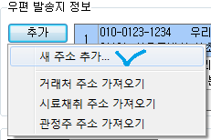
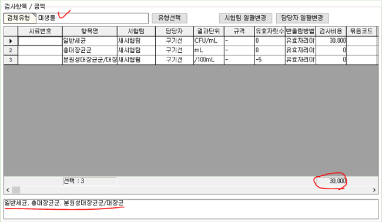
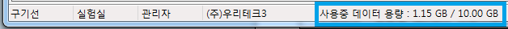

# 접수매뉴얼

아이랩을통해 시료접수를 하는 화면입니다.

아이랩 상단 메뉴중 접수/시료관리 -&gt; 각 분야별 접수화면으로 이동하여 사용합니다.

아이랩에서 사용하는 분야마다 입력하여 저장하는 내용은 다를 수 있지만 접수하는 방법이 크게 다르지 않기 때문에아이랩에서 가장 많이 사용되는 수질 접수화면을 토대로 매뉴얼을 작성합니다.

추후 각 분야에 대한 접수 매뉴얼이 필요할 경우 추가로 작성하도록 하겠습니다.

각 기관, 각 분야마다 접수번호 생성규칙을 다르게 설정할 수 있기 때문에, 접수번호 생성규칙이 필요하다면 서비스요청으로 문의해주세요.

각 기관설정에 따라 매뉴얼에서 안내하는 동작과 조금 다를 수 있지만 기본적으로 입력, 수정, 저장 하는 등의 방법은 동일하기 때문에 동작이 다른 부분에 대하여 자세히 알고 싶다면 서비스요청으로 어떤 부분에 대해서 알고 싶은지 문의해주세요.

기본적인 매뉴얼을 위한 문서이기 때문에 모든 기관설정을 안내하지 않으니 양해부탁드리며,

기관설정에 대해 궁금한 부분은 서비스 요청으로 문의해주시면 답변드리겠습니다.

접수화면이기 때문에 다소 내용이 많습니다. 꼭 다 알아야 하는것은 아닙니다.

하지만거래처정보, 우편발송지, 검체유형 선택하는 부분은 중요합니다.

## 화면구성

모니터 해상도가 PC마다 다르기 때문에, 아이랩을 최소 사이즈로 캡쳐하였으니, 실제 사용하실 때에는

각 모니터에 맞게 최대 크기로 변경하시면 문제 없이 화면을 모두 보실 수 있습니다.

접수화면에 있는 Spliter  \(파란색 막대기\)를 이용하여 보이지 않는 화면을 조절할 볼 수 있습니다.

## 버튼설명

접수화면에는 다양한 버튼 기능이 있기 때문에 영역별로 나누어 버튼에 대한 기능을 설명하겠습니다.

버튼이 보이지 않는다면,보이지 않는 버튼에 대한 권한이 없는 것이기 때문에 당황하지 마시고, 관리자분께 권한을 부여받은 뒤 사용해주세요.

**조회**  
표기된 접수번호를 조회하기위해 사용됩니다.  
접수화면이 처음 열리게 되면 가장 최근에 접수했던 접수번호가 표기되어집니다.  
\(아이랩에 접수된 접수번호가 하나도 없다면 공란으로 표기 될 수도 있습니다.\)

**이전**  
한번에 한번씩 표기된 접수번호의 바로 앞 접수번호를 조회합니다.  
바로 앞 접수번호가 없다면, 조회 할 접수번호가 없다는 메시지와 함께 조회가 되지 않습니다.

**다음**  
한번에 한번씩 표기된 접수번호의 바로 뒤 접수번호를 조회합니다.  
바로 뒤 접수번호가 없다면, 조회 할 접수번호가 없다는 메시지와 함께 조회가 되지 않습니다.

**재검**  
접수된 항목중에서 판정이 부적합이 나온 항목이 있을 때 판정이 적합인 항목들은 그대로 두고, 판정이 부적합인 항목들만 따로 빼서 접수할 수 있도록 해주는 기능입니다.  
기존 접수번호에 입력된 정보들은 모두 그대로 값유지 추가 되며, 항목선택만 자동으로 부적합난 항목들로 선택되어집니다.  
해당 기능을 이용하여 부적합 난 항목들을 다시 접수하게 된다면 접수화면 가장 하단에 있는 원접수번호 입력칸에 최초 적합이 난 항목들이 포함된 접수번호가 표기되어 집니다. 이후 저장 버튼을 눌러주셔야 신규 접수번호가 생성되어 집니다.  
부적합 난 항목에 대하여 재검이 필요할 경우 반드시 이렇게 진행해야 하는 것은 아니고, 해당 기능을 이용하시고 싶을 때만 이용하시면 되겠습니다.

**값유지 추가**  
조회된 접수건에 있는 내용을 보이는 그대로 복사하는 기능입니다.  
입력된 모든 정보를 복사한 후 변경 해야할 부분만 수정하여 사용하시면 되겠습니다.  
\(수정할 정보가 없다면 값유지 추가 후 바로 저장하시면 신규 접수번호가 생성됩니다.\)  
접수된 내용이 비슷하고, 여러건을 빠르게 접수할 경우 이용하시면 접수를 빠르게 진행하실 수 있습니다.

**추가**  
신규 접수건을 추가할 때 사용합니다. 각각의 입력칸에 정보들을 입력하고, 저장 버튼을 눌러야만 신규 접수번호가 생성됩니다.

**Option 영역**

가접수로 체크되어있는 상태로 저장한다면, 접수번호는 “가접수”로 생성되고, 실제 접수건과 연관없는 가짜 데이터가 생성되어집니다.

타기관 위탁여부는 접수하려는 접수건이 우리 기관의 시료가 아닌 타기관에서 검사를 의뢰한 시료인 경우

를 아이랩에서 체크하기 위해서 사용하는 기능입니다. 

해당 부분에 체크하고 저장한다면 아이랩 상단 메뉴중 접수/시료관리 -&gt; 통합접수목록 화면에서 

조회해볼 수 있습니다. 그 외에 별도 기능은 없으며, 필요한 경우에만 체크하셔서 관리하시면 됩니다.

**접수 정보 영역**

각 입력칸 우측 상단에 삼각형 표시가 있다면, 필수 입력칸이니 빈칸이 되지 않도록 값을 입력해주세요.

확정수수료 수정은 아이랩 상단 메뉴 중 -&gt; 도구 -&gt; 메뉴권한관리 -&gt; 해당 접수화면에 수수료 수정 가능 권한이 있어야만화면에서 보여집니다.

**거래처 정보 영역**

거래처 입력시 아이랩 상단 메뉴중 공통/코드관리 -&gt; 거래처 관리 화면에 등록되어 있는 거래중 사용여부가 체크되어있는 거래처들만 조회됩니다.

※중요합니다. 반드시 잘 읽어보시고, 기능을 이용해주세요.

**새 업체로 저장**  
업체명을 입력하여 조회하였는데, 검색되지 않는다면 접수화면에 입력칸들에 거래처 정보를 입력하고,  
새 업체로 저장 버튼을 눌러주세요. 이렇게 하면 신규 업체가 하나 생성되어지고 거래처관리 화면에서도 조회가 가능합니다.  
\(거래처 관리에서 신규 업체를 추가한 것과 같은 기능입니다.\)

**수정저장**

 ※중요합니다. 반드시 잘 읽어보시고, 기능을 이용해주세요.

검색된 거래처 정보를 변경하고 싶을 때는 접수화면에 입력칸들을 수정하고, 수정저장을 눌러주세요.

변경된 내용은 신규 접수건부터 기본적으로 적용됩니다.

\(거래처 관리에서 업체 정보를 변경한 것과 동일한 동작입니다.\)

만약 거래처 정보는 그대로 두고 해당 접수건에만 변경된 업체정보로 적용하시려면,

수정저장 버튼을 이용하시면 안됩니다.

이런 경우라면 업체를 조회하고, 입력칸의 정보를 변경하고, 상단에 저장 버튼을 클릭해주세요.

**업체명 복사**

 입력된 업체명을 클립보드에 복사합니다. 복사된 업체명을 원하시는 곳에 붙여넣기 할 수 있습니다.

**우편 발송지 정보 영역** ※우편 발송지는 추가, 수정, 삭제 됨과 동시에 접수건에 반영됩니다.

**추가**

1. 새주소추가를 선택하여, 원하는 주소로 선택하여 추가할 수 있습니다.

통합접수목록, 성적서 관리 화면에서 성적서 출력시 하나의 접수건에 여러 발송지가 있는 경우, 발송지유형이 “일반 발송지"인 주소가 우선순위로 출력됩니다.

\(선택적으로 일반, 부본 발송지를 개별 출력 또는 모든 발송지 \)

일반 1장, 부본1장 총 2장 성적서를 출력할 수도 있습니다.

1. 각 접수화면에 있는 주소들 중 하나를 선택하여 추가할 수도 있습니다.

**수정**  
입력된 발송지 정보를 수정합니다.

**삭제**

최종 삭제 문구 이후, 아래와 같이 선택한 우편 발송지 정보를 삭제합니다.

**검체유형 및 항목 선택**

실제 접수되어야 할 검사항목을 선택하는 기능입니다.

측정/분석관리 -&gt; 검사항목관리2.0 화면에서 사용여부가 켜져 있는 검체유형들만 조회되어집니다.

\(사용여부가 꺼져있는 유형은검사항목관리화면에서오른쪽에 있는 것처럼 표기됩니다.\)

각 접수화면에 분야별로 검체유형이 조회되고, 아무것도 입력하지 않는다면 해당 분야 모든 검체유형을 조회합니다.

\(검체유형이 많을수록 다소 시간이 소요될 수 있습니다.\)

조회된 검체유형 중 실제 접수할 항목을 선택하여 접수합니다. 전체선택, 일부선택 모두 가능합니다.

검체유형에 지정된 항목의 검사수수료가 합산되어 해당 접수건의 확정수수료로 책정되어 집니다.

\(필요시 수정도 가능합니다. 수정방법은 위쪽 확정수수료 부분을 참고해주세요.\)

선 검체유형에 접수하고자하는 항목이 없는 경우, 다른 검체유형에서 선택하여 접수할 수 있습니다. 

선택된 항목이 다른 검체유형에 속해있는 항목이라면, 해당 항목의 배경색이 빨간색으로 표기되어집니다.

검체유형에서 지정된 항목에 대한 담당팀, 담당자를 해당 접수건에서만 직접 지정할 수도있습니다. 

\(접수화면에서 직접 지정한 담당팀, 담당자는 해당 접수건 1건에만 적용되어집니다. 그 외는 검체유형에서 지정한 담당팀, 담당자를 따라갑니다.\)

 예1\)

 항목 선택 -&gt; 접수 

                                                                                                  ↓ 

 예2\)

 다른 검체유형에 포함된 항목 표기 

 예3\)

 해당 접수건에서만 다른 담당자로 지정. 

**접수메모 및 업체메모**

항목 선택 아래쪽에 있는 메모칸입니다. 해당 접수건에 대한 참고사항을 입력할 수 있습니다.

왼쪽 : 접수메모, 해당 접수건에 대한 참고사항입니다, 해당 접수건에 종속됩니다.

오른쪽 : 업체메모, 해당 접수건에 접수하는 업체에 대한 참고사항입니다, 접수건이 바뀌더라도 해당 업체에 종속 됩니다.

**수정**  
입력한 정보들을 수정할 때 사용합니다.  
각 접수화면별로 수정 권한이 없다면 버튼이 보이지 않을 수 있습니다.  
버튼이 보이지 않는다면 관리자분께 요청하셔서 권한을 받으신 후 사용할 수 있습니다.

**저장**

화면에 입력되어있는 정보들을 저장합니다.

가접수로 저장이 체크되어있는 상태로 저장한다면, 접수번호는 “가접수”로 생성되고, 실제 접수건과 연관없는

가짜 데이터가 생성되어집니다. 가접수 기능에 대한 자세한 내용은 가접수 자료관리 화면을 참고해주세요.

접수화면에 입력된 정보중, 우편 발송지 정보 부분을 제외한 모든 데이터는 저장 버튼을 눌러야만 저장이 되어집니다.

**삭제**  
화면에서 조회한 접수건을 삭제합니다. 삭제는 2단계까지 진행할 수 있습니다.

**최초삭제**

 해당 접수건을 삭제하여 아이랩에서 조회 및 참조 되지 않도록 합니다.

해당 접수건을 왜 삭제하는지 이유를 남겨야 한다면 아래쪽에서 삭제사유를 선택하셔서 이유를 남기시면 됩니다.

추후 통합접수목록에서 복원이 가능합니다.

\(삭제된 접수건 복원 방법\)

**영구삭제**  
통합접수목록 -&gt; 삭제 탭에 조회되는 데이터들만 영구삭제 할 수 있습니다.  
해당 탭에 대한 권한이 없다면 진행할 수 없습니다.  
영구삭제를 진행하게 되면, 데이터가 물리적으로 삭제되는 것이기 때문에 저희쪽에서도 복구해드릴 수 없으니, 영구삭제는 신중하게 결정해주세요.

**취소**  
입력된 데이터, 선택한 항목 데이터를 저장하지 않고 취소합니다.  
일부분 취소가 아닌 전체취소입니다.

**인쇄**

화면에 조회된 접수건과 같은업체, 같은분야로 접수된 접수건들에 대하여 접수증을 출력할 수 있는 

기능입니다.

추후 통합접수목록 화면에서도 동일하게 진행하실 수 있으니 참고해주세요.

**파일관리**

필요에 따라, 해당 접수건과 관련하여 아이랩상에서 표현하기 어려운 부분들 또는 참고자료들을 

등록 해야하는 경우 파일을 등록, 관리 할 수 있는 기능입니다.

이미지 파일을 등록한 경우 기록서, 성적서 상에서 연동할 수 있습니다.

파일을 등록하면 아이랩 하단에 사용중인 저장공간을 일부 차지하게 됩니다.

\(전체 용량을 초과하게되면 과금이 될 수 있으니 참고해주세요.\)

**접수SMS**  
아이랩 연동 서비스인 바로빌을 사용하는 기관에서만 사용이 가능하며, 거래처 정보 중 “업체명”, “휴대전화”에 입력된 정보로 문자메시지를 입력 -&gt; 전송할 수 있는 기능입니다.  
바로빌 연동이 안된 기관중 바로빌 연동이 필요하다면 상시 신청이 가능하니, 서비스 요청으로 문의해주세요.

