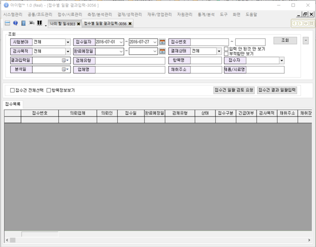
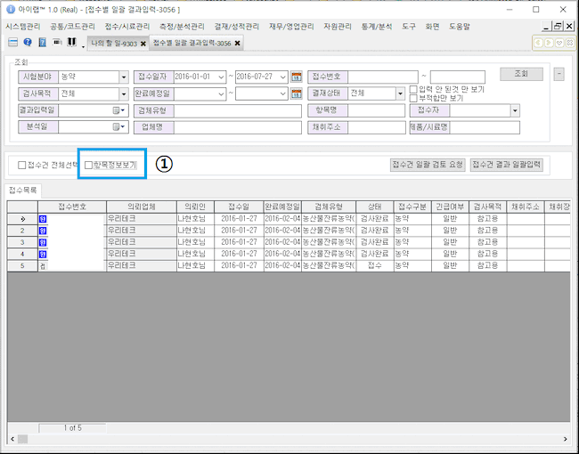
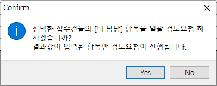
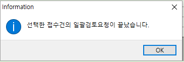
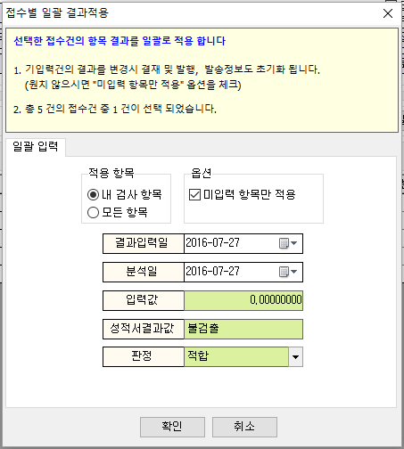
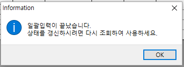
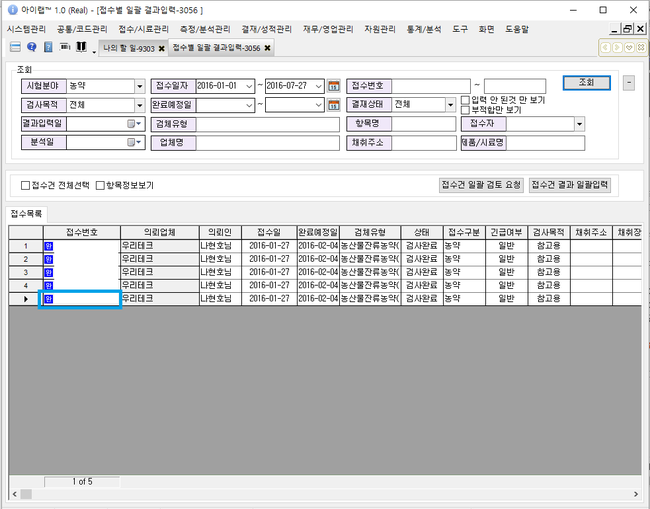

# 접수별 일괄 결과입력

※ 농약\(=잔류농약\), 농산물 분야에서만 사용 가능 합니다.

\(1접수건에 100건, 200건, 300건 이상의 항목이 한번에 접수되기 때문입니다.\)

기존에 결과등록2.0, 3.0 화면에서도 결과입력은 가능하지만 각 접수건별로 접수된 항목이 너무 많다 보니

조회 및 결과입력 시간이 많이 소요되어, 별도 화면으로 개발되었습니다.

단순하게 결과값과 성적서 결과를 수기로 입력하고 접수 된 모든 항목에 대하여 일괄 입력하는 방식으로 처리됩니다.

검사결과등록3.0 화면을 토대로 파생된 화면이기 때문에 중복되지 않는 부분만 안내합니다.

**화면구성-**

## 조회

아이랩의 다른 화면들과 조회 방법은 동일합니다.

원하시는 조회 조건을 입력 후 조회하여 사용합니다.

접수건 조회 이후, 선택한 접수건에 접수된 항목의 상세 정보를 보고 싶을 때, “항목정보보기”를 체크 하여 선택된 접수건의 항목 정보를 화면 하단에서 확인 할 수 있습니다.

\(선택된 접수건이 많은 경우 하단에서 조회 되는 시간이 다소 소요될 수 있습니다.\)

예\)

## 버튼설명

**접수건 전체선택**

접수목록 탭에 조회된 모든 접수건을 일괄선택합니다.

※ 항목정보보기가 체크 되어 있고, 조회된 접수건이 많을 수록 하단 항목정보를 보여 주기 위해 다소 시간이 걸릴 수 있습니다.

**항목정보보기**

선택한 접수건의 항목 결과값 입력 또는 다른 기능을 이용하기 위해 항목정보보기를 체크하셨다면

아이랩 상단 메뉴 -&gt; 검사결과등록3.0 화면과 동일하기 때문에 해당 부분의 매뉴얼을 참고해주세요.

**접수건 일괄 검토 요청**

※ 아이랩에서 3단 결재를 사용하는 기관에서만 사용할 수 있습니다. \(시험 -&gt; 검토 -&gt; 승인\)

선택한 접수건에 포함 되어 있는 항목중, 자신이 항목 담당자로 되어있는 항목들을 일괄로 검토요청 처리합니다.

선택한 접수건에 포함 되어 있는 항목이 많을 수록 다소 시간이 걸릴 수 있습니다.

**접수건 결과 일괄입력**

※ \[중요\] 팝업 창에 안내 부분을 꼭 읽어보시고 사용해주세요.

선택한 접수건에 접수 되어 있는 항목에 대하여 결과값을 일괄 입력합니다.

조회된 접수건에서 선택된 접수건을 카운트하여 보여 주니 참고해주세요.

팝업창에서 보여지는 입력값들을, 원하시는 값으로 입력 후, 확인을 눌러 결과 및 기본정보들을 일괄 입력합니다.

접수된 항목이 많은 경우 시간이 다소 소요될 수 있습니다.

&lt;다시 조회&gt;

