# 메뉴권한관리

**※ 메뉴권한은 아이랩 최초 셋팅시에만 우리테크에서 지원해드리며, 추후에는 문의사항에 대한 안내만 진행 해 드립니다.\(권한은 직접 설정 하셔야 합니다.\)**

**※ 아이랩 사용중에는 기관내 아이랩 관리자 또는 담당자가담당하는 것을 원칙으로 하기 때문에 권한 남용 또는 잘못된 권한 지정에 따른 책임을 우리테크에서 지지 않습니다.**

※ 관리자 권한의 무분별한 지정은 기관 내 문제의 소지가 될 수 있으니 참고해주세요.

※ 다른 사용자들에게 메뉴 권한 관리 화면을 열어주지 않는다면,다른 사용자들은 아이랩의 어떠한 권한도 수정 할 수 없습니다.

※ 각 기관별로 아이랩에서 사용하는 분야에 따라, 메뉴 권한에 표기되는 메뉴의 개수가 다를 수 있습니다.

자신의 권한을 확인 하는 방법.

1. 로그인 후 아이랩 좌측 하단에 있는 정보 확인.
2. 아이랩 상단 메뉴 중 공통/코드관리 -&gt; 사용자 관리 \(화면을 볼 수 있는 사용자의 경우\) 해당 화면에서 자신의 이름을 조회하여 권한을 확인.
3. 아이랩 상단 메뉴 중 도구 -&gt; 메뉴 권한 관리 \(화면을 볼 수 있는 사용자의 경우\) “사용자별 권한 그룹 탭”에서 각 사용자의 권한을 확인.

아이랩에서 사용중인 화면 및 화면에서 사용할 수 있는 기능들에 권한을 부여하여, 기관 내 사용자들의 사용 권한을 제어하는 화면입니다.

해당 화면에 없는 권한을 추가하고 싶으신 경우, 서비스 요청을 통해 문의해주세요.

확인 후 답변드리겠습니다.

최소 1명 이상의 관리자분께서 담당해주시길 권장합니다.

**화면구성-**

1. 권한 지정

메뉴권한, 나의 할 일 권한, 사용자별 권한 그룹 탭 모두 그리드 목록에서 각 행에 따른 권한을 부여 할 수 있습니다.

각 셀을 마우스 왼쪽 버튼을 클릭하시면 해당 행에 따른 권한을 부여 또는 미 부여할 수 있습니다.

※

메뉴권한 탭에서 지정된 내용은 각 화면이 열릴 때 적용 됩니다.

권한을 부여한 화면이 열려있었다면 화면을 닫고 다시 열어서 사용해주세요.

\(아래와 같은 예제처럼 권한이 없던 화면에 대한 권한이 부여된 경우, 아이랩 종료 후 재시작 하셔야 적용됩니다.\)

나의 할 일 권한에서 지정된 내용은 각 화면이 열릴 때 적용 됩니다.

권한을 부여한 화면이 열려있었다면 화면을 닫고 다시 열어서 사용해주세요.

사용자별 권한 그룹에서 지정된 권한은 아이랩 종료 후 재시작 하셔야 적용됩니다.

\(공통/코드관리 -&gt; 사용자 관리 화면 -&gt; 사용자 선택 -&gt; 수정버튼 클릭 -&gt; 권한 변경 -&gt; 저장 과 같은 기능입니다.\)

예\)

&lt;권한 부여&gt;

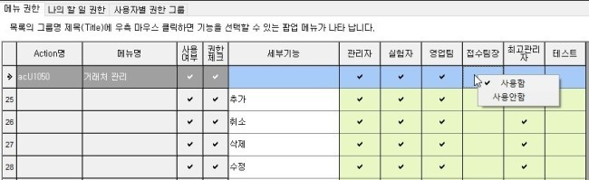

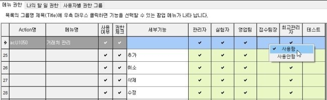

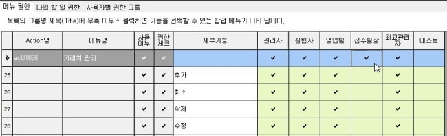

&lt;권한 해제&gt;

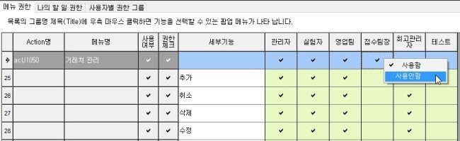

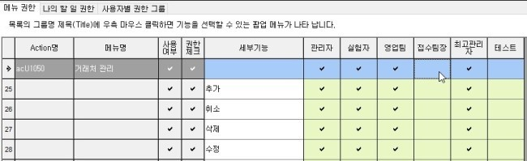

## 메뉴 권한

각 화면별 권한을 지정 할 수 있는 탭 입니다.

### 권한 추가

목록의 그룹명 제목\(Title\)에 우측 마우스 클릭하면 기능을 선택 할 수 있는 팝업 메뉴가 나타납니다.

팝업되는 메뉴에서 선택한 기능들을 사용할 수 있습니다.

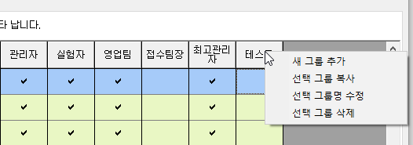

| 새 그룹 추가 | 새로운 권한 그룹을 생성합니다. 입력한 권한 명은 좌측부터 가나다 순으로 재 정렬됩니다. |
| :--- | :--- |
| 선택 그룹 복사 | 마우스 커서가 위치한 그룹에 대한 모든 권한을 복사하여 새로운 그룹을 추가 합니다. |
| 선택 그룹명 수정 | 선택한 그룹 명을 수정합니다. |
| 선택 그룹 삭제 | 선택한 그룹을 삭제 합니다.※ 해당 그룹을 삭제 하기 전에 사용자 관리 화면 또는 사용자별 권한 그룹에서해당 권한을 사용하는 사용자가 있는지 확인 후 삭제 하시길 권장합니다. |

나의 할 일 권한

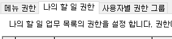

아이랩 최초 로그인 시 열리는 나의 할 일 화면에 있는 화면 구성 버튼 -&gt; 위쪽, 아래쪽 프레임에 대한 권한입니다.

여기서 지정되지 않은 기능은 나의 할 일 화면에 있는 화면 구성 버튼 -&gt; 위쪽, 아래쪽 프레임 지정 시 회색으로 표기 됩니다.

&lt;권한 해제&gt;

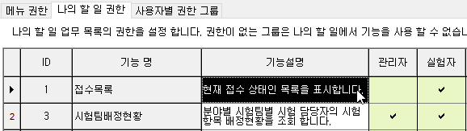

&lt;나의 할일 화면에서 확인&gt;

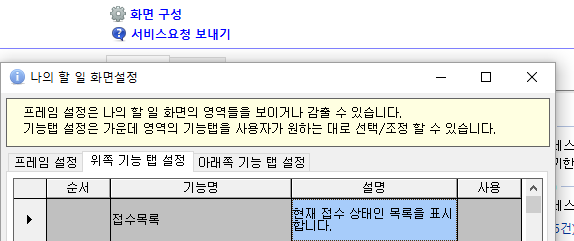

권한이 없기 때문에 사용을 하려고 해도 아래와 같은 메시지가 나타납니다.

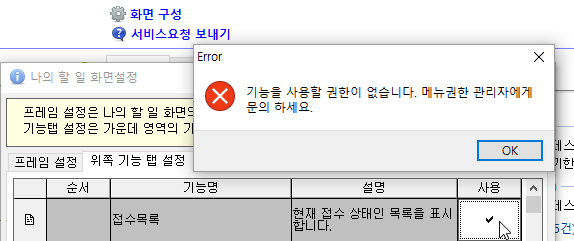

## 사용자별 권한 그룹

※ 권한 그룹 추가는 메뉴 권한 탭에서 진행해주세요.

※ 권한 지정 또는 변경 시 해당 권한을 받은 사용자는 아이랩 종료 후 재시작 하셔야 변경된 권한으로 적용됩니다.

사용자 목록에서 간편하게 사용자의 권한을 변경하는 기능 입니다.

\(공통/코드관리 -&gt; 사용자 관리 화면 -&gt; 사용자 선택 -&gt; 수정버튼 클릭 -&gt; 권한 변경 -&gt; 저장 과 같은 기능입니다.\)

각 사용자의 권한을 원하는 권한으로 지정 또는 변경 할 수 있습니다.

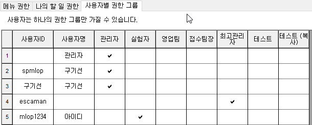

공통/코드관리 -&gt; 사용자 관리 화면에서 계정이 잠겨있는 사용자는 해당 화면 목록 아래쪽에 회색으로 정렬됩니다.

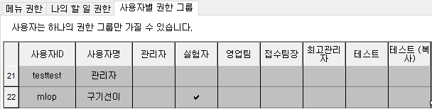

