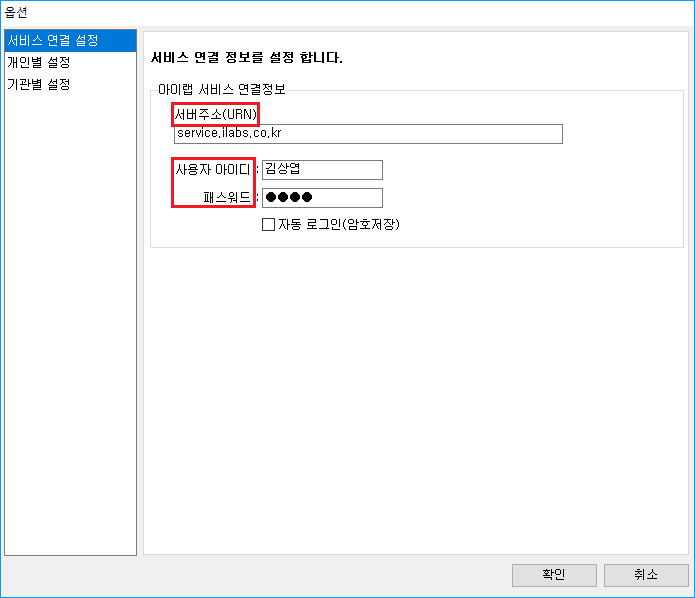
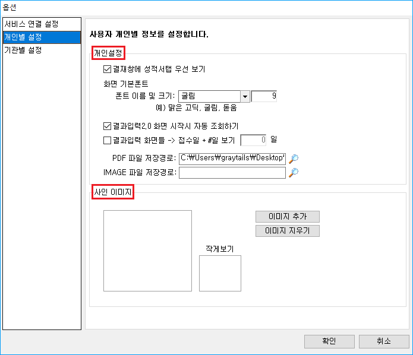
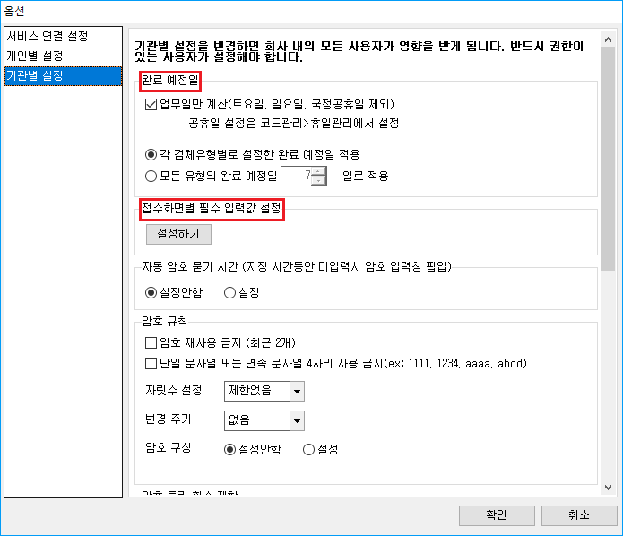

# 옵션

## 1. 개요

> 이 화면은 아이랩의 옵션을 설정하기 위한 화면입니다.  
> 서비스, 개인별, 기관별 옵션을 설정할 수 있습니다.

## 2. 서비스 연결 설정

### 2-1. 서버주소

⚠️초기세팅시 세팅되므로 해당 영역은 수정하지 않습니다.

### 2-2. 아이디, 패스워드

아이랩을 사용하시는 컴퓨터에서 사용자 아이디, 패스워드를 입력시 해당 컴퓨터에서 아이랩 실행시 기본 로그인 정보가 저장됩니다.  
\(⚠️여러 사람이 공용으로 사용하는 컴퓨터에는 해당 설정을 비추천합니다. \)

## 3. 개인별 설정

### 3-1. 개인설정

아이랩 화면의 폰트나 글씨체, 결과입력2.0 화면의 자동조회 조건, PDF, IMAGE 파일 저장경로를 설정합니다.

### 3-2. 사인 이미지

`이미지 추가` 버튼을 클릭하여 사인을 등록할 수 있습니다.  
등록한 사인 이미지를 `기록서 A타입` 출력시 연동할 수 있습니다.

사인 연동법에 대한 자세한 사항은 아래 매뉴얼을 참고합니다.  
[사인 연동법 매뉴얼](../faq/a.md)

## 4. 기관별 설정

\(**⚠️기관별 설정을 변경하시면 회사 내의 모든 사용자가 영향을 받게 되므로 반드시 권한이 있는 사용자가 확인후에 진행합니다.**\)

### 4-1. 완료 예정일

아이랩에서 공휴일 지정이 가능하며, 검체유형에서 자동으로 결정되는 완료 예정일 값도 설정이 가능합니다.

### 4-2. 접수화면별 필수 입력값 설정

접수화면에서 각 칸마다 필수 입력값 설정이 가능합니다.


해당기능이 보이지 않을시, 서비스요청을 보내주시면 해당기능의 권한부여를 진행해드리도록 하겠습니다.


입금자와, 확정수수료를 추가하였을때 이미지입니다.   
  
상단의 **미리보기** 버튼을 이용하시면 추가하셨을때 **어떤 정보부분에 어떤 칸이 필수항목으로 설정** 되었는지 확인이 가능합니다.

원래대로 되돌리기 기능은 초기셋팅값으로 되돌리는 기능입니다. 너무 많은 필수항목값이 설정되었을때  
이용하셔서 원하시는 항목만 진행해보시기 바랍니다.

### 4-3. 자동 암호 묻기 시간

시간을 지정하여 일정 시간동안 아이랩을 사용하지 않을 경우 암호를 재입력하는 팝업창을 설정합니다.

### 4-4. 암호 규칙

암호 설정시 규칙을 설정하며 변경 주기 또한 설정이 가능합니다.

### 4-5. 성적서 출력

성적서출력 버튼에 대한 설정이 가능합니다.

### 4-6. SMS 옵션

SMS 옵션을 **✔** 시 SMS전송관리에 **✔** 한 옵션의 임시저장된 SMS 를 생성합니다.  
\(옵션 사용 희망시 기술지원팀에 문의 바랍니다.\)  
해당 부분은 [SMS전송관리 매뉴얼](../03/1101.md)을 참고합니다.

