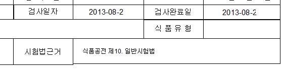
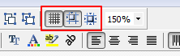
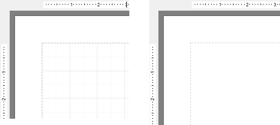
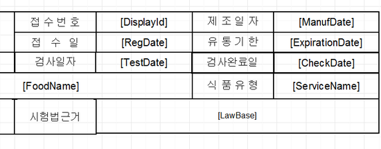
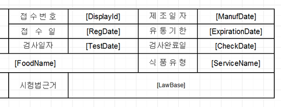

# 리포트 출력시 가로세로 줄 정렬

## Q

리포트 디자이너에서 양식을 수정했는데요.

가로세로 줄이 맞지 않습니다.

또, 선굵기도 제각각 다릅니다.

깔끔하게 할 수 있는 방법이 없을까요?

\(아래 그림 참조\)

## A

답변 드리겠습니다.

선이 잘 맞지 않고, 굵기도 달라 보이는건 해당 선이 인접해 있는 다른 컨트롤과 딱 맞게 배치된게 아니라 "겹쳐져"서 선이 더 넓어 보이는 현상 입니다.

해당 증상은 간단하게 해결 및 예방할 수 있습니다.

리포트 디자이너의 윗쪽에 보시면 아래와 같이 아이콘 3개가 보이실겁니다.

이 3개의 버튼을 이용하시면 리포트를 더욱 깔끔하게 만들 수 있습니다.

첫번째 버튼은 디자이너 배경에 너비와 높이를 잴 때 유용한 그리드 선을 보여주는 역할을 합니다.

버튼을 누르면 그리드선이 생겼다 없어졌다 하는걸 볼 수 있습니다.

두번째 버튼은 선을 그리거나, 움직일 때 자동으로 좌표를 일정하게 조절해서 좌표를 0.1 단위로 움직이도록 만들어주는 옵션 입니다.

이게 켜져 있으면 리포트 작업을 새롭게 하실 때 질문글의 캡쳐처럼 굵게 만들어지지 않습니다.

옵션으로 계속 켜지는 기능이니, 꼭 버튼을 눌러주세요.

세번째 버튼은 이미 만들어진 선이나 메모들의 좌표 및 너비를 일괄 조절 하는 기능 입니다.

질문글처럼 이미 굵기가 차이 나는 리포트의 디자인을 즉시 수정합니다.

리포트 디자이너에서 자판의 Ctrl 버튼을 누르고 마우스 왼쪽 클릭을 해서 드래그를 하시면 실제 드래그한 범위만큼의 컨트롤이 모두 선택 됩니다.

그 상태에서 세번째 버튼을 눌러주시면 즉각 수정 됩니다.

이랬던 양식을

버튼 한 번으로 이렇게 깔끔하게 정리할 수 있습니다. 질문 올리신 양식도 보기 불편하시면 Ctrl + 마우스 왼클릭 드래그로 범위를 잡으신 뒤 세번째 버튼을 눌러주세요.

감사합니다.

