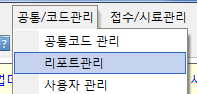
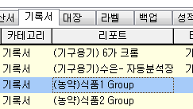
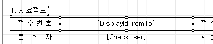
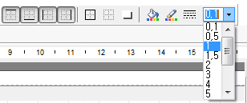
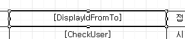
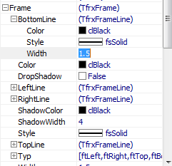
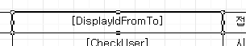

# 출력물의 라인 굵기 조절하기

## Q

리포트 디자이너에서 선 굵기 조정 하고 싶은데 어떻게 하면 되나요?

## A

기록서 라인 굵기 수정 방법에 대해 설명 드리겠습니다.

1. 리포트관리 메뉴 실행  

   

2. 기록서 탭에서 원하는 기록서 양식 선택, 리포트 디자인 버튼 클릭  

   

3. 굵기를 변경할 메모 선택  

   

4. 위, 아래, 왼쪽, 오른쪽 모든 테두리 라인 변경시 툴바에서 테두리 변경 툴바 이용 숫자 부분이 굵기 입니다.

   

   

5. 특정 방향의 선 굵기만 변경하고자 할 경우 속성창을 이 Frame이라는 속성창 아래에 있는 값들을 수정 해 주면 됩니다.  

   만약 아래 선만 굵게 하고 싶다면 BottomLine의 Width값을 수정 하면 됩니다.  

   

   

   보통 기본 선 굵기는 0.1 입니다.  

   0.5, 1, 1.5등 값을 변경 해가면서 원하시는 굵기로 조정 하시면 됩니다.

