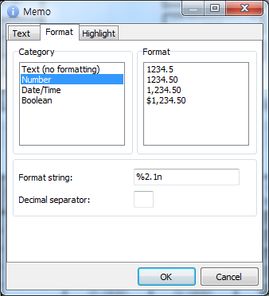

# 리포트 소수점 자리 고정 방법

## Q

기록서나 성적서 리포트에서 숫자값이 나올 때 항상 소수점 첫째 자리 값이 나오도록 고정을 하고 싶습니다.

ex\) -1 은 -1.0 으로.  
30 은 30.0 으로.

어떻게 해야 하나요?  
방법을 알려주세요.

## A

리포트의 메모에 아래와 같이 서식을 걸면 됩니다.

1. 리포트 디자이너에서 적용할 메모칸 더블 클릭

1. Format 탭 클릭

1. Number Category 선택

1. 두 번째\(1234.50\)나 세 번째\(1,234.50\) Format 선택

1. Format string 의 값에서 . 뒤의 숫자를 원하는 자리수로 변경

**&lt;서식 설정 설명&gt;**

 리포트 디자이너에서 서식을 적용할 메모 칸을 더블 클릭 한뒤

" Format " 탭을 선택하면 위에 첨부한 그림 처럼 서식 편집 창이 열립니다.

총 4개의 Category 중에 하나를 선택하시면

Category 에 해당 하는 서식을 적용할 수 있습니다.

2. Text \(no formatting\)

▶ 서식 없이 연동된 값을 그대로 보여 줍니다.

2. Number

▶ 숫자 관련 서식을 지정 합니다. \(천단위 구분 기호, 소숫점 자리수, 

$ 표시\)

2. Date/Time

▶ 날짜와 시간 관련 서식을 지정 합니다.

2. Boolean

▶ 참, 거짓을 표현하는 서식을 지정 합니다.

숫자값의 소수점을 지정하려면

Number Category 를 선택 하시면 됩니다.

Number 를 선택 하시면 4가지의 Format 이 나타납니다.

3. 1234.5

▶ 숫자의 기본 타입 입니다. 소수점 이하 가장 마지막에 붙는 0들은 자동 무시 됩니다.

ex\) 1.50 &gt; 1.5

3. 1234.50

▶ 소수점 자리수를 지정할 수 있습니다. 지정한 자리만큼 빈 공간은 0으로 채웁니다.

ex\) 소수점 셋째 자리로 고정시 1.5 &gt; 1.500

3. 1,234.50

▶ 천단위 구분 기호와 소수점 자리수를 함께 지정하는 서식 입니다.

1000 이 넘는 값은 천단위 구분 기호 , 가 자동으로 붙습니다.

ex\) 소수점 셋째 자리로 고정시 9876.5 &gt; 9,876.500

3. 

$1,234.50

▶ 3번과 동일 하며 숫자의 앞에 

$ 표시를 붙입니다.

천단위 구분 기호를 넣느냐 안 넣느냐에 따라 2번 또는 3번 Format 을 선택 하시면 됩니다.

원하는 Format 을 선택 하시면 아래 쪽의 Format string 값이 변경 됩니다.

여기에서 . 뒤의 숫자 값을 수정 하여 자리수를 지정할 수 있습니다.

%2.2n 은 소수점 둘째 자리까지 이며

만약 셋째 자리 까지 항상 나오게 하려면 %2.3n 으로 변경 하시면 됩니다.

