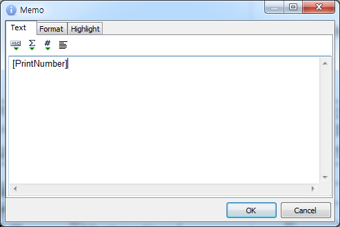

# 성적서에 발행이 몇번째인지 표시하는 방법

## Q

하나의 접수 건을 여러 번 출력 하는 경우가 있습니다.

그래서 이 성적서는 총 몇 번째 발행인지를 표기 하고 싶은데, 그럴 때는 어떻게 해야 하나요?

## A

성적서를 출력할 때 마다 내부적으로 누가, 언제, 어떤 양식으로 출력했는지를 기록 하고 있습니다.  
이 기록 중에 "몇 번째" 출력본인지의 데이터를 성적서에 포함할 수 있습니다.  
아래 순서대로 진행해보세요.

메뉴 : 공통/코드관리 &gt; 리포트 관리

1. 수정하려는 성적서 양식을 선택 후 "리포트 디자인" 버튼을 눌러 디자이너 폼을 띄웁니다.  
2. 화면 왼쪽의 그리기 도구 중에 "A" 버튼을 누른 뒤 화면에 원하는 위치, 크기만큼 드래그 하여 새로운 메모를 추가 합니다.  

   

3. 더블 클릭 하여 메모 편집창을 띄운 뒤 \[PrintNumber\] 라고 입력 합니다.  

   

4. 리포트를 저장 후 출력 해서 내가 올려놓은 메모칸에 "접수번호-출력횟수" 형태로 잘 나오는지 확인합니다.  

   

