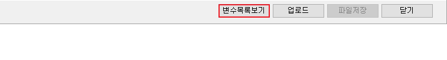

# 리포트에서 변수목록 보는 방법

## Q

리포트 양식에서 사용할 수 있는 변수목록은 어디에서 확인하나요?

## A

리포트 양식에서 사용할 수 있는 변수목록은 리포트 디자인 화면에서 볼 수 있습니다.

1. 아이랩 메뉴중 **공통/코드관리 -&gt; 리포트관리2.0** 화면으로 이동
2. 리포트 양식중 원하는 양식을 선택하여 **①영역 더블클릭** 또는 **②리포트 디자인** 클릭하여 이동  

   \(변수목록 확인은 해당 화면의 카테고리와 상관없이 모든 양식에서 확인 가능합니다.\)  

   

3. 해당 양식 우측 상단에 있는 변수목록보기 버튼 클릭  

   

4. 변수목록보기 버튼 클릭 후 우측에 나오는 목록에서 원하는 변수를 확인  

   


### 확인사항

* **카테고리**별로 사용하는 변수가 다를 수 있어 구분되어 있습니다.  
* **분야**별로 데이터를 입력하는 곳이 다를 수 있으니 **분야**열도 함께 확인하시기 바랍니다.  
* **키워드**를 입력하시면 해당 변수명에 대해 **검색**하실 수 있습니다.  
* **해당열을 더블클릭**시 해당 변수명을 복사하여 **Ctrl+V** & **붙여넣기**로 사용하실 수 있습니다.  



### 주의사항

* 변수는 필요에 따라 추가가 되는 경우가 있기 때문에 해당 목록에 보이지 않을 수 있습니다. 
* 아이랩에서 사용하는 모든 데이터에 대한 모든 변수를 특정 양식에 모두 포함 할 수 없습니다. 

  \(각 화면별, 양식별 용도가 모두 다르기 때문입니다.\) 



원하시는 데이터를 변수목록에서 확인하실 수 없는 경우 [서비스요청](https://help.ilabs.co.kr/11/service) 을 통하여 문의주시기 바랍니다.


