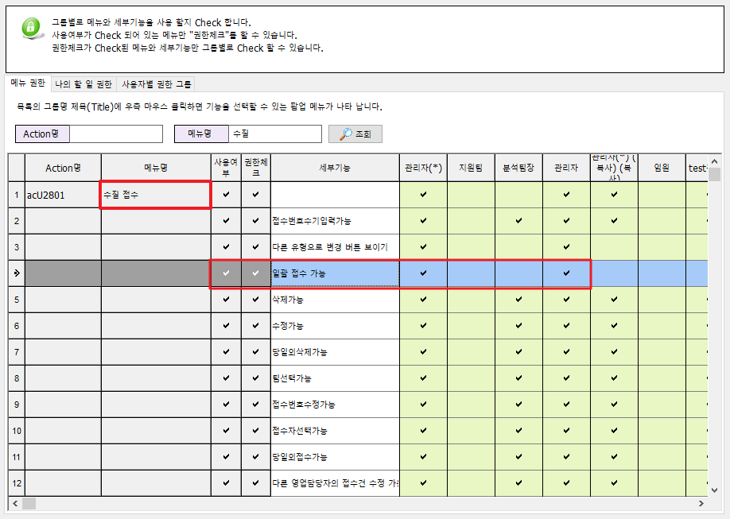

# 대량시료에 따른 접수를 일괄적으로 하는 방법


 일괄접수를 진행하시기 전에 먼저 메뉴가 보이지 않는 분들은 관리자 계정을 통하여메뉴권한관리에서 일괄접수에 대한 권한을 활성화해주시기 바랍니다. 권한체크를 따로 표시하지 않을시 모든 사용자가 이용할 수 있습니다.


위 그림과 같이 접수화면에서 일괄접수를 선택하고 접수를 진행할 수량을 선택하시면바로 우측의 초록색의 진행바가 이동하면서 일괄접수가 완료되게 됩니다.

여기서 알아두실 점은 접수번호는 생성된 접수번호로 부터 차례대로 생성되며 접수내용 또한 모두               
동일하게 생성되기 때문에 접수건마다 거래처가 다르거나 항목이 조금씩 다를시우측상단의 값유지버튼을 이용하시면 됩니다.


 접수된 건을 한번에 수정하고 싶으시다면 접수/시료관리 - 통합접수목록의 "일괄수정" 버튼을 이용하시면 일괄적으로 수정 또한 가능하니 접수시 참고하시기바랍니다.


