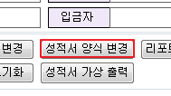
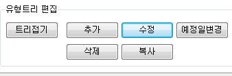
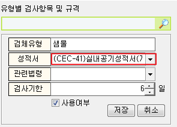

# 성적서 기본 연결양식 변경법

## Q

기본 연결 양식을 어떻게 변경 하는지 알려주세요.

## A

양식은 각 검체유형별로 설정할 수 있으며

설정 방법은 2가지 입니다. \(택일\)

1. 성적서 관리 화면을 이용하는 방법

메뉴 : 결재/성적관리 &gt; 성적서 관리

1\) 양식을 변경 하려는 접수 건을 조회 후 "성적서 양식 변경" 버튼을 누릅니다.

2\) 펼쳐지는 리스트 에서 원하는 양식을 선택 합니다.

**※\(1회 변경 시 그 접수건과 동일 유형의 접수건 기본 양식이 모두 변경 됨\)**

1. 검사항목관리 메뉴를 이용하는 방법

메뉴 : 측정/분석관리 &gt; 검사항목관리 2.0

1\) 양식을 수정 하려는 검체유형을 선택 합니다.

2\) "수정" 버튼을 누릅니다.

3\) 양식 수정 후 "저장" 을 누릅니다.

