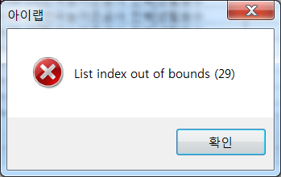
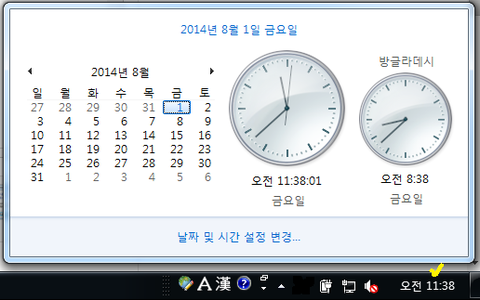
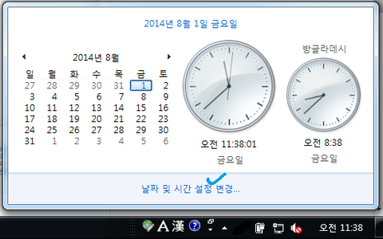
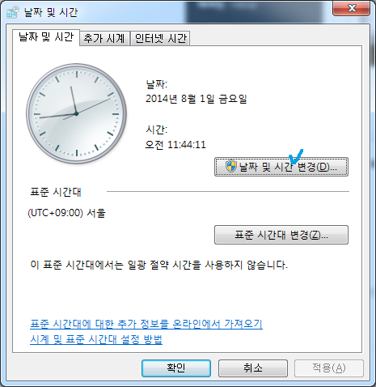
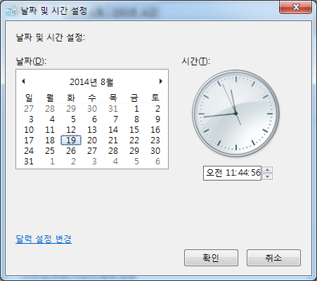
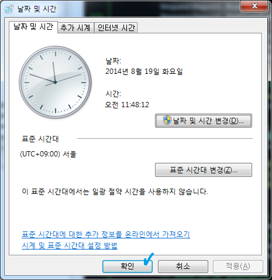

# 아이랩 실행 오류 문제

## Q

아이랩 실행 또는 로그인 시 오류메시지가 반복해서 발생합니다.

다른 사용자의 컴퓨터에서는 정상적으로 로그인이 됩니다.

## A

안녕하세요 답변드립니다. 해당 오류는 자신의 PC에 설치되어있는 운영체제인 Windows\(윈도우\) 와 충돌이 일어난 것입니다. 아이랩을 사용하기위한 윈도우 기본 설정 방법을 확인해 보시고, 해당 설정대로 되어있는지 확인해 보시기 바랍니다. \(해당 내용은 Windows7 기준으로 설명하도록 하겠습니다. 윈도우 XP, 윈도우 8도 크게 다르지 않습니다.\)

※ 실행되어있는 아이랩 종료.

※ 2번에 나오는 디스플레이 설정을 변경하기 위해서는 윈도우 로그오프를 진행해야하니, 저장해야 할 문서 또는 저장해야할 파일들은 미리 저장해주시기 바랍니다.

### 1.사용자 계정컨트롤 설정.

1. 시작 -&gt; 제어판으로 이동.
2. 사용자 계정 선택

   

   ＊ 사용자 계정 메뉴를 찾기가 어려우시다면 제어판 우측 상단에 있는 보기기준을 변경하여 찾아보시기 바랍니다.

   

3. 사용자 계정 컨트롤 설정 변경 클릭.

   

4. 왼쪽 막대를 기본 값 -&gt; 다음의 경우 항상 알리지 않기 로 이동

   

   

5. 확인 버튼 클릭

### 2.디스플레이 설정

1. 시작 -&gt; 제어판으로 이동.
2. 디스플레이 선택

   

   ＊ 디스플레이 메뉴를 찾기가 어려우시다면 제어판 우측 상단에 있는 보기기준을 변경하여 찾아보시기 바랍니다.

   

3. 선택되어있는 폰트 크기가 크게 또는 중간으로 선택되어있다면 작게로 변경.

   

   

4. 적용 버튼 클릭.
5. 로그오프 선택 창이 팝업되면 지금 로그오프를 해주세요.

   

   ※ 저장할 파일들이 있다면 나중에 로그오프를 선택 하시고, 파일들을 저장 후

   시작 -&gt; 시스템 종료 우측에있는 ▷\(오른쪽 화살표\) 선택 -&gt; 로그오프 선택을하여 로그오프해주세요.

   

### 3.현재 PC 시간을 오늘 날짜로 설정

1. 윈도우 우측 하단에 시간이 나온 부분을 클릭.

   \(오늘 날짜가 아닐때만 진행해주세요~\)

   

2. 날짜 및 시간 설정 변경... 부분 클릭

   

3. 팝업되는 창에서 한번더 날짜 및 시간 설정 변경버튼 클릭.

   

4. 현재 날짜를 선택, 현재 날짜로 입력 한 후 확인 버튼 클릭.

   

5. 다시한번 확인 버튼 클릭.

   

3가지 설정사항을 확인 후 아이랩 실행하여 로그인해보시기 바랍니다.

