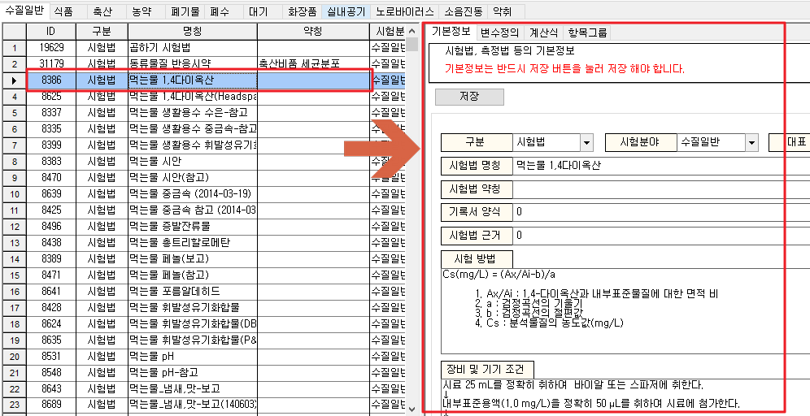

# 아이랩 리포트 관리에서 각 검체유형의 테두리 변경방법

리포트 테두리의 설정에는 두가지 방법이 있습니다.  먼저 간단한 설정부터 안내해드리겠습니다.

우선 공통/코드관리의 리포트관리로 가서 수정하고자 하는 리포트를 실행합니다.

① 그 다음 테두리를 수정하거나 삽입할 텍스트 칸을 선택합니다.

② 마지막으로  원하시는 선을 삽입하시면 됩니다.


녹색박스의 경우 선굵기나 모양등을 세밀하게 설정할 수 있는 창입니다.  선을 추가할때, 이미 선이 추가가 되어 있거나 굵기 또는 화면의 확대에 따라 선표시가 안보일 수 있으니 옆의 미리보기 칸을 참고하셔서 진행해보시기 바랍니다.


다음 두번째 방법으로는 좌측의 선택한 칸에 대한 상세내용\(Object inspector\) 을 이용한 세부설정입니다.

첫번째와 같이 변경하고자 하는 텍스트를 선택하시면 좌측에 그 칸에 대한 세부적인 설정이 나타납니다.

| bottom line : 프레임 선의 하단의 선을 뜻합니다. |  |  |
| --- | --- | --- | --- | --- |
| left line : 프레임의 좌측 선을 담당합니다.  |  |  |
| right line : 프레임의 우측 선을 뜻합니다.  |  |  |
| top line : 프레임의 상단을 담당합니다. |  |  |
| typ : 모든 라인을 동시에 조절합니다. |  |  |

변경하고자 하는 기본라인에 맞추어 style\(선모양\)과 width\(넓이\)를 조정해주시면됩니다.

