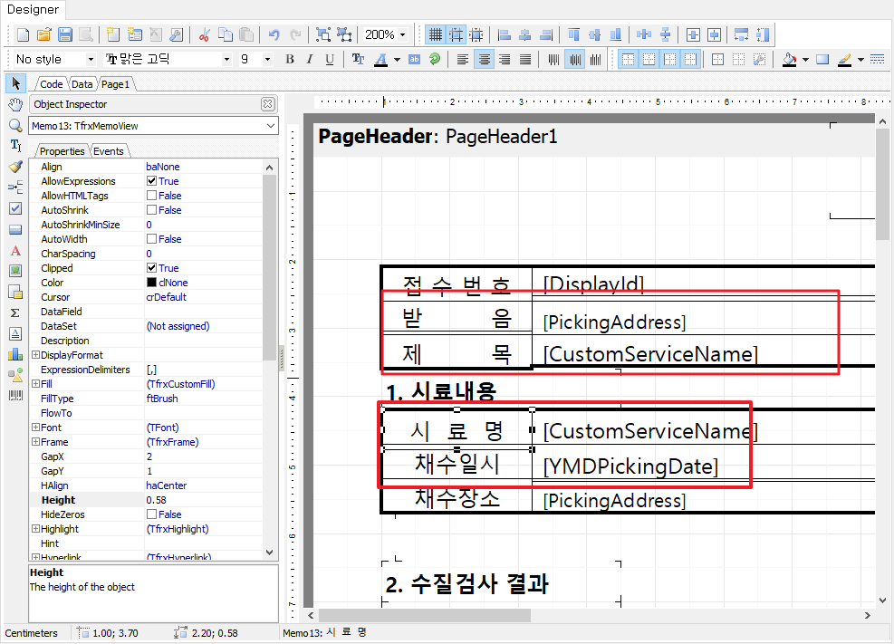

# 리포트 작성시 텍스트 상자를 틀에 맞게 일괄로 수정하기

## Q

성적서 리포트의 변수칸의 넓이나 높이가 잘 맞지 않고 어긋나 있습니다. 늘려도 다른 틀에 맞지 않고 어긋나있는데 수정할 수 있는 방법이 있을까요?

## A

해당 현상은 0.1단위로 움직이는 기능을 활성화 시키지 않은 상태로 수정했기 때문에 발생하는 현상입니다.

> **※ 아이랩 리포트 디자인 화면의 경우 반드시 아래 도구모음의 2가지 기능을 활성화 해놓은 상태로 수정합니다.**


해당 도구모음의 2가지 기능이 활성화 상태가 아니라면 0.1 단위가 아닌 0.01 단위로 메모, 이미지칸 등이 움직이기 때문에 서로 다른 프레임\(메모칸, 이미지칸..등등\)의 간격을 맞추기가 매우 어렵습니다.


위 그림과 같은 경우 0.1단위가 아닌 0.01 단위로 움직여져 있기 때문에 마우스로 메모칸의 크기를 조절하여도 다른 메모칸과 어긋나게 됩니다.

어긋나있는 메모칸들을 Ctrl 키를 누른채로 모두 선택하여 **②** 을 클릭하면 자동으로 0.1단위로 조정되어 집니다.  


**②** `정수변환` 버튼을 사용하셔도 모든 메모칸을 같은 크기로 변환시켜주지는 않습니다.


위의 안내사항 대로 0.1단위로 수정한 후에 다시 메모칸 및 이미지 칸의 위치를 수정합니다.

