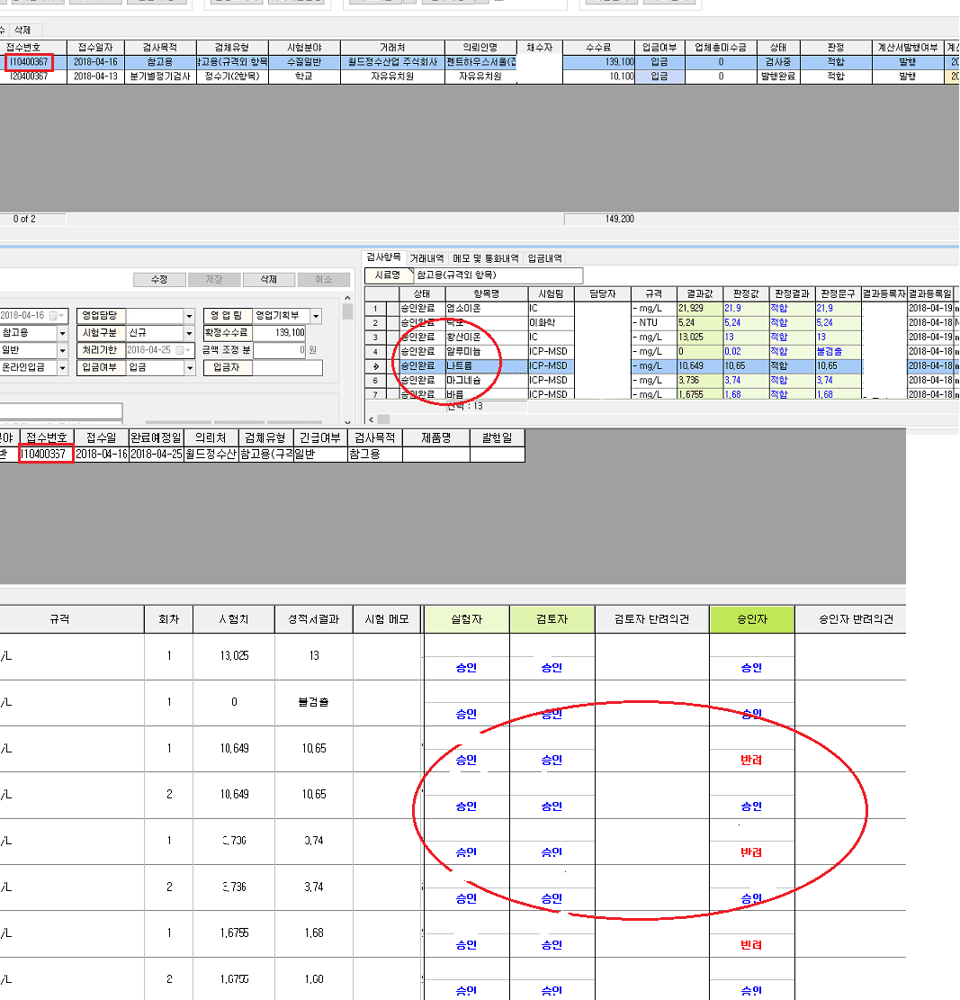

# 결재상태조회화면에서 결재상태확인


결재상태조회화면은 실험회차와 시험치, 성적서 결과등에 따라 나뉘어 자세하게 표현이 되는데 이전회차 결과를  최종결과로 인식하신 것으로 보입니다.

※ 결재자와 검토자 승인자는 공란으로 처리하였습니다.


위 그림의 상탄을 보면 상태탭에서 승인표시가 나타나 있음에도 불구하고 하단의 승인자칸에는

반려가 표시 되고 있습니다. 이때 좌측을 보면 회차의 부분에  1과 2로 서로 나눠져서 표시가 됩니다.

내 결재관리화면에서 접수건의 상태를 조회해 보아도 반려가 나타납니다. 

모든 접수건은 실험 회차와 결과를 표시하기 때문에 첫번재 실험에서 반려로 인해 결재진행이 되돌아갔다

면 결재 진행 상태에 기록이 남게 되어 최종결과가 승인이여도 1차 실험진행은 반려로 표시됩니다.

