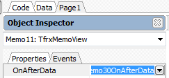

# 출력물 글씨 자동 조절 방법\(글자크기\)

## Q

성적서 또는 기록서 등 출력물을 출력할 때 메모칸 밖으로 벗어나는 글자들이 있습니다.

자동적으로 조절하는 방법이 있다면 알려주세요.

## A

방법을 알려드리겠습니다.

※적용하기에 앞서 이미 다른 메모에 적용이 되어있을 수도 있으니 확인해 보시고,

연결해주시면 시간이 절약 될 수 있습니다.

1. Code 탭 클릭

1. 기존에 코딩되어있는 부분이 있는지 확인

1. 기존에 코딩되어있는 메모의 이벤트를 현재 적용해야하는 메모의 이벤트에 연결해주기.

1. 해당 메모의 이벤트가 잘 걸렸다면 ▶ \(빨간색 화살표\) 표시가 잘 나타날 것입니다.

기존에 코딩되어있는 부분이 없다면 아래 순서에따라 작업해 보시기 바랍니다.

1.공통/코드관리 -&gt; 리포트관리 또는 리포트관리2.0 화면으로 이동

2.폰트조절이 필요한 양식을 선택하여 더블클릭 또는 리포트 디자인 버튼 클릭

3.폰트조절이 필요한 메모 클릭

1. 리포트 디자이너 왼쪽에 보이는 Event 탭 클릭 후 OnAfterData 부분 더블클릭\(빨간색 체크부분\)

1. 자동적으로 Code 탭으로 이동하게되며, 새로 생성된 procedure 의 begin과 end; 사이에 코딩.

//데이터에 따라 자동으로 폰트size조정

while \(TfrxMemoView\(Sender\).CalcHeight &gt; TfrxMemoView\(Sender\).Height\) do

begin

TfrxMemoView\(Sender\).Font.Size := TfrxMemoView\(Sender\).Font.Size - 1;

end;

1. 다시 page 탭을 눌러 이벤트를 설정 한 메모왼쪽 상단에 ▶\(빨간색화살표\) 가 생겼는지 확인.

 -&gt; 

1. 실제 접수된 접수건을 찾아 출력물을 출력하여 폰트 조절이 잘 되는지 확인.

1. 해당 양식 출력시 동작이 잘 된다면 해당 양식 업로드.

