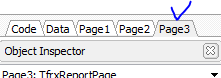
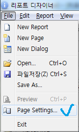

# 리포트 디자인시 짤리는 부분 보는 방법

## Q

리포트 디자이너에서 Page 하단부분이 짤려서 보이지 않습니다. 어떻게 해야하나요?

방법을 알려주세요.

## A

방법을 알려드리겠습니다.

아래 순서대로 진행해 보시기 바랍니다.

1. 하단부분이 짤리는 Page를 선택 해 주세요.

1. 리포트 디자이너 왼쪽 상단에 보시면 File 이라는 메뉴에 Page Settings 메뉴를 선택해주세요.

1. 새롭게 팝업되는 창에서 Other Options탭을 클릭하신 후 가장 마지막에 있는 

**Large height in design mode**

에 체크를

하신 후에 Ok 버튼을 눌러주시면 하단 부분이 짤리지 않고 잘 보이게 될 것입니다.

