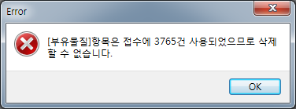

# 검사항목 추가 및 삭제

## Q

기존 있던 항목을 삭제하거나 없던 항목을 추가 하려고 합니다.

어떻게 해야 하나요?

## A

항목 삭제와 추가 방법을 알려 드리겠습니다.

메뉴 : 측정/분석관리 &gt; 검사항목관리 2.0

1. 항목 삭제  

   1\) 화면 왼쪽의 트리에서 검체유형을 선택합니다.  

   

   2\) 삭제하려는 항목을 선택 후 "항목 삭제" 버튼을 누릅니다.  

   

   3\) 접수된 건이 하나라도 있다면 기록 보존을 위해 삭제가 불가능 합니다.  

   

   이런 경우에는 항목 정보 제일 오른쪽에 있는 "사용여부"의 체크를 제거 하시면 접수화면에서 조회 되지 않습니다.  

   

   만약 기접수된 내역이 없다면 항목은 즉시 삭제 됩니다.  

2. 항목추가  

   1\) 항목을 넣을 검체유형을 트리에서 선택하시고 "항목추가" 버튼을 누릅니다.  

   

   2\) 추가하려는 항목명을 조회한 후 체크박스에 체크 하여 확인을 누릅니다.  

   

   3\) 추가된 항목을 확인 하고 규격을 수정 합니다.

