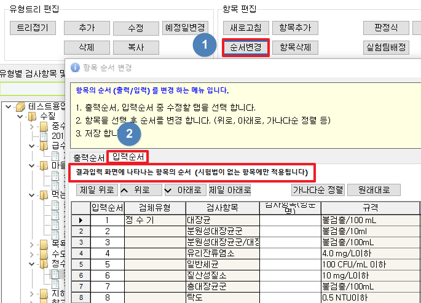

# 검사결과등록\(시험결과입력\)화면 입력순서 변경

## Q

입력시 우선적으로 검사하는 항목들이 있습니다. 결과값 입력순서를 변경할 수 있을까요?

## A

**검사항목관리에서는 검사항목들의 수수료나 유효자릿수 상위, 하위값 뿐만아니라 성적서에 출력되는 순서와 결과값 입력 순서를 정할 수 있습니다.**


결과입력화면에 나타나는 항목의 순서를 변경 "시험법"이 없는 항목에만 적용됩니다.


1. 측정 / 분석관리의 검사항목관리2.0 화면에서 순서변경 버튼을 클릭합니다.
2. "입력순서" 탭을 누르고 검사항목들의 순서들을 "위로, 아래로, 제일위로, 제일 아래로" 버튼을 사용하여 변경을 진행합니다.


목차의 입, 출력순서의 칸에 직접기입이 아닌 버튼을 이용하셔서 진행하셔야 합니다.


