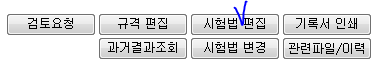
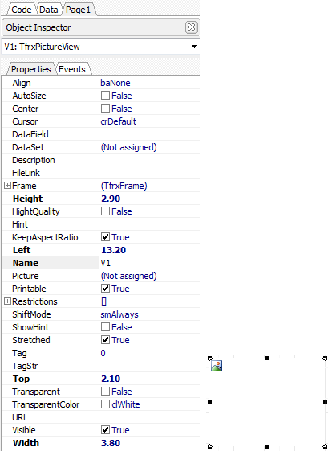
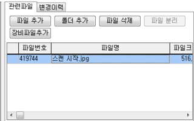

# 기록서에 이미지 변수 사용법

## Q

검사결과등록3.0 화면에서 기록서에 이미지를 지정하고 싶은데, 이미지도 올릴 수 있는건가요?

만약 가능하다면 어떻게 올리는 건지도 궁금합니다.

그리고 나중에 기록서 인쇄를 하면 이미지도 인쇄가 되는건가요?

## A

방법을 알려드리겠습니다.

※ 기록서 양식에서 이미지를 변수로 사용할 수 있는 양식 타입은 A타입만 가능합니다.  
시험법 안에 있는 항목은 모두 같은 변수로 적용됩니다. 하지만 양식은 다를 수 있으니 따로 작업해 주셔야 합니다.

1. 측정/분석관리 -&gt; 검사결과등록3.0 \(시험결과입력3.0\) 화면으로 이동 후 조건에 맞게 조회  
2. 조회된 항목 중 원하는 항목을 선택 후 시험법 편집을 클릭  

   

3. 시험법관리 화면이 열리면 "변수정의" 탭으로 이동하여 리포트 양식에서 사용될 변수명\(첫글자가 영문이되도록지정\)과 화면에 보여지게 될 한글명을  

   지정한 후 "형식"을 "file"로 변경\(기본은 string\)  

   

4. 다시 "기본정보" 탭으로 이동 후 연결된 기록서 양식을 "리포트디자인" 버튼을 이용하여 오픈  

   \(연결된 양식이 없다면 기록서 양식 목록에서 원하는 양식을 선택 후 "저장" 버튼을 이용하여 저장 후 작업\)  

   

5. 열려진 양식에서 왼쪽에 보시면 빨간색 네모 칸에 있는 아이콘을 마우스 왼쪽 버튼으로 클릭 후 이미지가 보여질 위치에 적당한 크기로 지정   

   \(크기를 지정하고 나면 창이하나 뜨는데 이미지를 검사결과입력3.0 화면에서 지정할 것이기 때문에 무시하고 창을 닫는다.\)  

   

     -&gt;  

   

     -&gt; 

   

6. 이미지틀을 선택한 후 왼쪽에 보이는 Properties 탭에서 이미지틀의 내용을 4번에서 지정한 변수 명과 동일하게 지정  

   

7. 리포트 디자이너 상단에 있는 "저장" 버튼을 누른 후 1번과 2번내용을 반복  

   \(변수정의에서 정의한 변수가 목록에 보여야함\)  

8. 조회된 항목을 선택후 관련파일/이력 버튼 클릭\(화면오른쪽에 탭이생김.\) 후 파일추가 버튼을 이용해 리포트 양식에 표기될 이미지를 지정  

   

     -&gt;

   

9. 관련파일 목록에 생성된 이미지 파일의 파일번호를 사진 변수에 지정.\(파일번호와 같아야만 기록서에 이미지가 표현됨\)  

   

10. 등록한 이미지가 기록서에 잘 표기되는지 확인 후 잘 나온다면 공통/코드관리 -&gt; 리포트관리 "기록서" 탭으로 이동하여 해당 양식을 업로드

