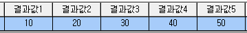
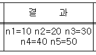

# 성적서에서 여러 변수 이용 방법

## Q

검사입력3.0 - 성적서 결과란에 여러개의 변수를 연동하려면 어떻게 해야하나요?  
예를들어 세균수\(N5\)법 같이 입력해야 할 결과 값이 여러개인 경우.  
어떻게 해야하나요?

## A

이번 업데이트를 통해 시험법 -&gt; 계산식에서 CheckText 에 입력되는 값이  
성적서결과에 표기됩니다. 참고해주세요. ex\) 1. CheckText = "n1=10, n2=20, n3=30, n4=40, n5=50"  
2. CheckText = "불검출"

아래는 사용 방법입니다.  
우선 해당 항목이 연결되어있는 시험법을 찾아갑니다.

1. 측정/분석관리 -&gt; 검사결과입력3.0\(시험결과입력3.0\) -&gt; 해당 항목이 조회 되도록 조회 조건에 맞게 입력 후 조회 -&gt;  

   해당 항목 선택 -&gt; 시험법 편집버튼 클릭\(시험법 연결이 되어있지 않다면 [http://cafe.naver.com/labtools/92](http://cafe.naver.com/labtools/92) 를 참조하여 작업 후 계속 진행.\)  

   

   

2. '변수정의' 탭으로 이동 하여 결과값이 입력 될 5개의 변수를 추가 버튼을 이용하여 추가.  

   '변수명'과 '한글명'은 원하시는대로 지정하시면됩니다.  

   ※ 입력 값이 없지만, 기본적으로 표기되는 값이 필요하시다면 해당 변수 선택 후 기본값에 해당 값을 입력해주시기 바랍니다.  

   \(ex - n1=0, n2=20, n3=30, n4=40, n5=50 여기서 n1는 입력값이 없음. 하지만 기본값이 0이기 때문에 0으로 표기가 됩니다.\)  

   

3. '계산식' 탭으로 이동하여 '성적서 결과'에 표기될 입력 값들을 셋팅합니다.  

   ※ CheckText = 내용이 길더라도 한 줄로 입력하셔야 적용됩니다.  

   

   CheckText = "n1=" + VarToStr\(변수명\) + " n2=" + VarToStr\(변수명\) + " n3=" + VarToStr\(변수명\) + " n4=" + VarToStr\(변수명\) + " n5=" + VarToStr\(변수명\)  

   ```text
                                           ↓↓↓↓↓↓  
   ```

   CheckText = "n1=" + VarToStr\(n1\) + " n2=" + VarToStr\(n2\) + " n3=" + VarToStr\(n3\) + " n4=" + VarToStr\(n4\) + " n5=" + VarToStr\(n5\)  

   만약, 아래와 같이 계산식에 의해 변수 값이 설정된다면,  

   VarToStr\(\) 이라는 함수로 숫자형 을 문자형으로 변환하여 사용해 주셔야 합니다.  

   CheckText = "n1=" + VarToStr\( \(변수명\) \) + " n2=" + VarToStr\( \(변수명\) \) + " n3=" + VarToStr\( \(변수명\) \) + " n4=" + VarToStr\( \(변수명\) \) + " n5=" + VarToStr\( \(변수명\) \)  

   계산식을 성립하기 위해서는 문자가 아닌 숫자가 계산이 되기때문입니다.  

   

4. 시험법 편집 화면을 빠져나온 후 실제 결과 입력 -&gt; 기록서 인쇄  

   

    -&gt; 

   

5. 기록서에서 정확히 표기 되는지 확인.  

   

