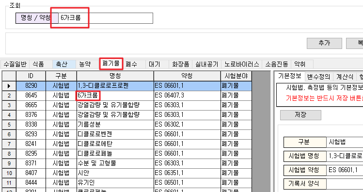

# 접수한 건을 다른 유형으로 변경


유형변경을 진행하시기 전에 먼저 메뉴가 보이지 않는 분들은 관리자 계정을 통하여 메뉴권한관리에서 다른 유형으로 변경버튼 보이기에 대한 권한을 활성화해주시기 바랍니다. 권한체크를 따로 표시하지 않을시 모든 사용자가 이용할 수 있습니다.


가능합니다. 우선 접수하신 화면 \(접수/시료관리의 접수창\)을 열고나서 변경하고자 하는 접수번호을  조회합니다. 그 다음 "수정" 버튼을 클릭하시면 다른유형으로 변경 버튼이 활성화됩니다.

이 때, 검체유형명은 그대로 유지하면서 진행하실지 검체유형명 또한 변경하실지 선택이 가능합니다. 검체유형을 선택하시면 검체유형안에 있는 모든 항목이 자동적으로 선택됩니다.상황에 맞게 일부만 선택하셔서 체크 후 확인을 클릭, 저장해주시면됩니다.


이미 접수한 건의 검사항목에 결과값이 입력되어 있더라도 변경하는 유형에서도 사용하고 있고같은 규격과 판정식을 가지고 있다면 결과값이 삭제되지 않고 남아있습니다.


