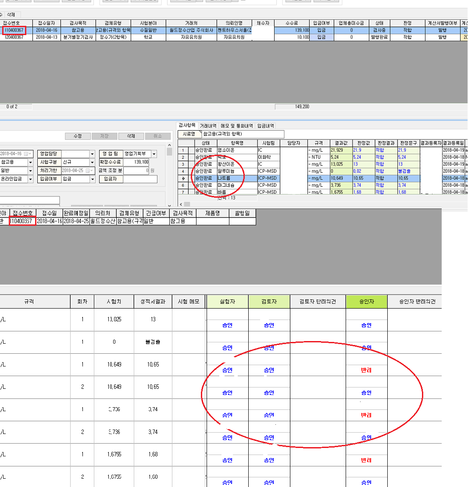

# 201. 리포트관리 화면

* [화면 설명](201..md#화면-설명)
  * [카테고리 탭](201..md#카테고리-탭)
  * [새로운 카테고리 만들기](201..md#새로운-카테고리-만들기)
* [조회 조건](201..md#조회-조건)
  * [리포트 명](201..md#리포트-명)
  * [리포트 ID](201..md#리포트-id)
  * [미사용 포함](201..md#미사용-포함)
  * [삭제된 양식](201..md#삭제된-양식)
* [버튼 설명](201..md#버튼-설명)
  * [업로드 이력](201..md#업로드-이력)
  * [리포트 추가](201..md#리포트-추가)
  * [리포트 디자인](201..md#리포트-디자인)
  * [리포트 복제](201..md#리포트-복제)
  * [리포트 삭제](201..md#리포트-삭제)

## 화면 설명

이 페이지에서는 새로운 리포트를 만드는 방법에 대해 설명드리겠습니다. 아이랩의 모든 리포트 양식은 **공통/코드 관리 &gt; 리포트 관리**화면에서 관리됩니다.

### 카테고리 탭

카테고리는 리포트 양식을 분류하기 위한 이름 입니다. 카테고리 탭을 클릭 하면 해당 카테고리에 포함된 리포트 양식이 표시됩니다.

### 새로운 카테고리 만들기

카테고리 이름은 "성적서", "기록서" 등 아이랩에 정해진 이름을 사용해야만 출력이 가능 합니다. 하지만, 단순한 분류 및 저장을 위해, "연습용", "임시저장" 등과 같은 사용자 및 우리기관 만의 카테고리를 만들 수도 있습니다.

새로운 카테고리를 만들기 위해서는 리포트 양식 목록에서 카테고리 컬럼의 값을 수정한 다음 `Enter`키를 입력합니다. 그러면, 입력된 카테고리 이름으로 새로운 카테고리가 만들어집니다.

## 조회 조건

아래 조회 조건을 입력한 다음 `조회`버튼을 누르면 리포트 양식을 조회할 수 있습니다.

### 리포트 명

리포트 이름은 리포트를 구분하는 이름 입니다. 동일한 이름이 목록에 있어도 오류가 발생하지 않습니다.

### 리포트 ID

리포트ID는 리포트 양식을 구분하는 고유번호입니다. 모든 리포트 양식은 ID를 가지고 있고, 목록에 표시되어 있습니다.

### 미사용 포함

`미사용 포함`을 체크하면 사용여부에 체크되지 않은 리포트 양식도 조회에 포함됩니다.

### 삭제된 양식

`삭제 포함`을 체크하면 현재 카테고리의 삭제된 양식을 조회할 수 있습니다.

## 버튼 설명

### 업로드 이력

버튼을 누르면 리포트 양식을 업로드한 이력을 확인 할 수 있습니다. 업로드 이력의 목록에 표시된 리포트 양식을 더블클릭 하면 해당 양식의 리포트 디자인을 확인할 수 있습니다.

### 리포트 추가

버튼을 누르면 새로운 리포트 양식 파일이 현재 선택된 카테고리 탭에 추가됩니다.

### 리포트 디자인

버튼을 누르면 현재 선택된 리포트 양식을 편집할 수 있는 [리포트 디자이너 화면](https://github.com/wooritech/ilab-user-manual/tree/c3f599ffe2c9b410fe63d742b445df777f217443/리포트양식만들기/100리포트디자이너이해하기/101리포트디자이너화면구성.md)이 열립니다.

### 리포트 복제

버튼을 누르면 현재 선택된 리포트 양식과 같은 새로운 양식을 복제, 추가 합니다.

### 리포트 삭제

버튼을 누르면 현재 선택된 리포트 양식을 삭제 합니다. 삭제된 양식은 복구할 수 없습니다. 하지만, [삭제된 양식 조회](201..md#삭제된-양식)하기 기능을 이용해 양식을 조회하고 디자인된 내용을 확인할 수 있습니다.

