# 견적서 관리

아이랩에 저장되어있는 데이터를 활용하여 견적서를 작성하고, 종이인쇄 및 E-mail, PDF, 이미지 파일등으로 변환하여거래처에 견적서를 보낼 수 있도록 지원하는 화면입니다.

아이랩에 저장되어있지 않은 데이터라면 직접 입력하여 견적서를 작성 할 수도 있습니다.

**화면구성-**

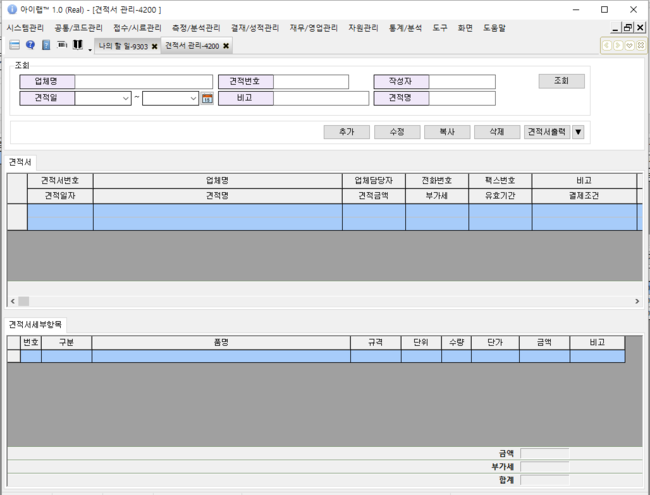

## 조회

작성한 견적서들을 조회합니다.

화면 견적서 탭 부분은 작성된 견적서의 기본 정보를 표기하고, 견적서세부항목 탭은 선택한 견적서의 자세한 내용을 표기합니다.

견적서 작성 시 금액이 입력된 경우라면 하단 부분에 합계 금액이 표기 됩니다.

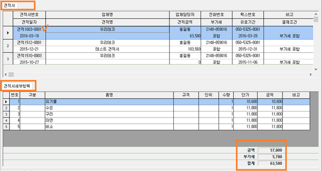

## 버튼설명

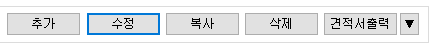

**추가**

새로운 견적서를 생성합니다.

추가 버튼 클릭시 아래와 같이 견적서의 내용을 작성 할 수 있는 팝업창이 열리게 됩니다.

견적번호 미 입력시 자동으로 일련번호가 생성됩니다.

\(“견적” + 년도2자리 + “-” + 일련번호4자리 = 견적16-0001\)

수기로 견적번호를 입력할 수도 있습니다.

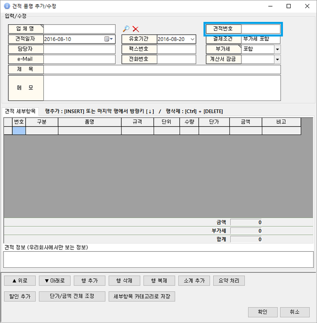

**견적서 작성 요령**

※ 견적서 출력시 견적 세부항목의 내용들이 화면에 보이는 대로 출력되어 집니다.

1. 견적서를 보낼 업체명을 조회 및 선택
2. 견적일자, 담장자 등 기본 정보를 입력
3. 견적 세부항목을 입력

3.1

품명 부분을 마우스 왼쪽 버튼으로 클릭하시면 ...버튼이 나타납니다. ...버튼을 눌러보시면 아래 와 같은 메뉴가 나타나며, 원하시는 메뉴를 선택하여 세부항목을 추가 할 수 있습니다.

**카테고리 가져오기**

견적서 발행 시 자주 보내게 되는 내용을 카테고리로 미리 저장해두고, 필요 시 카테고리에 저장 되어 있는 세부 항목들을 불러와서 견적서를 빠르게 작성 할 수 있습니다.

하단에 있는 세부항목 카테고리로 저장 버튼을 이용하여 카테고리를 저장 할 수 있습니다.

**접수목록 가져오기**

상단에 입력한 업체명으로 접수된 접수 정보를 불러옵니다.

각 접수건에서 저장한 검사목적, 검체유형, 확정수수료가 각각 구분, 품명, 금액 부분에 입력됩니다.

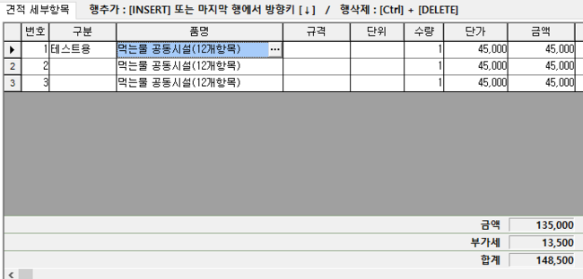

**검사항목 가져오기**

아이랩 상단 메뉴 중 측정/분석관리 -&gt; 검사항목관리 화면에 등록되어있는 검체유형 트리에서 항목들을 선택하여 불러옵니다.

검체유형 명칭, 항목명, 항목수수료가 각각 구분, 품명, 금액 부분에 입력됩니다.

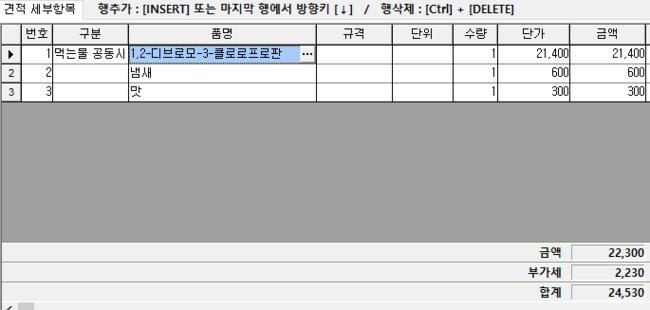

3.2 키보드의 “Insert 키” 또는 마지막 행에서 아래 방향키 “↓” 또는 “행 추가” 버튼을 눌러 행을 하나 씩 추가하여 수기로 견적서를 입력할 수도 있습니다.

1. 견적 세부항목을 모두 작성 한 뒤 확인을 눌러 새로운 견적서를 저장 합니다.
2. 조회 목록에서 해당 견적서를 선택하여 견적 정보와 견적 세부항목의 내용이 작성한 내용과 같은지 검토합니다.

**화면 하단 버튼 설명**

※ 견적서 출력시 견적 세부항목의 내용들이 화면에 보이는 대로 출력되어 집니다.

추가, 수정 버튼 클릭 후, 사용할 수 있습니다.

해당 버튼들은 견적 세부항목 탭에 입력 되어 있는 내용들에만 적용됩니다.

**위로, 아래로**

선택한 행의 위치를 현재 기준으로 위쪽으로 옮기거나 아래쪽으로 옮길 때 사용 합니다.

예\) 1,1,1-트리클로로에탄 항목 선택 -&gt; 아래로 버튼 클릭.

**행 추가, 행 삭제, 행 복제**

&lt;행 추가&gt;

현재 커서가 있는 행을 기준으로 위쪽에 새로운 행을 추가 합니다.

새로운 행을 추가하여 원하는 내용을 직접 입력할 때 사용합니다.

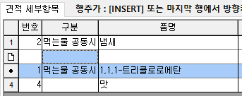

&lt;행 삭제&gt;

선택한 행을 삭제 합니다.

최초 작성 이후 견적서를 수정중에 삭제 하셨다면 견적서를 저장하지 마시고, 팝업 창을 닫았다가 다시 열어서 사용해주세요.

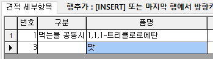

&lt;행 복제&gt;

선택한 행의 내용을 그대로 복제하여 새로운 행을 하나 생성 합니다.

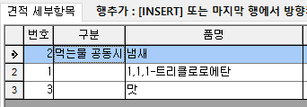

**소계 추가**

※ 선택한 행을 기준으로 위쪽에 있는 행들에 대한 소계를 계산합니다.

견적 세부항목 중 선택한 행의 바로 아래쪽에 “소계” 행을 추가합니다.

**요약 처리**

선택한 세부항목을 요약처리 합니다.

※ 요약 처리 후 이전으로 되돌릴 수 없으니 참고하세요.

요약 처리 방법은 2가지 입니다. 필요하신 방법으로 이용해주세요.

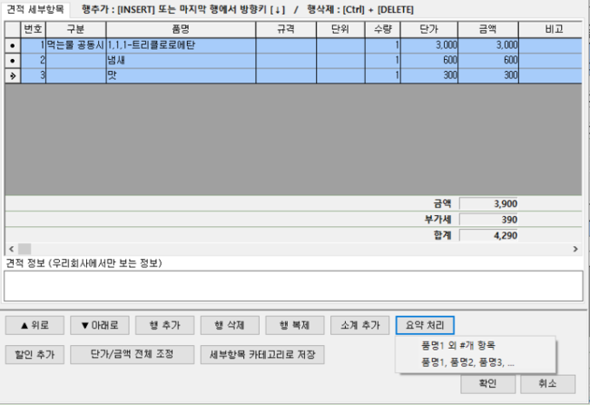

&lt;품명1 외 \#개 항목&gt;

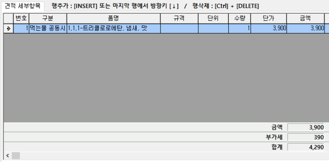

&lt;품명1, 품명2, 품명3, ...&gt;

**할인 추가**

세부항목에 작성한 단가에 대하여 할인을 적용합니다.

메뉴의 내용대로 적용됩니다.

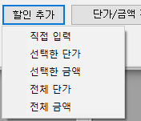

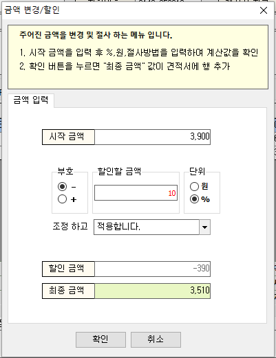

**단가/금액 전체 조정**

세부항목에 대한 전체 금액을 조정 합니다.

※할인 금액 적용시에는 금액 앞에 “-”를 붙여주세요.

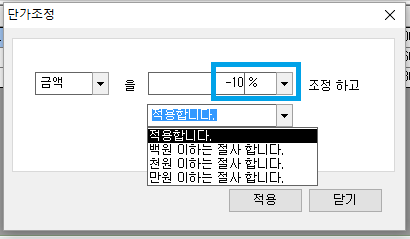

**세부항목 카테고리 저장**

화면에 보이는 세부항목을 카테고리로 저장 합니다.

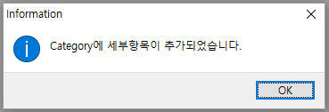

&lt;저장된 카테고리 불러오기&gt;

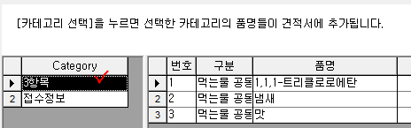

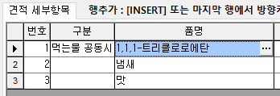

**수정**

작성된 견적서를 수정합니다.

수정 방법은 2가지 입니다.

1. 조회 된 목록에서 수정할 견적서를 선택 -&gt; 수정버튼 클릭
2. 조회 된 목록에서 수정할 견적서를 더블 클릭.

**복사**

선택한 견적서를 동일한 내용으로 복사하여 새로운 견적서를 생성합니다.

이후 원하시는 내용으로 수정하여 사용합니다.

**삭제**

선택한 견적서를 삭제 합니다.

견적서 작성시 견적서를 잠궈둔 경우라면 삭제 할 수 없습니다.

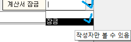

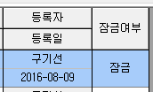

&lt;행 삭제&gt;

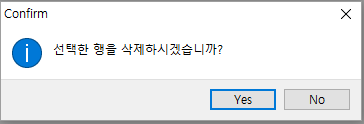

**견적서출력**

아이랩 상단 메뉴 중 공통/코드관리 -&gt; 리포트관리 -&gt; 견적서 탭에 등록되어있는 견적서 양식으로 작성한 견적서를 출력할 수 있습니다.

견적서 버튼 클릭시 “견적서” 양식으로 기본 연결되며, ▼ 버튼을 통하여 다른 양식을 선택하여 출력할 수 있습니다.

※ 견적서 출력시 견적 세부항목의 내용들이 화면에 보이는 대로 출력되어 집니다.

