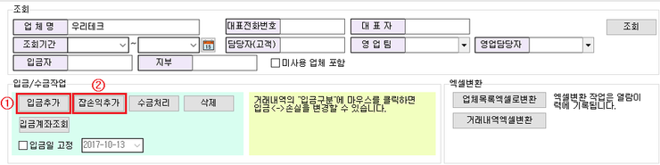
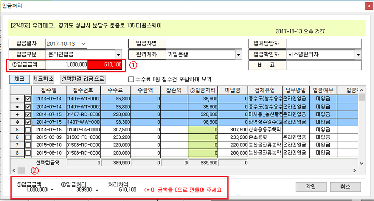

# 거래내역/조회 관리

아이랩에서 거래내역을 조회&관리 하기위한 화면입니다.

거래내역/조회 관리 화면의 주 기능은 업체마다의 접수건과 들어온 입금액을 접수건을 기준으로 분배하여 연결시켜주는 기능을 하는 화면입니다.

사용방법에 대해서는 아래내용대로 사용하시면 됩니다.

먼저 입금 받은 내역을 추가하는 방법으로 3가지가 존재합니다.

현재화면 외에는 2가지 방법이 있습니다.

**통합접수목록 **화면에서의 입금처리 버튼 \( 권한이 없다면 버튼이 보이지 않습니다. \)

**입금관리** 화면에서의 입금추가 처리

**거래내역/조회 관리 **화면 에서 입금추가를 하실려면

1. 해당업체를 조회
2. 아래 이미지를 참고하여 ① 입금추가 버튼을 클릭

\( ② 잡손익추가 버튼은 부가세, 할인, 출장비등등의 추가비용이나 감소비용에 대한 처리 \)

1. 아래 이미지를 참고하여 접수건 마다 입금처리

① 항목에 입금금액을 작성

② 의 처리차액을 확인하시면서 각 접수된 건마다 해당건을 체크하여 입금처리를 한다

1. 처리가 완료된 접수건은 색깔이 표시되지 않는걸 확인

**※이 과정을 완료하셔야 해당 접수건으로 입금처리가 연결이 됩니다.**

