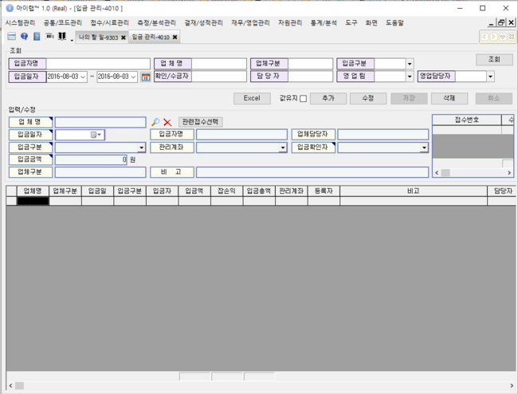
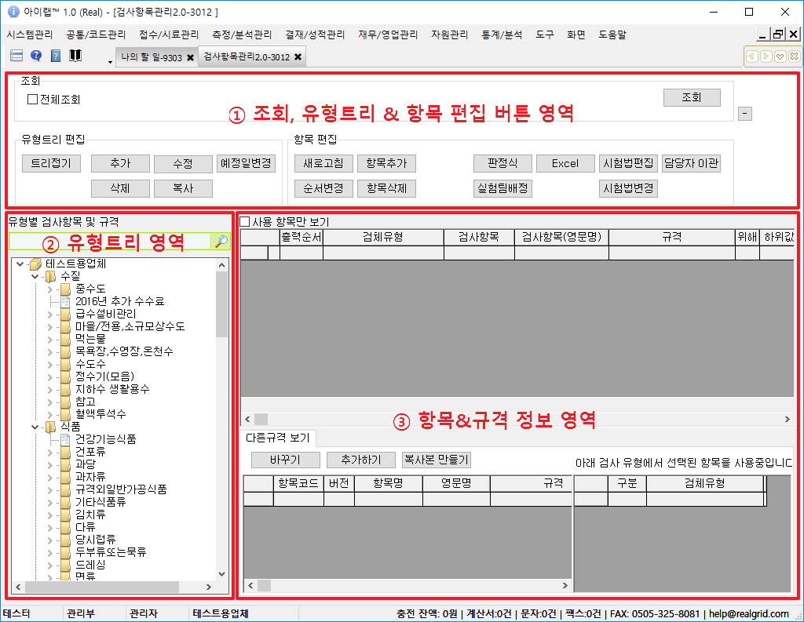
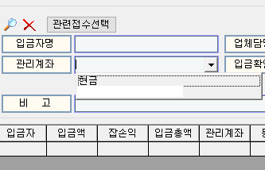
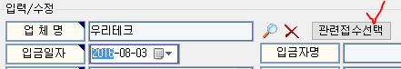
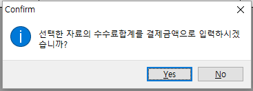

# 입금 관리

아이랩을 통해 입금 정보를 관리하는 경우에만 사용해 주시면 됩니다.

아이랩을 통해 발생한 매출에 대하여, 입금처리를 진행합니다.

아이랩을 통해 발생한 매출이란, 각 접수건에 저장된에 업체에 대한 확정수수료 입니다.

아이랩에서 입금처리는 편의를 위해 접수/시료관리 -&gt; 통합접수목록 -&gt; 입금처리 버튼에서도 처리할 수 있습니다.

\(

사용자의 권한에 따라 사용하지 못할 수도 있습니다.

\)

해당 접수건으로 입금처리를 하지 않는다면, 추후 해당 업체에 대한 미수금, 입금액 등 회계 부분에 대하여 금액이 맞지 않을 수 있습니다.

화면구성-

## 조회

※ 해당 화면에서는 접수 정보를 기준으로 조회 하는 것이 아니라, 접수건과 연결된 입금정보를 기준으로 조회가 되어집니다.

화면 상단에 보이는 조회 조건을 입력 하여 입금 정보를 조회 할 수 있습니다.

조회 목록에서 선택한 입금 정보에 연결 되어 있는 접수 정보가, 화면 중간 영역에 표기됩니다.

## 버튼설명

**Excel**  
조회 목록에 조회 된, 모든 데이터를 엑셀로 변환합니다. 기본 저장 위치는 아이랩 설치 폴더 -&gt; Excel 폴더 -&gt; “입금목록\_현재날짜” 로 저장됩니다.  
\(화면 중간 영역은 변환에서 제외됩니다.\)

**추가**

신규 입금 정보를 생성합니다.

기존에 있던 입금 정보를 복사하여 추가하시려면 값유지를 체크 후 추가 버튼을 클릭하세요.

입력란 우측 상단에 화살표가 있는 입력칸은 필수입력칸이니 반드시 내용을 입력하셔야합니다.

입금구분, 관리계좌에서 선택할 수 있는 내용은 공통/코드관리 -&gt; 공통코드관리 -&gt; 분류 목록에 납부방법, 관리계좌에 등록된 내용들이 표기됩니다.

※ 공통코드관리 -&gt; 납부방법, 관리계좌는 모든 시험분야에 동일하게 적용됩니다.

추가 및 수정할 내용이 있다면 공통코드관리 매뉴얼을 참고하셔서 진행해주세요.

&lt;공통코드관리-납부방법&gt;

&lt;공통코드관리-관리계좌&gt;

입금확인자 : 공통/코드관리 -&gt; 사용자관리에 등록 되어 있는 아이랩 사용자들이 표기됩니다.

예

\)

 입금처리 방법입니다.

돋보기 버튼을 클릭하여 업체 조회 -&gt; 선택 -&gt; 관련접수 선택 버튼을 클릭합니다.

\(

입금 처리 되지 않은 접수건이 많은 경우, 조회가 오래 걸릴 수 있습니다.

\)

기본적으로 해당 업체에 대한, 입금 처리 되지 않은 접수건들이 조회 됩니다.

조회 이후에는 원하시는 조회 조건을 따로 입력하여 다시 조회 하실 수 있습니다.

입금금액이 연결되어야하는 접수건을 찾아 왼쪽에 체크 -&gt; 선택 버튼 클릭

입금 정보 입력란에 입금금액을 입력하지 않았다면 매출금액 과 입금금액을 동일하게 입력하겠냐는 문구가 나타납니다.

원하신다면 Yes, 직접입력하시려면 No 버튼을 눌러주세요.

&lt;Yes&gt; 버튼을 누른다면 자동으로 입금금액이 입력됩니다.

선택한 접수건은 화면 중간 영역에 표기됩니다.

**수정**  
조회 목록에서 선택한 입금 정보를 수정합니다.

**저장**  
입력된 입금 정보를 저장합니다.

**삭제**  
조회 목록에서 선택한 입금 정보를 최종 메시지 확인 후 삭제 합니다.  
※ 별도 이력을 남기지 않기 때문에, 삭제 후 복원은 불가능합니다. 삭제 시 신중하게 결정해주세요.

**취소**  
입력한 정보를 입력 전 상태로 되돌립니다.

