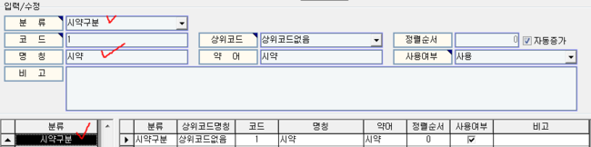
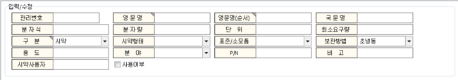
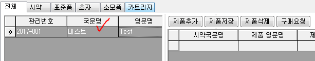
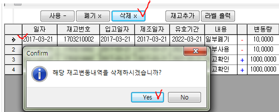
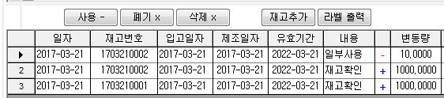
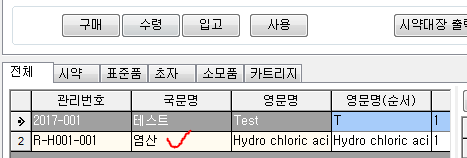
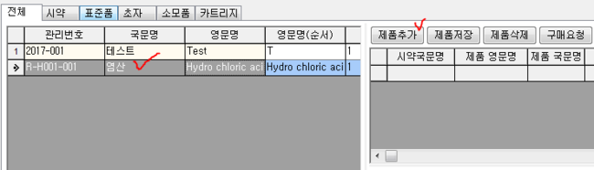
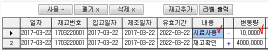

# 시약관리2.0

기관내에서 구매하고, 사용한 시약의 사용내역을 관리하는 화면입니다.

사용자가 직접 입력, 저장하는 화면이기 때문에 실제 구매, 변경 사항이 있을 때 아이랩에 정보를 저장, 수정하지 않으신다면 실제 보유하고 있는 시약들의 개수 및 남은 잔량 등 이 다를수 있습니다.

**화면구성-**

**1.1 시약 관리 화면에 탭 추가 하기**

화면에서 시약을 조회 할 수 있는 탭을 구성하는 방법입니다. 공통코드관리 화면에서 관리하실 탭을 추가 및 삭제 하실 수 있습니다.

1. 아이랩 상단 메뉴 중 공통/코드관리 -&gt; 공통코드관리
2. 해당 화면의 분류 목록에 시약구분 을 추가 합니다.

   \(

   코드 부분은 아무값이나 입력하셔도 됩니다.

   \)

   

3. 해당 부분을 작업할 때 시약관리2.0 화면이 열려있었다면 화면을 닫고 새로 열어서 방금 추가 및 수정한 내용이 반영 되었는지 확인합니다.  

   

※탭을 삭제 하는 방법은 시약구분에서 행을 삭제하고, 화면을 닫고 새로 열어주시면 제거됩니다.

※ 삭제 이력을 별도로 관리 하지 않으니, 삭제 시 신중하게 진행 해 주세요.

## 조회

아이랩의 다른 화면들과 같이 화면 상단은 조회 조건으로 이루어 집니다.

원하시는 조회 조건을 입력하여 조회하실 수 있고, 전체 탭이 아닌 각 탭을 선택하여 시약의 구분에 맞게 조회 하실 수도 있습니다.

## 상단 버튼 설명

※ 구매,수령,입고, 사용 그리고 제품 부분에 있는 구매요청 버튼에 대한 기능은 바코드로 시약을 관리하는 기관에서만 사용하는 부분입니다. 사용을 원하실 때 문의해주시면 설명 드리겠습니다.

**시약대장출력▼**

선택한 시약의 정보를 출력물로 출력하는 기능입니다.

기본적으로 공통/코드관리 -&gt; 리포트관리2.0 화면 -&gt; “시약대장” 이라는 명칭의 양식을 사용하게 됩니다.

\(탭 구분없이 시약대장이라는 명칭의 양식을 사용합니다.\)

시약대장이 여러가지가 있는 경우, ▼버튼을 클릭하여 원하시는 양식으로 선택하여 출력 할 수 있습니다.

▼버튼을 클릭 할 경우, 공통/코드관리 -&gt; 리포트관리2.0 화면 -&gt; 시약대장 탭에 작성되어있는 양식들을 불러옵니다.

**추가**

새로운 시약을 추가 합니다. 추가 버튼 클릭시 입력칸이 나타납니다.

**입력칸 설명**

관리번호는 기관내에서 시약을 관리 하기 위해 구분하는 일련번호로써 기관내에서 정한 규칙을 수기로 입력하여 사용해주세요. 관리번호 규칙은 기관내에서 정하는 것이기 때문에 특별한 제약은 없습니다.

입력칸 오른쪽 상단에 세모모양이 있는 입력칸은 필수 입력칸 입니다.

필수입력 : 

구분, 시약형태, 표준/소모품, 보관방법, 분야 부분은 화면을 구성하는 탭과 같이 공통/코드관리 -&gt; 공통코드 관리에서 추가 및 삭제하셔서 사용하실 수 있습니다.

원하시는 부분에 내용 추가 및 삭제 부분은 “시약 관리 화면에 탭 추가 하기”에 안내한 방법과 동일합니다.

|  | 공통/코드관리 | 시약관리 | 비고 |
| :--- | :--- | :--- | :--- |
| 구분 |  |  |  |
| 시약형태 |  |  |  |
| 표준/소모품 |  |  |  |
| 보관방법 | 초냉동냉동냉장실온위험물\(고정\) |  |  |
| 분야 | 시약표준품초자소모품배지\(고정\) |  | 공통/코드관리-&gt; 시약분야로 등록하여 사용 가능.\(필요시 문의\) |

**수정**

입력 되어 있는 시약의 정보를 수정합니다.

**저장**

입력 되어 있는 시약의 정보를 아이랩에 저장합니다.

**삭제**

조회 -&gt; 선택한 시약의 정보를 삭제합니다.\(여러 시약을 한번에 삭제 가능합니다.\)

※ 삭제 이력을 별도로 관리 하지 않으니, 시약 삭제 시 신중하게 진행 해 주세요.

**취소**

입력된 내용을 저장하지 않고 취소합니다.

## 제품 부분 버튼 설명

선택한 시약에 대한 제품을 등록합니다.

똑같은 시약이지만 용기에 담긴 용량이 다르거나, 시약의 정보가 조금씩 다른 경우 여러 제품을 등록하여 사용하실 수 있습니다.

※해당 부분에는 기관내에 있는 제품만 등록하는 것이고, 실제 재고를 늘리거나 사용하는 것은변경내역부분에서 지정하실 수 있습니다.

※제품 추가는 선택한 시약이 있을때만 가능합니다.

**제품추가**

선택한 시약의 제품을 추가 합니다.

제품추가 버튼을한 번 클릭 할 때마다 입력할 수 있는행이 하나씩 증가합니다.

시약국문명, 제품 영문명, 제품국문명은 시약을 추가할때 입력한 정보들이 입력됩니다.

입력칸설명

| 입력칸 | 설명 | 비고 |
| :--- | :--- | :--- |
| 시약국문명 | 선택한 시약의 국문명입니다. |  |
| 제품 영문명 | 등록할 제품의 영문명을 입력합니다. |  |
| 제품 국문명 | 등록할 제품의 국문명을 입력합니다. |  |
| 용량 | 등록할 제품의 용량을 입력합니다. |  |
| 단위 | 용량에 입력한 값에 대한 단위를 입력합니다. | 예1 |
| 재고량 | 해당 제품을 기관에 내에서 실제로 가지고 있는 재고량 입니다. | ※실제 재고는변경내역부분에서만 진행합니다.※이곳에서는 변경 및 입력 할 수 없습니다.※재고량은 기본적으로 소수점 4째자리까지 표기 되어집니다.\(소수점표기가 필요한 제품들이 있기 때문입니다.\) |
| 기본량 | 입력된 용량 및 단위에 맞게 한번에 사용하는 기본량입니다. | 기본량은  변경내역부분에서 해당 제품의 사용량을 처리할 때 제품을 한 번 사용할 때 얼만큼씩 사용하시는지에 대한 참고 사항입니다. |
| 제조사 | 제품의 제조사를 입력합니다. |  |
| LotNo | 제조 단위가 필요할 경우 입력합니다. |  |
| 등급 | 등급이 필요할 경우 입력합니다. |  |
| 순도 | 순도가 필요한 경우 입력합니다. |  |
| 분자량 |  |  |
| 보관장소 |  |  |

**제품저장**

기본적으로 각 입력칸에 맞게 입력 후 엔터를 치면 저장되지만, 제품저장 버튼을 눌러 입력한 제품의 정보를 저장할 수도 있고, 별도의 안내메시지는 나타나지 않습니다.

**제품삭제**

선택한 제품을 목록에서 삭제합니다.

※ 등록된 변경내역도 모두 삭제되니 삭제시 신중하게 진행해 주세요.

※ 삭제 이력을 별도로 관리 하지 않으니, 시약 삭제 시 신중하게 진행 해 주세요.

**구매요청**

※ 구매,수령,입고, 사용 그리고 제품 부분에 있는 구매요청 버튼에 대한 기능은 바코드로 시약을 관리하는 기관에서만 사용하는 부분입니다. 사용을 원하실때 문의해주시면 설명드리겠습니다.

## 변경내역 부분 버튼 설명

선택한 제품에 대한 재고량을 관리합니다.

입고된 재고를 수량에 맞게 추가하고, 사용, 폐기량을 입력할 수 있습니다.

**재고추가**

선택한 제품의 재고가 등록되어있지 않다면, 재고추가 버튼을 눌러 선택한 제품에 해당 제품의 제조일, 유효기간, 수량을 입력합니다.

※여기서 등록되는 수량\(변동량\)의 합이 제품 부분에 재고량입니다.

※추가 수량은 제품에 등록된 용량이 기본값으로 입력됩니다. 예제를 꼭 참고하시고 등록해주세요.

예\)

↓

**사용 -**

※정보를 수정하시고, 엔터를 치시면 자동 저장됩니다.

제품안에 등록된 재고중, 선택한 재고번호에 대한 사용량을 입력합니다.

사용- 버튼을 클릭하면 새로운 행이 하나 생기고, 비고란에 자동으로 “사용 버튼” 이라는 문구가 입력되며, 사용하신 양을 변동량 부분에 입력해주시고, 참고사항 입력 필요시 내용 부분에 입력하시면 되겠습니다.

**폐기 x**

※정보를 수정하시고, 엔터를 치시면 자동 저장됩니다.

제품안에 등록된 재고중, 선택한 재고번호에 대한 폐기량을 입력합니다.

폐기x 버튼을 클릭하면 새로운 행이 하나 생기고, 비고란에 자동으로 “폐기 버튼” 이라는 문구가 입력되며, 폐기하신 양을 변동량 부분에 입력해주시고, 참고사항 입력 필요시 내용 부분에 입력하시면 되겠습니다.

**삭제 x**

제품의 사용량 또는 폐기량을 잘 못 기입했거나 필요없는 데이터라면 변동량을 선택적으로 삭제 할 수 있습니다.

삭제된 변동량 만큼 재고량에 +가 되어집니다.

※ 삭제 이력을 별도로 관리 하지 않으니, 시약 삭제 시 신중하게 진행 해 주세요.

↓

**라벨출력**

변경내역 리스트중에서 시약라벨로 출력하고 싶은 변동량을 선택하여 라벨로 출력하는 기능입니다.

기본적으로 공통/코드관리 -&gt; 리포트관리2.0 -&gt; 라벨 탭 -&gt; 스마트시약라벨 양식이 연결되어집니다.

라벨이 출력되지 않거나 오류가 발생한다면 스마트시약라벨 양식이 없는것이니 서비스요청으로 문의해주세요.

## 시약관리 업무흐름

시약관리 화면에서의 기본적인 업무흐름에 대한 예제 입니다.  
조회는 단순 기능들이니 예제에서 제외하고, 시약 추가에 대한 부분만 안내해드립니다.

아래 순서대로 진행 하였고, 참고하셔서 기관에서 응용하여 사용하시면 되겠습니다.

문의사항은 서비스요청으로 보내주시면 확인하여 답변드리겠습니다.

1. 추가 버튼 클릭

관리번호는 Reagent\(시약\)의 첫글자인 R + “-” + 시약명의 영문명 첫글자 + “-” + 시약명 일련번호 3자리 + “-” + 일련번호 3자리로 해보았습니다. -&gt; R-H001-001 \(원하시는 관리번호 체계로 입력 가능 합니다.\)

1. 시약 정보 입력

1. 저장버튼 클릭. -&gt; 목록에서 추가된 시약 확인

1. 시약에 대한 제품추가.

4.1. 제품추가 버튼 클릭

4.2. 제품정보 입력

4.3. 제품저장 버튼 클릭

1. 재고추가를 통한 재고량 추가.

5.1. 화면 우측 하단 재고추가 버튼 클릭. 원하는 재고 수량을 입력

\(기본재고량은 해당 제품 -&gt; 용량에 입력한 값으로 입력됩니다.\)

1. 해당 재고에 대한 변동량 저장.

6.1. 해당 제품을 “사용” 했다면, 사용- 버튼 클릭 후 변동량 부분에 “사용한” 수량을 입력.

**↓**

6.1. 해당 제품을 “폐기” 했다면, 폐기x 버튼 클릭 후 변동량 부분에 “폐기한” 수량을 입력.

**↓**

1. 6번까지 진행한 후 재고량 확인

