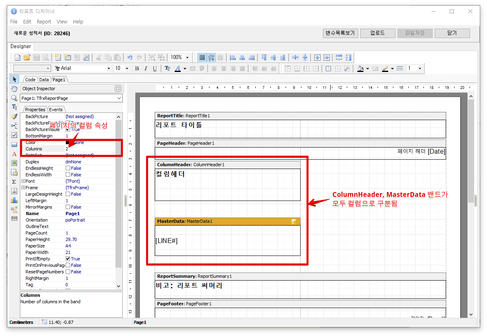

# 104. 리포트 밴드

* [밴드의 기능](104..md#밴드의-기능)
* [밴드의 종류](104..md#밴드의-종류)
  * [ReportTitle](104..md#reporttitle)
  * [PageHeader](104..md#pageheader)
  * [MasterData](104..md#masterdata)
  * [ReportSummary](104..md#reportsummary)
  * [PageFooter](104..md#pagefooter)
  * [밴드 인쇄 미리보기](104..md#밴드-인쇄-미리보기)
* [컬럼 구분과 ColumnHeader밴드](104..md#컬럼-구분과-columnheader밴드)
  * [MasterData밴드 컬럼 속성](104..md#masterdata밴드-컬럼-속성)
  * [페이지의 컬럼 속성](104..md#페이지의-컬럼-속성)

## 밴드의 기능

아이랩의 리포트관리에서 밴드의 역할은 출력페이지의 특정 위치에 출력할 [인쇄 구성요소](103..md)를 배치하기 위한 영역입니다. **즉, 종이에 뭔가 인쇄를 하려면 반드시 밴드\(Band\)위에 인쇄할 객체를 위치시켜야 합니다.**

## 밴드의 종류

_**아이랩에서 자주 사용되는**_ 밴드의 종류를 나열해 보면 아래와 같습니다.

### ReportTitle

* 리포트의 최상단에 출력

### PageHeader

* 각 페이지의 상단에 출력
* 첫 번째 페이지 출력 안하기 기능

### MasterData

* 메인 데이터 출력
* 데이터의 갯수 만큼 자동으로 반복 출력
* 컬럼을 구분하여 출력하기 기능
* 각각의 데이터를 새로운 페이지에 출력하는 기능

### ReportSummary

* 리포트의 마지막 부분에 출력

### PageFooter

* 페이지의 최 하단에 출력
* 첫 번째 페이지 출력 안하기 기능
* 마지막 페이지 출력 안하기 기능

### 밴드 인쇄 미리보기

위 화면 이미지에 나열된 밴드를 실제 성적서관리 화면에서 미리보기해 보면 아래와 같습니다.

**ReportTitle**밴드와 **PageHeader**밴드의 차이를 구분하기 위해 일부러 MasterData 밴드의 높이를 높게 조정하여 2페이지로 출력되도록 했습니다.

## 컬럼 구분과 ColumnHeader밴드

컬럼 구분 기능은 MasterData밴드를 컬럼으로 구분하여 인쇄하는 기능입니다. 컬럼을 구분하는 방법은 MasterData밴드의 `Columns` 속성을 이용하는 방법과 Page의 `Columns` 속성을 이용하는 방법이 있습니다.

컬럼을 구분할 때 데이터의 헤더 부분을 인쇄할 용도로 ColumnHeader밴드를 사용하는 것이 바람직합니다.

### MasterData밴드 컬럼 속성

MasterData밴드의 `Columns` 속성을 2로 바꾸고 `ColumnWidth` 속성에 컬럼의 너비값을 입력하면 아래와 같이 컬럼을 구분하는 점선이 표시됩니다.

이때, ColumnHeader밴드는 자동으로 컬럼이 구분되지 않기 때문에 디자인시 각 컬럼의 헤더를 따로따로 디자인해야 합니다.

MasterData밴드의 컬럼 속성으로 컬럼을 구분한 경우 출력 미리보기는 아래 화면과 같습니다.

### 페이지의 컬럼 속성

페이지의 `Columns`속성을 2로 바꾸면 아래와 같이 페이지에서 ColumnHeader밴드와 MasterData밴드가 2개로 구분됩니다.

MasterData밴드의 컬럼 속성을 변경할 때와의 차이점은 데이터의 출력 방식에 있습니다. 즉, 페이지의 컬럼 속성으로 컬럼을 구분한 경우 데이터 출력 영역만큼 모든 데이터를 출력하고 다음 컬럼으로 이동합니다. 하지만, MasterData밴드의 컬럼 속성으로 컬럼을 구분하면 데이터의 갯수를 미리 컬럼 갯수만큼 나누어 행단위로 데이터를 출력합니다.

페이지의 컬럼 속성으로 컬럼을 구분한 경우의 출력 미리보기는 아래 화면과 같습니다.

