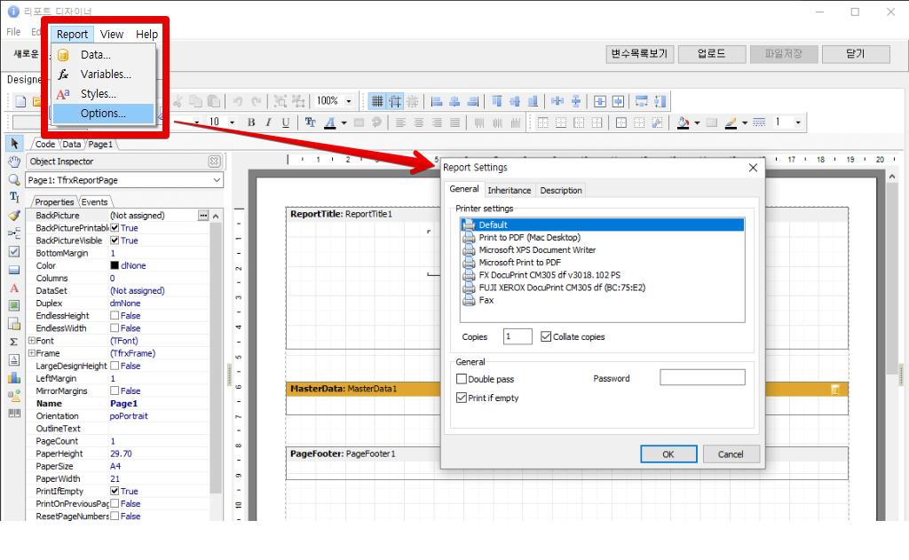

# 102. 리포트 디자이너 옵션

리포트 디자이너의 옵션은 세 가지 종류가 있습니다.

> **주의!!** 정확히 알지 못하는 옵션기능은 기본값을 유지하는 것이 좋습니다.

* [**리포트 옵션\(Report Options\)**](102..md#리포트-옵션report-options)
* [**디자이너 옵션\(Designer Options\)**](102..md#디자이너-옵션designer-options)
  * [Grid](102..md#grid)
  * [Fonts](102..md#fonts)
  * [Color](102..md#color)
  * [Other](102..md#other)
* [**페이지 옵션\(Page Options\)**](102..md#페이지-옵션page-options)
  * [Paper](102..md#paper)
    * [Size](102..md#size)
    * [Orientation](102..md#orientation)
    * [Margins](102..md#margins)
    * [Paper Source](102..md#paper-source)
  * [Other options](102..md#other-options)
    * [Columns](102..md#columns)
    * [Other](102..md#other)

## **리포트 옵션\(Report Options\)**

리포트 옵션 화면에서는 리포트의 파일 및 출력에 대한 옵션을 설정합니다. 이 화면은 일반 사용자가 변경할 일은 거의 없기 때문에 _각 기능의 설명은 생략_ 합니다. _Report &gt; Options_ 메뉴를 실행하면 아래와 같은 리포트 옵션 메뉴를 확인할 수 있습니다.

## **디자이너 옵션\(Designer Options\)**

디자이너 옵션 화면에서는 기본 폰트, 색깔등 디자이너의 기본정보를 설정합니다. _View &gt; Options_ 메뉴를 실행하면 아래와 같은 디자이너 옵션 화면을 확인할 수 있습니다. 기본값으로 되돌리려면 `Restore defaults`버튼을 클릭하면 됩니다. 변경한 내용을 적용하려면 `OK`버튼을, 취소하려면 `Cancel`버튼을 클릭 합니다.

### Grid

Grid옵션은 페이지 디자이너에 가로/세로 격자의 표시 여부를 선택하는 기능입니다.

* **Type**: 격자의 간격을 결정할 단위로 센티메터\(Centimeters\), 인치\(Inches\), 픽셀\(Pixels\)중 하나를 선택합니다.
* **Size**: 격자의 간격을 수치값으로 입력합니다.
* **Show grid**: 격자를 화면에서 보여줄 것인지 감출 것인지 결정합니다.
* **Align to grid**: 페이지에 올라가는 메모를 격자에 맞춰 위치시킬 것인지 선택합니다.

### Fonts

* **Code window**: [코드편집 화면](https://github.com/wooritech/ilab-user-manual/tree/dc2557ca13b72c21cc07884c110e4e7920bff543/리포트양식만들기/100리포트디자이너이해하기/100리포트디자이너이해하기.md#코드편집-화면)의 폰트를 설정합니다.
* **Memo editor**: [메모 편집기](102..md)의 폰트를 설정 합니다.
  * **Use object's font settings**: 메모 편집기의 폰트를 [메모 객체](102..md)의 폰트와 동일한 폰트로 보여줍니다.

### Color

* **Workspace**: 작업영역의 배경색을 지정합니다.
* **Tool Windows**: 속성창의 배경색을 지정합니다.
* **LCD grid color**: LCD모니터에서 대비를 약간 증가시켜 가시성을 향상합니다. 이 옵션은 노트북의 경우 희미한 선들을 조금 강조합니다.

### Other

* **Show editor after insert**: 체크하면 [메모 객체](102..md)등을 추가한 다음 즉시 편집창을 실행합니다.
* **Show band captions**: 체크하면 [리포트 밴드](102..md)의 제목을 표시합니다.
* **Show drop-down fields list**: 체크하면 밴드 위에서 필드와 연결된 Text객체가 필드의 드롭다운 목록에 접근 할 수 있는지 표시 합니다. 밴드위에서 폭이 좁은 Text객체를 올려놓고 디자인할 때 유용합니다.
* **Free bands placement**: 체크하면 [리포트 밴드](102..md)의 위치를 사용자가 자유롭게 조정할 수 있습니다.
* **Gap between bands**: 입력된 픽셀값 만큼 [리포트 밴드](102..md)의 간격을 유지합니다.

## **페이지 옵션\(Page Options\)**

페이지 옵션은 현재 디자이너에서 편집중이 페이지의 옵션을 설정합니다. 페이지에서 마우스 오른쪽 버튼을 눌러 표시되는 메뉴에서 _Edit..._ 메뉴를 선택하거나 아래 그림과 같이 옵션 툴버튼을 클릭하면 화면을 확인할 수 있습니다. 변경한 내용을 적용하려면 `OK`버튼을, 취소하려면 `Cancel`버튼을 클릭 합니다.

### Paper

#### Size

* **용지선택**: 출력할 용지를 선택합니다.
* **Width**: 출력할 용지의 너비를 입력합니다.
* **Height**: 출력할 용지의 높이를 입력합니다.

#### Orientation

* **Portrait**: 출력용지를 세로방향으로 디자인합니다.
* **Landscape**: 출력용지를 가로방향으로 디자인합니다.

#### Margins

* **Left**: 용지의 왼쪽 마진을 입력합니다.
* **Right**: 용지의 오른쪽 마진을 입력합니다.
* **Top**: 용지의 윗쪽 마진을 입력합니다.
* **Bottom**: 용지의 아랫쪽 마진을 입력합니다.

#### Paper Source

* **First page**: 첫 페이지를 출력할 용지의 트레이를 선택합니다.
* **Other pages**: 첫 페이지 이후 페이지를 출력할 용지의 트레이를 선택합니다.

### Other options

#### Columns

출력할 용지의 컬럼을 구분하여 디자인할 수 있게 구분선을 표시해 줍니다.

* **Number**: 컬럼의 갯수를 입력합니다.
* **Width**: 컬럼의 너비를 입력합니다.
* **Positions**: 각 컬럼의 시작위치를 지정합니다.

#### Other

* **Print to previous page**: 이전 페이지의 빈 공간부터 인쇄를 시작하여 인쇄용지 낭비를 막을수 있습니다.
* **Mirror margins**: 홀수페이지와 짝수페이지의 여백을 거울을 마주보듯 대칭적인 값으로 처리합니다.
* **Endless page width**: 페이지의 너비를 출력할 데이터의 레코드 수에 따라 무한정 확장합니다.
* **Endless page height**: 페이지의 높이를 출력할 데이터의 레코드 수에 따라 무한정 확장합니다.
* **Large height in desigin mode**: 디자인시 페이지의 높이를 증가시켜 디자인을 편리하게 합니다.
* **Duplex**: 양면 인쇄모드를 설정합니다.

