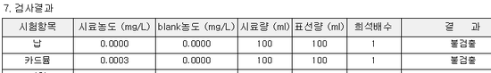

# 시험결과서 A,B,C 타입의 차이점

## Q

기록서 양식에 타입이 여러가지가 있는데 차이점이 궁금합니다.

알려주세요.

## A

기록서 타입별 특징을 알려 드리겠습니다.  
A타입 : 용지 1장에 1항목이 출력됩니다.  
측정/분석관리 -&gt; 검사결과등록 3.0, 검사결과등록 4.0 화면에서 출력 가능합니다.  
측정/분석관리 -&gt; 시험결과서 출력 -&gt; A타입 탭 에서 출력 가능합니다.

B타입 : 용지 1장에 여러 접수건의 여러 항목이 출력됩니다.  
\(1줄에 1접수씩 표기 됩니다. 시험법 관리 -&gt; 해당 시험법 선택 -&gt; 항목그룹 탭에 지정되어있는 항목 순서대로 표기됩니다. \)

측정/분석관리 -&gt; 시험결과서 출력 -&gt; B타입 탭 에서 출력 가능합니다.

\(목록에 조회가 되지 않는다면 결과입력 화면에서 결과값 입력 또는 다시계산 버튼을 클릭 후 다시 조회 해 보시기 바랍니다. \)

C타입 : 용지 1장에 여러 접수건의 여러 항목이 출력됩니다.

\(B타입과 동일하며 추가로, 시험법 관리 -&gt; 변수정의 탭에서 사용하는 변수값을 사용 할 수 있습니다.\)

측정/분석관리 -&gt; 시험결과서 출력 -&gt; C타입 탭 에서 출력 가능합니다.

\(목록에 조회가 되지 않는다면 결과입력 화면에서 결과값 입력 또는 다시계산 버튼을 클릭 후 다시 조회 해 보시기 바랍니다. \)

