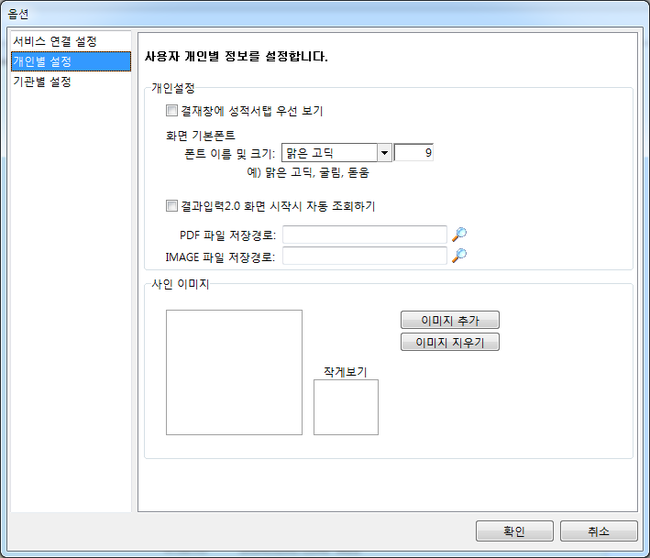
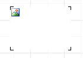

# 기록서A타입 출력물 사인 자동연동 방법

## Q

기록서를 출력할 때 검사자, 검토자, 승인자 사인이 자동으로 연동 되었으면 합니다.

결재를 한 경우에만 사인이 나타나고, 결재를 하지 않은 경우라면 빈 칸이 나타나야 합니다.

어떻게 해야 하나요?

## A

기록서 A타입에서만 가능하며 자동 연동되는 사인이 아이랩에 등록 되어 있어야 합니다.

사인등록방법

## 도구 &gt; 옵션 &gt; 개인별 설정 탭에서 사인을 등록 합니다.

기록서 양식에 사인을 추가하는 방법 입니다.

1. 수정하려는 기록서 디자인을 엽니다. \(공통/코드관리 &gt; 리포트관리 메뉴\)

1. 디자이너의 화면 왼쪽의 그리기 도구에서 PictureView 를 선택 후 디자인에 올립니다.

1. 올린 PictureView 컨트롤을 선택한 뒤 화면 왼쪽의 속성 창에서 Name 을 찾아 아래와 같이 수정 합니다.

검사자 : step1

검토자 : step2

승인자 : step3

정리하자면 리포트에 올라가 있는 PictureView 컨트롤의 Name 속성의 값이 step1, step2, step3 이라면

검사자, 검토자, 승인자의 사인이 Name 의 값에 따라 자동 연동되는 것입니다.

