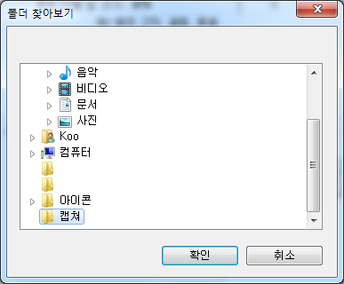

# 성적서PDF 저장폴더 경로 설정법

## Q

성적서 또는 기록서를 출력하기 전 미리보기 화면에 나오는  
PDF저장, 이미지 저장 버튼을 사용할 때 사용자가 폴더를 지정 할 수 있나요?

## A

※ 경로가 설정되어 있지 않으면 PDF, 이미지 저장폴더는  
기본적으로 ILab 설치 폴더에 있는 temp 폴더로 지정되어있습니다.

아래 순서와 같이 설정하신 후 테스트 해보시기 바랍니다.

1. 도구 -&gt; 옵션으로 이동  

   

2. 왼쪽에 보이는 목록 중에 '개인별 설정' 선택  

   

3. 원하는 파일의 경로를 돋보기 버튼을 클릭하여 원하는 폴더로 지정 후 확인버튼 클릭  

   

4. 선택한 경로가 잘 지정되었는지 확인.  

   

5. 설정이 끝났다면 확인 버튼을 클릭하여 저장.  

   

6. 실제 출력할 성적서 또는 기록서 미리보기를 띄운 후 지정된 경로로 저장되는지 확인.  

   \(저장시에 다른 폴더를 찾아서 저장하셔도 최초 열리는 폴더는 개인별 설정에서 지정하신 폴더가 열립니다.\)  

   

