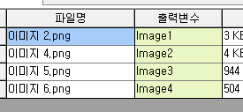
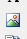

# 접수화면 파일관리 방법

## Q

파일관리 버튼으로 그림파일을 추가한 뒤에  
접수증이나 성적서 같은 출력물에 포함 하고 싶습니다.

방법을 알려주세요.

## A

이번 업데이트에서는 접수 화면의 "파일관리" 버튼을 통해 접수 관련 이미지를 추가할 수 있습니다.

또한 추가한 이미지는 출력물\(성적서, 접수증 등\) 에 포함시킬 수 있습니다.

이미지 파일을 추가하면 "출력변수" 명이 자동으로 지정됩니다. \(편집가능\)  
성적서나 접수증 등에 이 "출력변수" 와 동일한 이름의 TfrxPictureView 컨트롤이 있다면 자동으로 출력에 연동 됩니다.  
리포트 편집 방법은 간단 합니다.

메뉴 : 공통/코드관리 &gt; 리포트 관리

1. 편집할 리포트를 디자이너로 엽니다.  
2. 화면 왼쪽의 그리기 도구중 아래쪽 그림과 같은 모양을 선택하여 디자이너 위에 올립니다.  

   

3. 디자이너에 올린 컨트롤을 선택한 뒤, 화면 왼쪽의 속성 중에 Name 속성을 찾아서 출력변수와 이름을 통일시킵니다.  

   

4. 출력해보면 실제 해당 접수건의 관련 이미지가 자동 연동 됩니다.  

   

