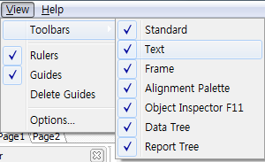
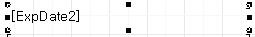
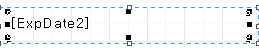

# 리포트 양식 정렬 및 자간 조절 방법

## Q

리포트 양식을 수정하려고 하는데요,

정렬 방법과, 자간 조절 하는 방법에 대해서 알려주세요.

## A

안녕하세요 답변드리겠습니다.

아래 순서대로 진행 해 보시기 바랍니다.

※ 정렬 변경하는 방법입니다.

\(자간 수정 방법은 정렬 변경방법 아래 쪽에 정리되어있습니다.\)

1. 공통/코드관리 -&gt; 리포트 관리, 리포트 관리2.0 화면으로 이동.

1. 수정하려는 양식을 더블클릭 또는 선택 후 리포트 디자인 버튼 클릭.

1. 수정 하려는 메모를 마우스 왼쪽버튼으로 선택.

1. 리포트 디자인 상단에서 원하시는 정렬 기준을 선택.

＊ 아래 캡쳐에서 왼쪽부터 설명하겠습니다. 메로칸의 크기 기준으로 조절됩니다 참고하세요

~

가로: 왼쪽정렬, 가운데정렬, 오른쪽정렬, 양쪽혼합

세로: 위쪽정렬, 가운데정렬, 아래쪽정렬

※ 해당 아이콘이 보이지 않으시다면,

리포트 디자인 상단에 있는 메뉴 중 View -&gt; Toolbars -&gt; Text 를 선택해서 진행하세요.

아래 이미지는 정렬이 변경된 모습입니다.

 -&gt; 

1. 파일저장 버튼 클릭.

1. 실제 출력하여 정렬이 원하는 대로 조절이 되었는지 확인.

1. 조절이 잘 되었다면 해당 양식을 다른분이 뽑으시더라도 적용 될 수 있도록

리포트 관리, 리포트 관리2.0 화면으로 와서 해당 양식을 선택 후 업로드 버튼 클릭.

※ 자간 조절하는 방법.

위에 1

~3번을 반복하여 작업 후 진행하세요

~

2. 선택된 메모의 Properties 에 있는 CharSpacing 에 0이 아닌 값을 입력.

양수입력시 자간이 넓어지고, 음수입력시 자간이 좁아집니다. 기본값은 0입니다.

변경된 모습입니다.

 -&gt; 

2. 파일저장 버튼 클릭.

2. 실제 출력하여 자간이 원하는 대로 조절이 되었는지 확인.

2. 조절이 잘 되었다면 해당 양식을 다른분이 뽑으시더라도 적용 될 수 있도록

리포트 관리, 리포트 관리2.0 화면으로 와서 해당 양식을 선택 후 업로드 버튼 클릭.

