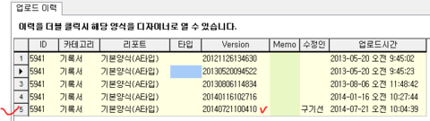

# 리포트 업로드 이력 확인

## Q

아이랩에서 과거에 사용하였던 양식을 볼 수 있나요?  
\(기록서, 성적서 등\)  
과거에 사용하였던 양식을 볼 수 있다면 과거 양식으로 업로드하여 사용할 수 있는 방법이 있다면 알려주세요~

## A

업로드 이력에 대한 설명에 앞서 아래 공통사항이 있으니 참고하셔서 작업해주시기 바랍니다.

1. 공통/코드관리 -&gt; 리포트 관리2.0 메뉴가 보이지 않으시다면 관리자분께 요청하셔서 권한을 받으시거나,

관리자분께 업로드 이력 기능에 대해 전달해 주세요

~

1. 리포트 관리2.0에 있는 버튼의 기능은 카테고리\(탭\)에서 보이는 양식에만 적용됩니다.

1. 리포트 양식의 업로드는 양식 수정 -&gt; 실제 출력 -&gt; 이상여부 확인 -&gt; 업로드 의 순서를 바탕으로 이상이 없는 경우에만 업로드를 해주시고, 아이랩계약시 계약한 파일 용량초과시 과금이 될 수 있으므로 무분별한 양식 업로드는 지양해주시기 바랍니다.

업로드 이력 설명입니다. 아래 순서를 참조해서 작업해보시기 바랍니다.

2. 공통/코드관리2.0 -&gt; 리포트 관리2.0 화면으로 이동

2. 원하시는 양식을 선택.

2. 업로드 이력 버튼 클릭.

2. 화면 오른쪽에 업로드 이력 탭이 생성되는 것을 확인.

2. 업로드 이력 탭에 있는 양식의 Version 또는 업로드 시간을 2번에서 선택한 양식과 비교하여

원하는 양식을 마우스 왼쪽버튼으로 더블클릭.

2. 리포트 디자이너에서 아무 메모창이나 더블클릭하고, 바로 OK 버튼 클릭.

\(이미 생성되어있던 양식은 양식이 수정되지 않으면 업로드 할 수가 없기 때문 입니다.\)

※ 양식 수정이 필요한 경우에는 양식을 원하시는 모양대로 수정 후 다음 순서로 진행하시면 됩니다.

 -&gt; 

2. 리포트 디자이너 오른쪽 상단에 위치한 파일 저장 버튼 클릭 후 업로드 버튼 클릭.

2. 조회 버튼클릭.

2. 해당 버전과 업로드 이력에 가장 아랫줄에 이력 하나가 추가 된 것을 확인.

2. 왼쪽 탭에서도 10번에서 생성된 업로드 이력과 버전이 맞는지 확인.

위에 순서대로 진행해 보시고, 잘 이해가 안되시거나 잘 안되는 부분이 있다면 서비스 요청 보내주시면 다시 설명해드리겠습니다.

