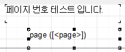
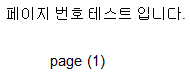
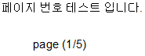
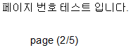

# 출력물에 페이지 표시 방법

## Q

리포트 양식 출력시 여러장이 나올경우가 있는데 페이지를 표기하려면 어떻게 해야하나요?

출력물에 순서대로 페이지 번호를 표기하고 싶습니다.

방법을 알려주세요.

## A

안녕하세요. 아래 순서대로 진행 해 보시기 바랍니다.

※ 공통/코드관리 -&gt; 리포트관리2.0 화면이 보이지 않으시다면 관리자분께 요청하셔서 권한을 받으시거나  
관리자분께 해당 작업을 전달하여 작업을 요청해주시기 바랍니다.

※ 만약 현재 페이지 수와 총 페이지 수를 모두 표기 해야 한다면,\(예: 1/5, 2/5, 3/5\)

리포트 양식에서 Report -&gt; Options -&gt; Double Pass 를 체크 해주셔야 합니다.

\(리포트 양식에서 기본적으로 지원되는 시스템 변수 TotalPages 를 사용하기 위함입니다.\)

/

/

페이지 번호만 표기 하는 경우

1. 공통/코드관리 -&gt; 리포트 관리2.0 화면으로 이동.

1. 페이지 수를 표기하고 싶은 양식 선택 후 리포트 디자인 버튼 클릭 또는 선택한 양식 더블클릭

1. 페이지를 표기하고 싶은 부분에 메모를 하나 생성.

1. 메모를 더블 클릭하여 텍스트 대화 상자를 호출 한 후 

\[

\]를 입력.

1. 리포트 디자이너 우측 상단에 있는 파일저장 버튼 클릭.

1. 실제 출력하여 페이지 수가 잘 표기 되는지 확인.

1. 이상이 없다면 해당 양식 업로드.

현재 페이지 / 총 페이지 를 표기 해야 하는 경우

1. 공통/코드관리 -&gt; 리포트 관리2.0 화면으로 이동.

1. 페이지 수를 표기하고 싶은 양식 선택 후 리포트 디자인 버튼 클릭 또는 선택한 양식 더블클릭

1. 현재 페이지 / 총 페이지를 표기하고 싶은 부분에 메모를 하나 생성.

1. 메모를 더블 클릭하여 

\[page\] / 

\[TotalPages\]를 입력.

1. 리포트 디자이너 우측 상단에 있는 파일저장 버튼 클릭.

1. 실제 출력하여 페이지 수가 잘 표기 되는지 확인.

1. 이상이 없다면 해당 양식 업로드.

