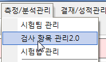
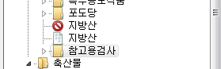
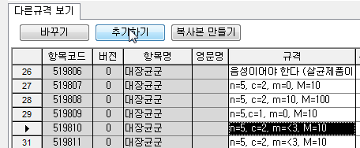
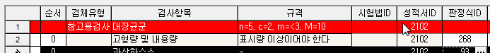

# 기준이 다른 항목 추가하기

## Q

검사항목관리에서 기준이 다른 항목을 추가 하는 방법을 알려주세요.

## A

검사항목관리에서 기준이 다른 항목을 추가 하는 방법을 설명드리겠습니다.

1. 검사항목관리 화면 실행  

   

2. 검체유형 선택  

   

3. 기준을 교체또는 추가할 항목 선택  

   

4. 아래 다른규격보기에서 해당 규격이 있는지 확인 있다면 선택 하고 추가하기 버튼 클릭  

   

   없다면 복사본 만들기 클릭후 규격을 직접 수정해 주시면 됩니다.  

5. 새로추가된 항목은 판정식이 없으면 적/부 판정을 할 수 없기때문에 경고색\(빨간색\)으로 표시됩니다.  

   

6. 판정식 부분을 클릭하면 판정식을 선택 할 수 있는 창이 뜹니다.  

   어떤 판정식을 선택해야 할지 모를 경우 유형중에서 제일 많이 선택된 판정식 번호를 적어 주면 됩니다.  

   특별한 판정식의 경우 판정식 설명을 보고 해당 판정식을 선택 하시면 됩니다.  

   

7. 항목의 출력 순서를 지정하기 위해 순서를 적어 주시면 됩니다.  

   순서는 직접 타이핑 하여 적어 줍니다.  

   

