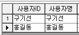

# 새로운 사용자 추가 방법

## Q

사용자를 추가하고싶습니다.

추가하는 방법을 알려주세요.

## A

방법을 알려드리겠습니다.

※ 공통/코드관리 -&gt; 사용자관리 메뉴가 보이지 않으시다면, 관리자분께 요청해주시기 바랍니다.

1. 공통/코드관리 -&gt; 사용자관리 화면으로 이동.  
2. 새로추가될 분이 속할 팀을 선택.  

   

3. 추가버튼을 클릭, 후 새로 생성될 사용자의 정보를 입력.  

   \(오른쪽 상단에 화살표로 색이 칠해져있는 부분은 필수입력 정보입니다.\)  

   

     - 사용자ID는 한글도 생성가능합니다.  

   

4. 저장버튼을 클릭하여 입력한 정보를 저장.  

   

5. 해당 리스트에 사용자가 추가가 잘 되었는지 확인.  

   

   ※ 사용자 생성시 최초 비밀번호는 0000입니다.  

   비밀번호 변경을 원하시면 도구 -&gt; 비밀번호 변경 메뉴를 이용해주시기 바랍니다.  

