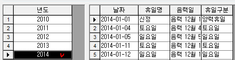
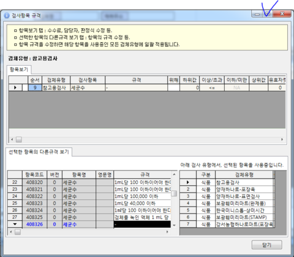
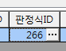

# 성적서 판정식 변경 방법

## Q

성적서 결과를 지정된 판정식에 따라 내보내고 싶은데 어떻게 해야하나요?

## A

※ 판정식을 변경하면 해당 검체유형에 있는 항목만 변경됩니다. 참고해주세요.

방법을 알려드리겠습니다.

1. 측정/분석관리 -&gt; 검사결과입력3.0\(또는 시험결과입력3.0\) 화면으로 이동  
2. 검사결과입력3.0 화면에서 판정식을 변경하려는 항목을 조회 조건에 맞게 조회.\(ex - 해당 접수번호, 시험법 등..\)  
3. 조회된 항목을 선택 후 화면 하단에 있는 "규격편집"버튼 클릭  

   

4. 팝업창을 화면에 맞게 키우신 후 화면 우측으로 이동  

   

5. 판정식ID에 ...부분을 클릭  

   

6. 원하시는 판정식을 리스트에서 선택 후 확인  

   

7. 해당 항목을 다시계산 버튼을 이용하여 다시 계산 후 결과값이 잘 반영되는지 확인.  

   

8. 출력을 원하시는 경우 1번과 2번의 내용을 반복한 후 출력해보시기 바랍니다.  

