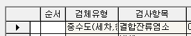
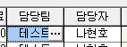
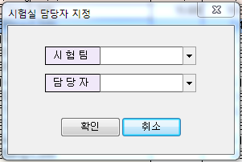

# 항목 담당자 변경 방법

## Q

아직 접수되지 않은 항목에 대해 담당자를 변경하고싶어요. 방법을 알려주세요.

## A

방법이 2가지 있습니다. 아래 내용을 확인하여 편하신 방법을 선택하여 작업해주세요.

### 첫번째

1. 측정/분석관리 -&gt; 검사항목 관리2.0 -&gt; 실험팀배정 버튼 클릭  

   

2. 해당 변경하고자 하는 항목을 선택 또는 항목명 찾아가기에 입력 후 검색  
3. 시험팀, 담당자를 클릭하여 원하는 사람으로 변경.  

   

### 두번째

1. 측정/분석관리 -&gt; 검사항목 관리2.0 -&gt; 왼쪽 검체유형 트리에서 원하는 검체유형을 선택.  

   

2. 검체유형을 선택하면 우측에 나오는 목록에서 원하는 검사항목을 선택  

   

3. 화면 우측으로 이동하여 담당팀 또는 담당자 를 선택하여 ...을 클릭  

   

4. 원하는 시험팀과 담당자를 지정한 후 확인  

   

