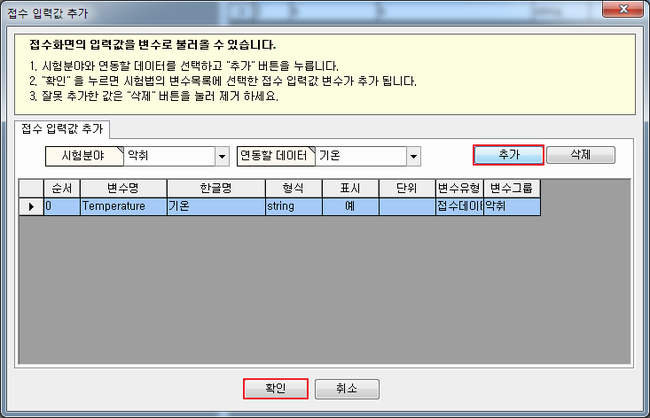
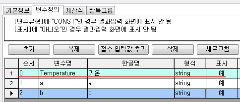

# 접수화면 데이터를 계산식에 사용하는 방법

## Q

결과입력3.0 에서 변수값을 통해 계산을 할 때, 이미 접수 화면에서 입력한 데이터를 다시 입력해야 합니다.

접수 화면에서 입력한 데이터를 계산식에서 쓸 수 있는 방법은 없을까요?

## A

시험법을 편집 할 때 "접수데이터" 형 변수를 추가 하면 됩니다.

메뉴 : 측정/분석관리 &gt; 시험법 관리  
또는, 결과입력3.0 에서 항목 선택 후 "시험법 편집"

1. "변수 정의" 탭으로 이동 합니다.  
2. "접수 입력값 추가" 버튼을 누릅니다.  

   

3. 새로운 창이 열리면 "분야" 와 "연동할 데이터"를 선택 후 "추가" 버튼을 누릅니다.  

   

   \(추가가 된 모습 입니다.\)  

   

4. 이렇게 변수 정의 탭에 "접수데이터" 유형의 변수가 추가 되었다면 끝 입니다.  

   해당 변수가 존재 하면 결과입력 화면에서 데이터를 자동 조회 합니다.  

   

