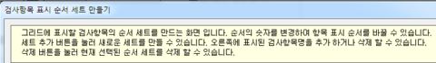
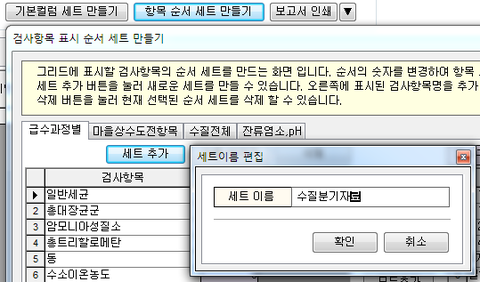
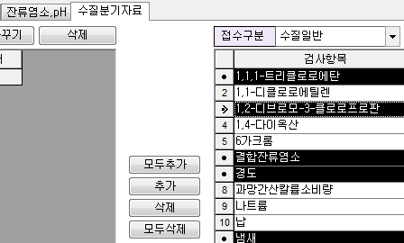
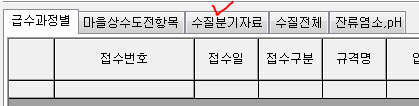

# 항목순서세트 만드는 방법

## Q

측정/분석관리 -&gt; 접수구분별 검사대장 조회 화면에서

항목 순서 셋트 만들기에 대한 기능에 대해 설명해주세요~

## A

아래 순서대로 진행 해보시기 바랍니다.

검체유형에 지정된 항목 순서를 가져오는 기능이 추가 되었습니다. 필요하신 분들은 아래쪽으로 스크롤하셔서 먼저확인하세요~

※ 저장방법 1. 항목 순서 세트를 수정 중에 다른 탭으로 이동하는 경우  
1. 하단에 있는 저장 버튼을 클릭하는 경우

1. 측정/분석관리 -&gt; 접수구분별 검사대장 조회 화면 또는 검사 대장 조회3.0으로 이동.  
2. 항목 순서 세트 만들기 버튼 클릭  
3. 새로 팝업되는 창에 있는 내용을 한번 읽어 보기.  

   

4. 세트추가 버튼 클릭  
5. 새로 만들게 될 셋트\(탭\)명 입력 후 확인 버튼 클릭  

   ※ 항목 순서 세트는 왼쪽부터 가,나,다 순으로 표기됩니다.  

   

6. 새로 생성된 명칭의 탭으로 이동하게 되며,  

   오른쪽에보이는 항목들 중 원하시는 항목을 선택하여 추가 버튼 클릭  

   

7. 왼쪽으로 옮겨진 항목 리스트를 확인 후 빠진 것이 없다면 닫기 버튼 클릭.  

   

8. 접수구분별 검사대장 조회 화면에서 새로 추가한 탭이 생성되었는지 확인 후  

   실제 조회 조건을 주어 데이터 조회 후 데이터가 잘 나오는지 확인.  

   

### 검체유형에 지정된 항목 순서를 가져오는 기능이 추가 되었습니다.

새로운 항목 순서 세트를 추가하여 유형을 불러오거나, 기존에 있던 항목 순서 세트에서

검체유형에 지정된 항목 순서를 불러 올 수 있습니다.

유형에서 불러오기 버튼 클릭.

추가할 할목이 포함되어있는 검체유형 선택 -&gt; 추가할 항목 선택 -&gt; 확인

항목 순서 세트에 검체유형에서 불러온 항목이 잘 적용 되었는지 확인 -&gt; 저장 버튼 클릭.

새로 추가된 항목 순서 세트 또는 변경된 항목 순서 세트를 선택 -&gt; 화면 우측으로 이동 -&gt; 추가한 항목이 잘 표기되는지 확인.

